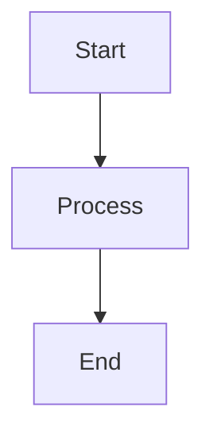

# Mermaid Diagrams Guide

**Visual-first approach.** Alexander is a visual learner — default to adding a diagram unless there's a clear reason not to. Diagrams make notes more scannable, memorable, and useful for future review.

**For syntax reference and validation**, use the mermaid skill at `.claude/skills/mermaid-tools/skill.md`.

---

## Decision Tree

Alexander is a visual learner, so every note evaluates this tree. The default is ADD — only skip for genuinely structureless content.

```text
1. NAMED FRAMEWORK or MODEL?
   ("Habit Loop", "Golden Circle", "Four Laws of...")
   → ADD - Named models deserve visualization

2. PROCESS, SEQUENCE, or WORKFLOW?
   (steps, how-to, cause-effect chain, pipeline)
   → ADD - Use flowchart LR or TD

3. SYSTEM RELATIONSHIPS or ARCHITECTURE?
   (components, feedback loops, hierarchies, layers)
   → ADD - Use graph with connections

4. COMPARISON or CONTRAST?
   (approach A vs B, tradeoffs, before/after)
   → ADD - Use quadrant chart, graph, or table-as-graph

5. TIMELINE, PROGRESSION, or EVOLUTION?
   (phases, history, roadmap, maturity levels)
   → ADD - Use timeline or graph LR

6. ARGUMENT STRUCTURE or MENTAL MODEL?
   (thesis + supporting points, decision tree, taxonomy)
   → ADD - Use mindmap or graph TD

7. KEY CONCEPT with RELATIONSHIPS?
   (central idea connected to sub-ideas, categories, examples)
   → ADD - Use mindmap

8. Content is a short quote, simple opinion, or link list?
   → SKIP: "Content too brief for meaningful diagram"

9. Truly no visual structure after considering all above?
   → SKIP: "No visual structure identified" (rare — reconsider)
```

### Type Priority Matrix

| Priority   | Content Types                                | Action                                                          |
| ---------- | -------------------------------------------- | --------------------------------------------------------------- |
| **ALWAYS** | book, talk, course                           | Add at least one diagram — find the visual angle                |
| **HIGH**   | article, youtube, podcast, evergreen, github | Add diagram unless content is genuinely just a list             |
| **MEDIUM** | newsletter, reddit, note                     | Evaluate — add if any structure, comparison, or argument exists |
| **LOW**    | quote, map, manga, movie                     | Skip unless obvious visual structure                            |

---

## When to Add Diagrams

✅ **Use diagrams for (broad — look for these):**

- **Frameworks** - Any named model, matrix, pyramid, or mental model
- **Process flows** - Step-by-step sequences, cause-effect chains, decision trees, workflows
- **System relationships** - Component interactions, feedback loops, hierarchies, architectures
- **Comparisons** - Two or more approaches, tradeoffs, pros/cons, before/after
- **Timelines** - Historical progression, project phases, learning paths, evolution
- **Argument structure** - A thesis with supporting claims, or an opinion with reasoning
- **Concept maps** - A core idea broken into sub-categories or related concepts
- **Key takeaways** - Even a summary of 3-5 key insights can be a mindmap

❌ **Skip diagrams ONLY when:**

- Content is a very short quote or single-sentence opinion
- The note is a link list (MOC/map type) — these are already visual by nature
- After genuinely considering all 7 diagram triggers above, nothing fits

---

## Diagram Type Selection

Match content patterns to the best diagram type:

| Content Pattern               | Best Diagram Type                | Example                               |
| ----------------------------- | -------------------------------- | ------------------------------------- |
| Steps, workflow, pipeline     | `flowchart LR` or `flowchart TD` | Build process, user journey           |
| Core idea → sub-ideas         | `mindmap`                        | Book key takeaways, concept breakdown |
| Timeline, phases              | `timeline`                       | Project evolution, historical events  |
| Components with relationships | `graph TD`                       | Architecture, system design           |
| Circular/feedback loops       | `graph` with cycle edges         | Habit loops, reinforcement cycles     |
| Comparisons, tradeoffs        | `quadrantChart` or `graph`       | Framework vs framework                |
| States and transitions        | `stateDiagram-v2`                | User states, process stages           |
| Argument/thesis structure     | `mindmap` or `graph TD`          | Author's argument mapped out          |
| Category/taxonomy             | `mindmap`                        | Classification, types of X            |
| Sequence of interactions      | `sequenceDiagram`                | API calls, conversation flow          |

**Prefer `mindmap` for non-technical content** — it's the most versatile for capturing key ideas and their relationships without imposing artificial flow.

**Prefer `flowchart` for processes** — anything with steps, decisions, or cause-effect chains.

---

## Fenced Code Block Syntax

When placing a validated diagram into a note, use a standard fenced code block:

````markdown

````

**Never add colors or styling** — let the app's theme handle appearance.

---

## Diagram Triggers by Content Type

### Books

Almost always have diagram-worthy content:

- "The [X] Model" or "The [X] Framework"
- "Four laws of...", "Three pillars of...", "Five stages of..."
- Circular relationships ("A leads to B leads to C leads to A")
- Before/after transformations
- Concentric circles or layers ("at the core...", "surrounding that...")
- **Author's core argument** → mindmap of thesis + key supporting points
- **Book structure** → the key chapters/sections as a concept map

### Talks/YouTube

- Speaker draws on whiteboard or shows diagram slide
- Describes a cycle or loop
- Compares two approaches side-by-side
- Presents a structured argument → mindmap the argument
- Any "here's how this works" explanation → flowchart

### Podcasts

- Guest describes their framework or approach
- Discussion follows a structure (problem → diagnosis → solution)
- Multiple topics covered → mindmap of the key discussion points
- Guest's background/journey → timeline

### Articles

- Technical articles: architecture diagrams, data flows, pipeline stages
- Opinion pieces: argument structure as mindmap
- How-to articles: step-by-step as flowchart
- Comparison articles: approaches mapped visually

### GitHub Repos

- Architecture overview of the project
- How the tool works (pipeline/flow)
- Feature comparison with alternatives

---

## Multiple Diagrams

For rich content (books, long talks, in-depth articles), consider adding **2 diagrams** when appropriate:

1. **Concept overview** — mindmap of the key ideas
2. **Key process/framework** — flowchart or graph of the most important model

Don't exceed 2 diagrams per note — keep it focused.

---

## Placement

Place diagrams where they naturally reinforce the text:

- **After the concept they visualize** — not in a separate section at the bottom
- **Inline with the relevant highlight/insight** — the diagram appears right where the reader needs it
- If the diagram summarizes the whole note (e.g., a mindmap of key takeaways), place it near the top after the intro
- Section heading is optional — use `## Visual Model` or `## How It Works` only if it reads naturally; otherwise just embed inline
