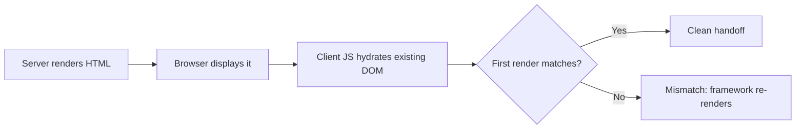

# How to Catch Hydration Errors in Playwright Tests (Astro, Nuxt, React SSR)

Your E2E tests pass. The page loads. Buttons work. Navigation works.

But open the browser console:

```text
Hydration failed because the server rendered HTML didn't match the client.
```

This is a hydration mismatch. It means the server sent one thing and the client immediately replaced it with something else. The page still works, so nobody notices. Your tests do not check for it, so they pass.

I first saw this pattern in the [npmx.dev](https://npmx.dev) open source project. They use it across their Nuxt app to test hydration correctness for every combination of user settings -- dark mode, locale, accent color, package manager preference -- across every page. That is around 48 hydration checks from a single fixture. They even reuse the same console-listening technique to catch CSP violations.

I adapted it for my own Astro site. It is a small Playwright fixture that catches hydration mismatches automatically. It found a real bug on its first run. Here is the pattern and the full code.

## What are SSR and hydration?

**SSR (server-side rendering)** means the server generates HTML and sends it to the browser before JavaScript loads. Users see content immediately. SEO works. The page exists before client code boots.

Frameworks like Astro and Nuxt lean heavily on this model.

**Hydration** is the next step: client JavaScript takes over the server-rendered HTML, attaching event handlers and state to the existing markup. The critical contract is that the first client render must match what the server already sent.

When it does not match, the framework discards the server HTML and re-renders on the client. That is a hydration mismatch.



## Common causes of hydration mismatches

Anything that makes the client disagree with the server on the first render:

- Reading `localStorage` or `window.matchMedia()` during render
- Calling `new Date()` or `Math.random()` during render
- Formatting dates or numbers differently across server and client
- Rendering conditional branches based on browser-only state

In practice, the usual suspects are theme toggles, timestamps, locale formatting, and client-only feature detection.

## Example: React hydration mismatch in a theme toggle

My theme hook was reading browser state during the first render:

```ts
function getInitialTheme(): Theme {
  const stored = localStorage.getItem(SITE.themeStorageKey);
  if (stored === "light" || stored === "dark") return stored;
  return window.matchMedia("(prefers-color-scheme: dark)").matches ? "dark" : "light";
}

export function useTheme() {
  const [theme, setTheme] = useState<Theme>(getInitialTheme);
}
```

The server defaulted to `dark`. The browser immediately decided `light`. First client render did not match server HTML. React threw a hydration warning and re-rendered.

The page still worked. The button still existed. Normal E2E tests were happy.

**The fix:** start with a deterministic value, resolve browser state after mount.

```ts
export function useTheme() {
  const [theme, setTheme] = useState<Theme>("dark");
  const [mounted, setMounted] = useState(false);

  useEffect(() => {
    const preferredTheme = getPreferredTheme();
    document.documentElement.classList.toggle("dark", preferredTheme === "dark");
    setTheme(preferredTheme);
    setMounted(true);
  }, []);

  useEffect(() => {
    if (!mounted) return;
    const root = document.documentElement;
    root.classList.toggle("dark", theme === "dark");
    localStorage.setItem(SITE.themeStorageKey, theme);
  }, [mounted, theme]);

  return { theme, setTheme, toggleTheme: () => setTheme((t) => (t === "dark" ? "light" : "dark")) };
}
```

## Playwright fixture for hydration error detection

The idea is simple: listen to console output during page navigation, collect hydration warnings separately from other errors, and assert both are empty.

```ts
import { expect, test as base, type ConsoleMessage } from "@playwright/test";

const HYDRATION_ERROR_PATTERNS = [
  /hydration failed because the server rendered html didn't match the client/i,
  /hydration completed but contains mismatches/i,
  /hydration text content mismatch/i,
  /hydration node mismatch/i,
  /hydration attribute mismatch/i,
];

function isHydrationError(text: string): boolean {
  return HYDRATION_ERROR_PATTERNS.some((pattern) => pattern.test(text));
}

function toConsoleText(message: ConsoleMessage): string {
  return message.text().trim();
}

export const test = base.extend<{
  hydrationErrors: string[];
  runtimeErrors: string[];
}>({
  hydrationErrors: async ({ page }, use) => {
    const hydrationErrors: string[] = [];

    const handleConsole = (message: ConsoleMessage) => {
      const text = toConsoleText(message);
      if (isHydrationError(text)) {
        hydrationErrors.push(text);
      }
    };

    page.on("console", handleConsole);
    await use(hydrationErrors);
    page.off("console", handleConsole);
  },

  runtimeErrors: async ({ page }, use) => {
    const runtimeErrors: string[] = [];

    const handleConsole = (message: ConsoleMessage) => {
      const text = toConsoleText(message);
      if (message.type() === "error" && text.length > 0 && !isHydrationError(text)) {
        runtimeErrors.push(text);
      }
    };

    const handlePageError = (error: Error) => {
      runtimeErrors.push(error.message);
    };

    page.on("console", handleConsole);
    page.on("pageerror", handlePageError);
    await use(runtimeErrors);
    page.off("console", handleConsole);
    page.off("pageerror", handlePageError);
  },
});

export { expect };
```

Drop this into `test/e2e/test-utils.ts` and import from there instead of `@playwright/test`.

## Writing hydration tests with the fixture

```ts
import { expect, test } from "./test-utils";

test("home page hydrates cleanly", async ({ page, hydrationErrors, runtimeErrors }) => {
  await page.goto("/", { waitUntil: "domcontentloaded" });
  await expect(page.getByRole("heading", { name: "Home" })).toBeVisible();

  expect(hydrationErrors).toEqual([]);
  expect(runtimeErrors).toEqual([]);
});
```

Start with your homepage. Add one interactive route. Add one route with a theme toggle or client-only widget. That is usually enough to surface at least one bug.

If you are shipping an SSR app and not checking for hydration errors in your browser tests, there is a decent chance you already have one in production.
