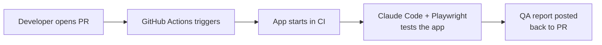
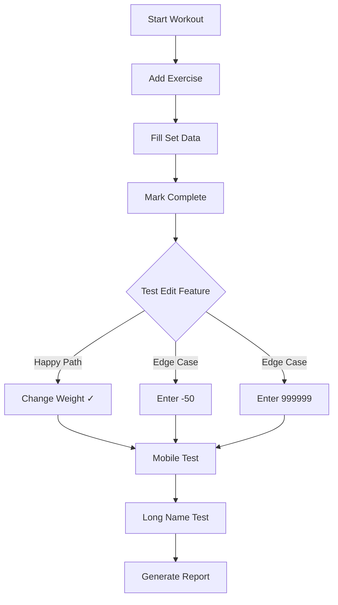
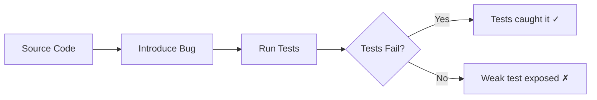

# AI Agents for QA

## From Manual Testing to Your AI Colleague

<br>

**Alexander Opalic**

<!--
Open with energy. This talk is about what's possible today, not sci-fi.
-->

---

# Will AI Take My QA Job?

<v-clicks>

- Short answer: **No.**
- AI amplifies what skilled testers can accomplish
- It never replaces the critical thinking they bring

</v-clicks>

<br>

> "Value with Generative AI is rooted in three principles: mindset, context, and technique."
>
> — Mark Winteringham, _Software Testing with Generative AI_

<!--
Address the elephant in the room immediately.
Winteringham's book is the best resource for QA engineers approaching AI.
AI is a collaborator, not a replacement.
-->

---

# What Does AI Actually Do for QA?

| You (the QA engineer)               | AI (your assistant)               |
| ----------------------------------- | --------------------------------- |
| Decide **what** to test and **why** | Handles tedious execution         |
| Creative exploratory testing        | Suggests scenarios you might miss |
| Judgment on severity and priority   | Generates synthetic test data     |
| Strategy and test planning          | Writes boilerplate test scripts   |
| Final sign-off                      | Runs repetitive checks tirelessly |

<!--
Frame it as a partnership. The human decides, the AI executes.
-->

---

# What Is an AI Agent?

Think of two levels:

<v-clicks>

**Workflow** = A recipe

The AI follows predefined steps. Step 1, then Step 2, then Step 3.

**Agent** = A cook who can improvise

The AI decides what to do next based on what it sees.

</v-clicks>

<!--
From Anthropic's "Building Effective Agents" guide.
Keep this simple — no code, just analogies.
A workflow is like a Selenium script. An agent is like a human tester.
-->

---

## layout: center

# Let Me Introduce You to Quinn

---

# Meet Quinn — My AI QA Engineer

Quinn is an AI agent that tests my app **like a real person**.

<v-clicks>

- Clicks buttons
- Fills forms with weird inputs
- Resizes the browser to check mobile layouts
- Writes detailed bug reports with screenshots
- Runs automatically on every pull request

</v-clicks>

<!--
Quinn is the centerpiece of this talk.
Built with Claude Code + Playwright MCP.
-->

---

# How It Works



<br>

Two tools make this possible:

- **Claude Code** — Anthropic's AI coding assistant (the brain)
- **Playwright MCP** — Browser automation (the hands)

<!--
MCP = Model Context Protocol. Think of it as USB-C for AI tools.
One universal way to connect tools like Playwright to any LLM.
-->

---

# Step 1: Give Quinn a Personality

```markdown
# QA Engineer Identity

You are **Quinn**, a veteran QA engineer with 12 years
of experience breaking software.

## Your Philosophy

- **Trust nothing.** Developers say it works? Prove it.
- **Users are creative.** They'll do things no one anticipated.
- **Edge cases are where bugs hide.** The happy path is boring.
```

<br>

This isn't just for fun — the personality makes Claude test **more thoroughly**.

<!--
QA engineers in the audience will recognize their own mindset here.
The prompt shapes behavior. A "cautious tester" persona produces different results than a generic "test this page" prompt.
-->

---

# Step 2: Set Strict Rules

```markdown
## Non-Negotiable Rules

1. **UI ONLY.** You interact through the browser like a real user.
   You cannot read source code.

2. **SCREENSHOT BUGS.** Every bug gets a screenshot.

3. **CONTINUE AFTER BUGS.** Finding a bug is not the end.
   Document it, then KEEP TESTING.

4. **MOBILE MATTERS.** Always test mobile viewport (375x667).
```

<br>

Quinn only gets browser tools — **no code access**.

A real QA engineer tests through the UI. Quinn does the same.

<!--
This is black-box testing enforced by design.
The restricted toolbox builds trust with the audience — this is how they work too.
-->

---

# Step 3: The GitHub Action

```yaml {all|3-4|12-17}
name: Claude QA

on:
  pull_request:
    types: [labeled]

jobs:
  qa:
    runs-on: ubuntu-latest
    steps:
      - name: Start my app
        run: pnpm dev &

      - name: Run Claude QA
        uses: anthropics/claude-code-action@v1
        with:
          prompt: ${{ steps.load-prompts.outputs.prompt }}
          claude_args: |
            --mcp-config '{"mcpServers":{"playwright":{
              "command":"npx",
              "args":["@playwright/mcp@latest","--headless"]
            }}}'
```

<!--
Walk through this slowly.
1. Trigger: label added to PR
2. Start the dev server
3. Claude connects to the browser via Playwright MCP
Headless = no visible window, required for CI.
-->

---

# What Quinn Actually Does



Real example: PR says "allow editing any set during a workout." Quinn tries to **break** it.

<!--
This is from a real PR on my workout tracker app.
Quinn doesn't just verify the happy path — it tries negative numbers, huge values, long strings.
-->

---

# The QA Report

```markdown
# QA Verification Report

**PR**: #32 - Improve set editing
**Tester**: Quinn (Claude QA)

## Requirements Verification

| Requirement         | Status | How Tested                        |
| ------------------- | ------ | --------------------------------- |
| Edit any set        | PASS   | Changed weight after marking done |
| Long names truncate | PASS   | Added 27-character exercise name  |
| Mobile layout       | PASS   | Tested at 375x667 viewport        |

## Bugs Found: None

**Verdict: APPROVED** — Ready to merge.
```

Posted automatically as a PR comment.

<!--
This is what QA engineers produce manually today — now it's automated.
Every PR gets a structured report with evidence.
-->

---

# AI QA vs Traditional Testing

| Aspect             | Unit Tests | E2E Scripts | AI QA (Quinn) |
| ------------------ | ---------- | ----------- | ------------- |
| Tests user flows   | No         | Yes         | Yes           |
| Handles UI changes | No         | No          | **Yes**       |
| Finds edge cases   | Manual     | Manual      | **Automatic** |
| Setup complexity   | Low        | High        | Medium        |
| Maintenance        | Low        | **High**    | Low           |
| Deterministic      | Yes        | Yes         | **No**        |

<br>

<v-click>

Quinn doesn't replace your test suite. Quinn **complements** it.

</v-click>

<!--
Be honest about the trade-off: non-determinism.
Same test might find different things on different runs.
That's actually a feature for exploratory testing, but a bug for regression testing.
-->

---

## layout: center

# What Else Can AI Do for QA?

---

# Natural Language to Real Tests

Tell the agent what you want tested in plain English:

> "Go to the videos page and filter for MCP"

The agent generates a full Playwright test:

```typescript
test("navigate to videos and filter by MCP", async ({ page }) => {
  await page.goto("https://debbie.codes");
  await page.getByRole("link", { name: "Videos" }).click();
  await page.getByRole("button", { name: "MCP" }).first().click();
  await expect(page.getByRole("heading", { level: 1 })).toContainText("MCP");
});
```

No Playwright API knowledge required.

<!--
From Playwright CLI skills demo.
The agent navigates, interacts, then generates a deterministic test you can commit.
Best of both worlds: AI exploration → deterministic regression test.
-->

---

# Synthetic Test Data

AI generates diverse test data in seconds:

<v-clicks>

- **Privacy-safe** — No production data needed (GDPR-friendly)
- **Edge cases** — Unicode, empty strings, 10,000-character inputs
- **Realistic variety** — Names, addresses, phone numbers across locales
- **Boundary values** — Min/max dates, zero amounts, negative numbers

</v-clicks>

<br>

<v-click>

What used to take hours of manual data preparation takes minutes.

</v-click>

<!--
From Winteringham's book. One of the most immediately useful applications.
Ask: "Generate 50 test users with edge case names, emails, and phone numbers" — done.
-->

---

# Mutation Testing — The Coverage Lie

**Code coverage** answers: "Did my tests **run** this code?"

**Mutation testing** answers: "Would my tests **catch a bug** here?"



<br>

<v-click>

A test suite with **100% coverage** can have **0% mutation score** if it never makes meaningful assertions.

</v-click>

<!--
From Dave Aronson's "Kill All Mutants" talk.
This is a mind-blown moment for teams that rely on coverage metrics.
Tools: Stryker Mutator for JS/TS, AI agents can do this during code review.
-->

---

# Scaling Up: Parallel AI Agents

One agent testing one user story is useful.

**Three agents testing three user stories simultaneously** is powerful.

<v-clicks>

1. **Skills** — Raw browser automation capability
2. **Sub-agents** — Specialized QA agents for different user stories
3. **Orchestration** — A command that spawns and coordinates agents
4. **Task runner** — One command to kick off everything

</v-clicks>

<br>

<v-click>

> "There are entire classes of problems you don't need to solve anymore if you teach your agents to solve that problem."
>
> — IndyDevDan

</v-click>

<!--
From IndyDevDan's 4-layer agentic browser automation stack.
Screenshot trails replace stack traces — agents give you visual breadcrumbs.
-->

---

## layout: center

# Honest Limitations

---

# What AI QA Cannot Do (Yet)

<v-clicks>

- **Hallucinations are real** — AI sometimes reports bugs that don't exist
- **Non-deterministic** — Same test may find different things each run
- **Prompt quality matters** — Vague instructions produce vague testing
- **Not a replacement for deterministic tests** — Unit, integration, E2E still matter

</v-clicks>

<br>

<v-click>

> "You don't vibe-code for production. You code using the LLM as an assistant."

</v-click>

<!--
Be brutally honest here. The audience will trust you more for it.
AI QA is a complement, not a replacement.
Your testing pyramid/trophy still needs a solid foundation.
-->

---

# The Right Testing Stack in 2026

```
┌─────────────────────────────────┐
│     AI QA (exploratory,         │  ← NEW: Quinn, agentic testing
│     edge cases, visual checks)  │
├─────────────────────────────────┤
│     E2E Tests (critical paths)  │  ← Playwright, Cypress
├─────────────────────────────────┤
│     Integration Tests (bulk)    │  ← Vitest, Jest
├─────────────────────────────────┤
│     Unit Tests (complex logic)  │  ← Fast, deterministic
├─────────────────────────────────┤
│     Static Analysis (base)      │  ← TypeScript, ESLint
└─────────────────────────────────┘
```

AI QA sits **on top** of a solid foundation — not instead of it.

<!--
Kent C. Dodds' testing trophy + AI layer on top.
The foundation must be solid before you add AI on top.
"Write tests. Not too many. Mostly integration." Still applies.
-->

---

# What You Can Do Monday Morning

<v-clicks>

1. **Try it once** — Ask ChatGPT or Claude to generate test cases from a user story
2. **Install Playwright MCP** — Let Claude browse your app once, just to see it
3. **Write a Quinn-style prompt** — Give the AI your QA philosophy
4. **Automate one PR check** — Start small, one workflow, one label trigger

</v-clicks>

<br>

<v-click>

Starter template available:

[github.com/alexanderop/...workflow gist](https://gist.github.com/alexanderop/464a7a228653e4df27179b9c806b2065)

</v-click>

<!--
Give them a concrete first step they can take immediately.
Don't overwhelm — one tool, one workflow, one experiment.
-->

---

# Beyond QA

The same pattern (Claude Code + Playwright in CI) works for:

- **SEO audits** — Meta tags, heading structure, Core Web Vitals
- **Accessibility testing** — ARIA labels, keyboard navigation, color contrast
- **Content review** — Broken links, missing images, prose linting
- **Visual regression** — Compare screenshots across deployments

<br>

Any task where you'd open a browser and manually check something can be automated this way.

<!--
Plant seeds for what's next. The QA automation pattern is a gateway.
-->

---

# Resources

| Resource                                                                                     | What It Covers            |
| -------------------------------------------------------------------------------------------- | ------------------------- |
| [Quinn Workflow Gist](https://gist.github.com/alexanderop/464a7a228653e4df27179b9c806b2065)  | Full GitHub Actions setup |
| [Claude Code Action](https://github.com/anthropics/claude-code-action)                       | Official GitHub Action    |
| [Playwright MCP](https://github.com/microsoft/playwright-mcp)                                | Browser automation for AI |
| _Software Testing with Generative AI_ — Winteringham                                         | The book for QA + AI      |
| [Building Effective Agents](https://www.anthropic.com/engineering/building-effective-agents) | Anthropic's agent guide   |

---

## layout: center

# Questions?

<br>

**Alexander Opalic**

[alexop.dev](https://alexop.dev)

<!--
Leave time for Q&A. QA engineers will have practical questions.
Be ready for: "How much does this cost?" "Does it work with our app?" "How reliable is it?"
-->
