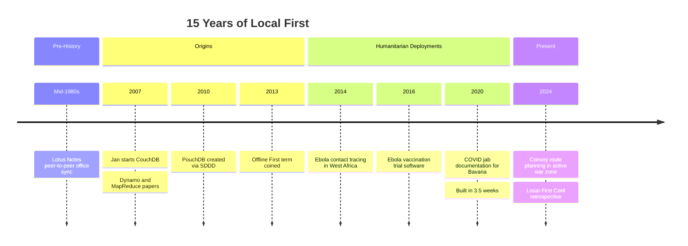
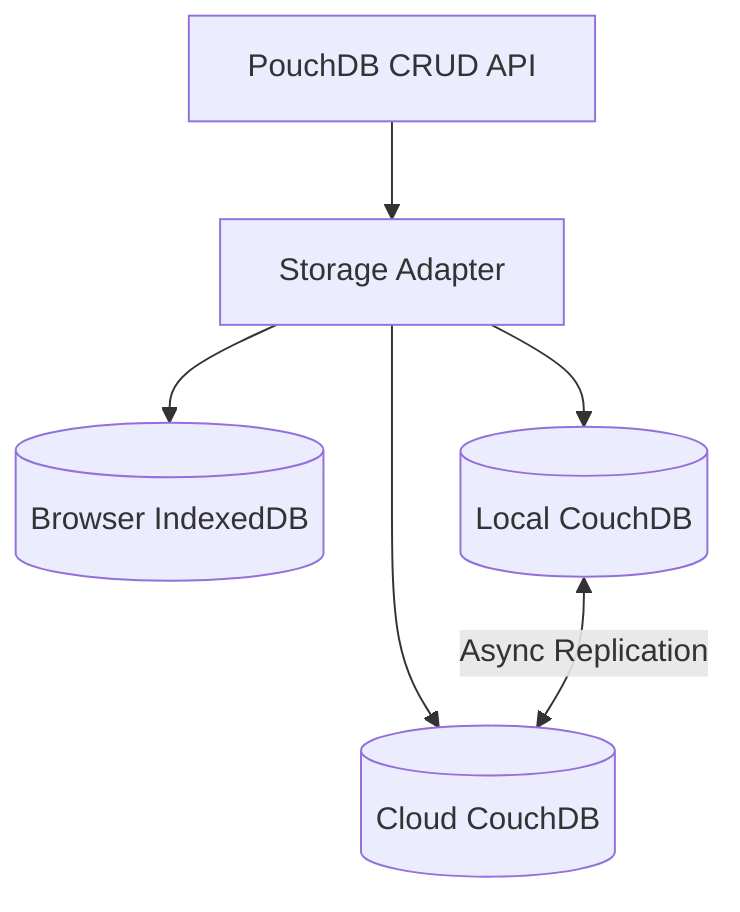

## Overview

Jan Lehnardt has been doing local-first since before the term existed. He started working on CouchDB in 2007, inspired by Lotus Notes' 1980s peer-to-peer sync model, and coined "Offline First" in 2013 — six years before the Ink & Switch essay that most people treat as the origin story. This talk is 15 years of battle scars distilled into the lessons that survive.

What makes this talk different from the typical local-first pitch: Jan doesn't argue from developer ergonomics or latency gains. He argues from Ebola contact tracing, COVID vaccination documentation, and active war zone logistics. When your software failing means people don't get vaccinated, the abstract benefits of local-first become concrete and non-negotiable.

::

## Key Arguments

### The Lineage Goes Back Decades

Most local-first discourse starts with the 2019 Ink & Switch essay. Jan's lineage traces to Lotus Notes in the mid-1980s — portable computers that needed to sync office documents without continuous connectivity. CouchDB directly inherited this mental model: replication as a primitive, composed into any topology. The ideas aren't new. The vocabulary is.

### Data Safety Is the Non-Negotiable Trade-Off

CouchDB and PouchDB make one immovable trade-off: data safety above everything else. No last-write-wins. Ever. In the Ebola response, in COVID vaccination tracking, this principle was what made the stack trustworthy for life-critical deployments. Jan's position: if your sync engine uses LWW, it "just means randomly throwing data away." In contexts where data loss means a patient doesn't get their second vaccine dose, that's unacceptable.

### The Right Abstraction Eliminates Infrastructure Lock-in

PouchDB's storage adapter pattern meant that switching from IndexedDB to a local CouchDB server to cloud CouchDB was a one-line change — or zero lines. The Ebola call center app started on browser storage, switched to cloud CouchDB for speed, then to a local CouchDB laptop when the network proved unreliable. Same application code through all three configurations.

::

### People Lie About Infrastructure

In every deployment, stakeholders misrepresented conditions. Call center managers claimed reliable Wi-Fi that buckled under hundreds of simultaneous connections. Field workers' phones were full of other apps, leaving no storage. Jan's response: build telemetry that proves where failures actually occur. Don't trust verbal assurances — trust data.

### Mission Beats Everything

Three-week sprints that would be impossible in normal product development became achievable when the mission was stopping an epidemic. The COVID vaccination system was built in 3.5 weeks and deployed on December 26th. Jan's argument: the ultimate validation of local-first isn't performance benchmarks — it's whether the technology enables humans to help other humans under pressure.

## Notable Quotes

> "When we started out talking about data sync and disconnected networking in 2007, we had no community. We didn't even have words for the things that we were talking about."

> "Engineering is all about trade-offs and the one trade-off that CouchDB and PouchDB always make is: data safety is more important than everything else."

> "If your software gets in the way of people getting the job done, they will route around it, they will go back to the old system."

> "Documentation is the only 10x multiplier to your development speed."

## Practical Takeaways

- **Be public about your capabilities.** Jan's team was recruited for three world-historical crises because their reputation preceded them. Talk at conferences, blog, be visible — the right high-impact projects find you.
- **Never use last-write-wins for critical data.** Conflict tracking with user-resolvable states is the only acceptable model when data loss has real consequences.
- **Build telemetry that proves your software isn't the problem.** People will blame your stack. Objective proof of where failures occur maintains trust and fixes the actual problem.
- **Documentation is the only real 10x multiplier.** In the Ebola project, onboarding a senior dev/designer/PM per week for three months was only possible because everything was written down as it was built.
- **Design offline UX with explicit confidence signals.** Users need to see at a glance what data is safely available offline — like the map tile tinting trick that gave convoy operators visual certainty.

## Connections

- [[local-first-software]] — The Ink & Switch essay that formalized what Jan had been building for over a decade. Jan's CouchDB work is the lived practice that the essay theorized about.
- [[the-past-present-and-future-of-local-first]] — Kleppmann's retrospective from the same conference. Both are looking back, but from different vantage points: Kleppmann shaped the definitions, Jan shipped the deployments.
- [[powering-offline-first-forestry-in-europes-wilds]] — Another Local-First Conf talk about real-world offline deployment. Thiele's forestry work and Jan's humanitarian deployments share the same truth: when connectivity isn't optional, local-first is the only architecture.
- [[a-gentle-introduction-to-crdts]] — Covers last-write-wins as a CRDT merge strategy. Jan's talk is the strongest practical argument against LWW: in life-critical contexts, "randomly throwing data away" is not a merge strategy.
