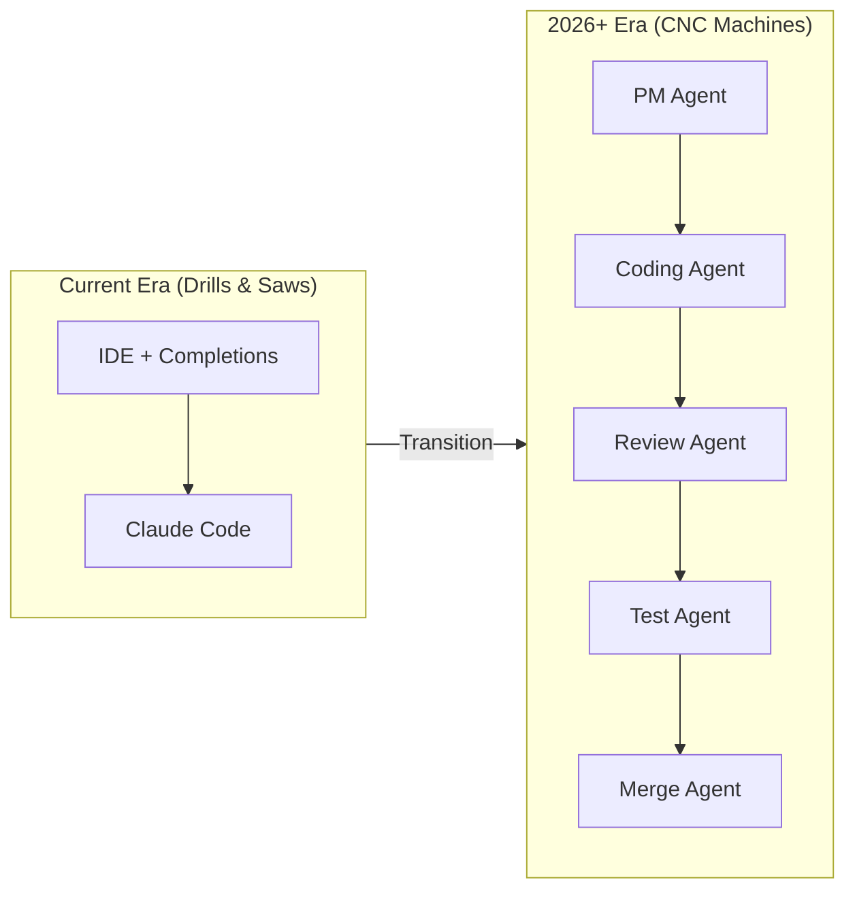

## Overview

Steve Yegge and Gene Kim present a provocative vision: current AI coding tools are merely the drill-and-saw era of software automation. The real transformation—CNC-style agent swarms—arrives in 2026, reshaping not just how engineers write code but who writes code at all.

## Key Arguments

### The Single-Agent Problem

Current tools like Claude Code are "the world's biggest ant"—one expensive model handling everything from trivial git checks to complex refactors. Yegge argues the context window is like an oxygen tank: sending one diver deep into a codebase will always hit limits. The solution: specialized agent swarms. Send a product manager agent first, then a coding agent, then review and test agents.

> "Nature builds ant swarms and Claude Code built this huge muscular ant that's just going to bite you in half and take all your resources."
> — Steve Yegge

### The Productivity Divide

OpenAI faces an internal crisis: engineers using Codex are so much more productive than those who don't that performance reviews have become meaningless. The gap is "staggering"—and senior engineers are often the resisters. Yegge compares this to Swiss watchmakers dismissing quartz: "No cheap. That's word for word what they say."

### Leaders Who Ship

Gene Kim shares case studies of non-engineers shipping production code:

- **Dr. Top Pal at Fidelity**: Frustrated by 5-month estimates, he vibe-coded a critical application in 5 days—now the junior engineer maintains it
- **Cisco's experiment**: 100 top leaders required to ship one feature via vibe coding in Q4
- **The sobering quote**: "When I told my team I wrote an app with 60,000 lines of AI-generated code I haven't looked at, they all looked at me as if they wished I were dead."

### FAFO: Why People Vibe Code

Kim offers a framework for adoption:

- **Faster**: The obvious benefit, but the most superficial
- **Ambitious**: The impossible becomes possible; tedious tasks become free
- **Alone**: Coordination costs vanish—domain expert plus developer might be a team of two
- **Fun**: "Steve and I both thought our best coding days were behind us"
- **Optionality**: More experiments, more swings at bat, more parallel exploration

## The Trust Curve

Kim shares unpublished Dora research: trust in AI correlates directly with time spent using it. Every engineer who says "I tried it, it's terrible" made that judgment after an hour or two. The data shows skill develops with practice—it's teachable.

## Visual Model

::

## Notable Quotes

> "If you're using an IDE starting January 1st, you're a bad engineer."
> — Steve Yegge

> "We can only have one engineer per repo now because of merge conflicts. We haven't figured out the coordination mechanisms yet."
> — Anonymous technology leader

> "We are probably going to be the last generation of developers to write code by hand. So let's have fun doing it."
> — Dr. Erik Meijer

## Practical Takeaways

- Learn Claude Code now—it's the intermediate step before agent swarms
- Expect teams to shrink: "Before we needed eight people. Maybe now it's two."
- Engineer productivity should be measured in token spend: $500-$1,000/day creates mechanical advantage
- Trust builds with practice—the data confirms it's a learnable skill
- Watch for the Cisco-style mandate: leadership coding their own features signals organizational transformation

## Connections

- [[the-age-of-the-generalist]] - Yegge and Kim's vision of leaders shipping code validates the generalist thesis
- [[12-factor-agents]] - The "ant swarm" critique directly supports Factor 10's call for small, focused agents
- [[vibe-coding-for-production-quality]] - Practical guidance for the vibe coding approach Kim advocates
