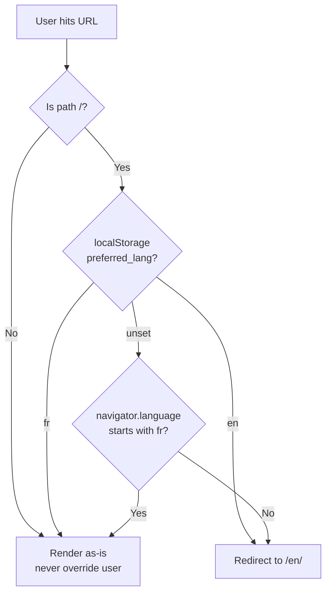

## The pattern worth stealing

Besse's three tips are pitched as "micro-features." The real throughline is more interesting: each one is a naive answer refused. The craft isn't in the code — it's in seeing why the first answer hurts a user you haven't pictured yet.

| Problem             | Naive answer                                | Why it's wrong                                                                                  | Actual fix                                                                 |
| ------------------- | ------------------------------------------- | ----------------------------------------------------------------------------------------------- | -------------------------------------------------------------------------- |
| Wrong default lang  | Redirect on `navigator.language` everywhere | Hijacks shared links; a Spanish colleague clicking a French URL ends up on the English homepage | Only redirect from `/`, and only if the user hasn't expressed a preference |
| Tiny close target   | Leave the × as the only closer              | Mobile users expect tap-outside; breaking that feels broken                                     | Document-level listener, scoped to the open state                          |
| Invisible SVG icons | Hardcode `stroke="white"`                   | Breaks the moment theming shifts                                                                | CSS variable + `currentColor` so SVGs inherit                              |

Worth holding onto: the shape of the thinking, not the snippets. "What's the naive version, and who does it fail?" is the prompt.

## Detail 1 — Language redirect that respects shared links

The rule: redirect only at the strict root, and only when no user preference exists. Anywhere else on the site, the URL wins.



The second half — clicking the language picker writes back to `localStorage` — is what makes the redirect stop being wrong over time. A user who manually chose French is never forced into English again.

```html
<script is:inline>
  if (window.location.pathname === "/") {
    const savedLang = localStorage.getItem("preferred_lang");
    if (savedLang === "en") {
      window.location.replace("/en/");
    } else if (!savedLang) {
      const browserLang = navigator.language || navigator.userLanguage;
      if (!browserLang.toLowerCase().startsWith("fr")) {
        window.location.replace("/en/");
      }
    }
  }
</script>
```

`is:inline` matters here — Astro normally bundles scripts, but a redirect needs to run before paint. Without it, the user sees the wrong language flash first.

## Detail 2 — Click-away menu, with ClientRouter's lifecycle bomb defused

The feature is boring: close the menu when the user clicks outside it. The interesting bit is the Astro footgun. With `ClientRouter` / View Transitions, scripts re-run on every navigation, and every run attaches another listener to `document`. Three pages in, one click fires the handler three times.

```javascript
const closeMenuOnClickOutside = (event) => {
  const target = event.target;
  if (
    navLinksContainer?.classList.contains("expanded") &&
    !navLinksContainer.contains(target) &&
    !newMenuToggle.contains(target)
  ) {
    newMenuToggle.setAttribute("aria-expanded", "false");
    navLinksContainer.classList.remove("expanded");
    newMenuToggle.classList.remove("open");
  }
};
// Clean up the old listener before adding a new one (thanks ClientRouter!)
document.removeEventListener("click", closeMenuOnClickOutside);
document.addEventListener("click", closeMenuOnClickOutside);
```

Two things to steal: the named handler (so `removeEventListener` actually finds it), and the pattern of always calling `removeEventListener` before `addEventListener` inside `astro:page-load`. Anonymous arrow functions can't be cleaned up — that's the mistake this avoids.

## Detail 3 — Themeable icon color in one CSS variable

One variable, `currentColor`, done:

```css
@media (max-width: 768px) {
  #menu-toggle {
    color: var(--kebab-menu-color, #ffffff);
  }
  #menu-toggle svg {
    stroke: currentColor;
  }
}
```

`currentColor` is the real move. The SVG stops caring about its own color and defers to the parent. Change one variable at the theme root, and every icon downstream follows. The fallback (`#ffffff`) keeps things alive if the variable isn't defined yet.

## Why this landed

Astro is the stack under this vault. These three patterns — redirecting only at root, cleaning listeners across `ClientRouter` navigations, using `currentColor` for themeable SVGs — are things worth stealing directly, not just reading.

The meta-lesson is the one to actually internalize, though: the difference between a site that feels respectful and one that feels hostile is usually a handful of naive-answer refusals. Nobody credits you for them, but everyone notices their absence.

## Connections

- [[semantic-related-posts-astro-transformersjs]] - Same Astro ecosystem, same author-owned static site mindset: small, surgical features rather than framework lock-in.
