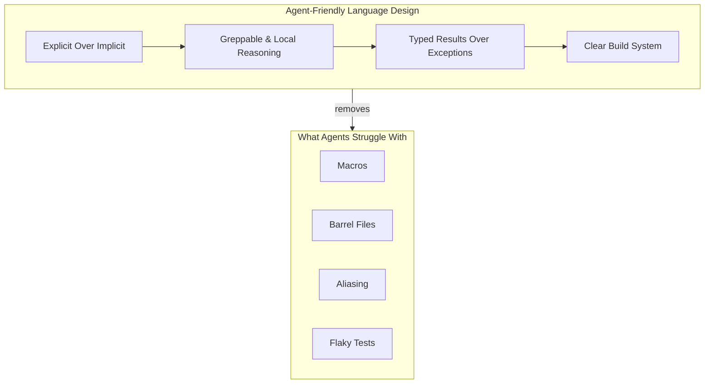

## Summary

Armin Ronacher argues that new programming languages will emerge specifically for agent programming. The economic shift is simple: code production costs dropped so dramatically that ecosystem breadth no longer trumps language design quality. Agents can port functionality between languages when needed, so developers should pick languages optimized for machine understanding.

## Key Principles for Agent-Friendly Languages

**Explicit over implicit.** Whitespace-based indentation wastes tokens and confuses agents. Braces and brackets provide clear structure. Hidden dependencies should surface through explicit markers like `needs { time, rng }` instead of lurking in global state.

**Greppability and local reasoning.** Agents rely on basic search to navigate codebases. Go's package-prefixed imports (`context.Context`) work well because they remain discoverable through simple tools. Barrel files, re-exports, and aliasing destroy this discoverability.

**Typed results over exceptions.** Agents default to broad catch-all strategies when facing exception-based error handling. Typed result systems give clearer error paths that agents can reason about mechanically.

**Build system clarity.** Dependency graphs must be explicit. Circular import bans and deterministic test caching (as Go implements) help agents understand what needs rebuilding and why.

## What Agents Struggle With

- **Macros** require understanding runtime code generation
- **Barrel files and re-exports** obscure where symbols actually live
- **Aliasing** creates ambiguity in symbol tracking
- **Flaky tests** from environmental non-determinism break agent feedback loops
- **Multi-line strings** get misinterpreted as executable code

## Visual Model



::

## Code Example

Ronacher proposes explicit effect declaration for testability:

```rust
fn issue(sub: UserId, scopes: []Scope) -> Token
    needs { time, rng }
{
    return Token{...}
}
```

The `needs` clause surfaces dependencies that would otherwise hide behind global imports, making functions easier for agents to test and reason about in isolation.

## Connections

- [[the-markdown-programming-language]] - Both explore how AI agents interact with programming languages, but from opposite ends: markdown as a language agents already understand vs. designing new languages that optimize for agent comprehension
- [[12-factor-agents]] - Shares the concern for building agent systems on solid engineering principles—Ronacher focuses on the language substrate while 12-factor addresses the application architecture layer
- [[how-to-build-a-coding-agent]] - Understanding what agents struggle with (macros, barrel files, flaky tests) directly informs what tooling and language affordances make coding agents more effective
