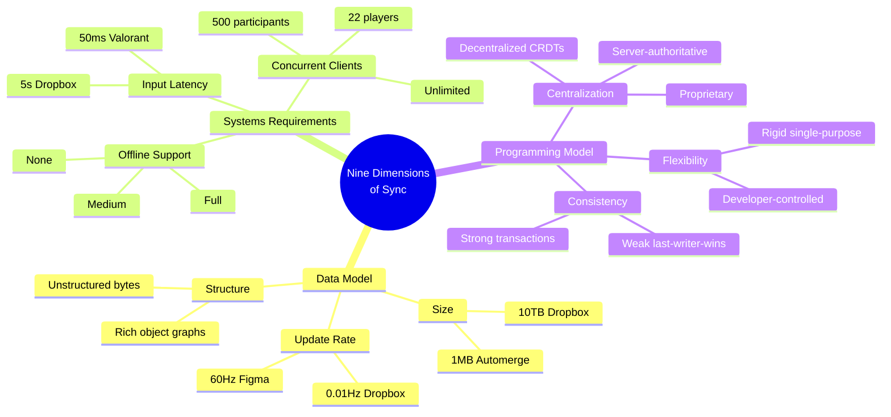

## The Problem With Sync Conversations

Every discussion about sync engines devolves into "just use CRDTs" vs "just use a server" — as if the choice were that simple. Jayakar, drawing on a decade of sync work at Dropbox, argues the real issue is that people lack a shared vocabulary for the tradeoff space. His solution: a nine-dimension taxonomy that plots any sync platform from Automerge to Valorant.

This is the cartography the sync space has been missing. Not a "which engine should I pick" guide, but a coordinate system for understanding _why_ different engines make different choices.

::

## Key Insights

1. **Three categories, nine dimensions** — The taxonomy groups into Data Model (size, update rate, structure), Systems Requirements (input latency, offline support, concurrent clients), and Programming Model (centralization, flexibility, consistency). Every sync platform occupies a unique point in this nine-dimensional space.

2. **Size determines architecture** — At ~1MB (Automerge, collaborative docs), you can keep everything in memory. At ~10TB (Dropbox), you need lazy loading and cheap storage tiers. The gap between these extremes is enormous, and most frameworks only handle one end.

3. **Update rate reveals the real product** — Figma and Valorant both push 60Hz updates. Dropbox sits at 0.01Hz. The frequency tells you what kind of experience the product is actually building — latency tolerance and update rate together define the "feel" of the sync.

4. **Structure is the underrated dimension** — Dropbox treats files as opaque bytes. Linear maintains a rich object graph with relationships between issues, teams, and workspaces. Understanding data structure determines how intelligent the sync layer can be about conflicts and queries. This maps directly to the tension I've been tracking between document-level and field-level CRDTs.

5. **No universal sync engine exists** — Each product sits at a different point in this space. Valorant needs 50ms latency but zero offline support. Dropbox tolerates 5 seconds of latency but needs massive scale. The fact that both are "sync" problems but share almost no engineering in common is the core insight.

6. **Centralization is a spectrum, not a binary** — The article positions this from fully decentralized (Automerge, local-first purists) through middle ground (Replicache's server authority with client control) to fully proprietary (Linear, Figma). Most real-world products land somewhere between, which is exactly what I argued in [[sync-engines-for-vue-developers]].

7. **Consistency is where CRDTs stumble** — CRDTs often default to last-writer-wins, which embeds a product decision (the latest write is "correct") into the data structure. Replicache's transaction-based model preserves application-level invariants. The tradeoff: CRDTs are automatic but opinionated; custom resolution is flexible but requires engineering.

## Where This Fits

Jayakar builds on Aaron Boodman's earlier three-dimension model (Boodman co-created Replicache and Zero), expanding it to nine. The framework doesn't prescribe — it illuminates. When someone says "sync is solved," this taxonomy shows exactly why it isn't. Different products have fundamentally different requirements along these nine axes, and no single engine can optimize for all of them simultaneously.

For the article I wrote on sync engines, I chose a different framing — a spectrum from server-first to local-first. Jayakar's nine dimensions are more granular and more useful for comparing specific platforms. The two framings complement each other: mine explains the philosophical divide, his explains the engineering tradeoffs within each position.

## Connections

- [[sync-engines-for-vue-developers]] — My comprehensive comparison of sync engines uses a server-first to local-first spectrum; Jayakar's nine dimensions offer a more granular map of the same territory
- [[local-first-software]] — The foundational Ink & Switch essay that Jayakar's taxonomy helps contextualize — CRDTs optimize for certain dimensions (offline, decentralization) while trading off others (consistency, flexibility)
- [[what-is-local-first-web-development]] — My introduction to local-first principles covers the "why"; Jayakar's framework covers the "how different" across the sync landscape
