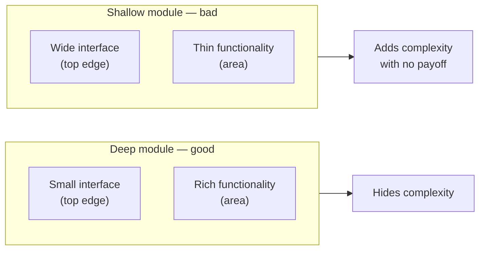
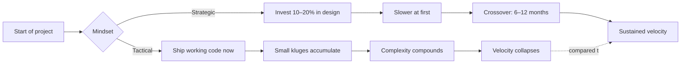

## Why This Talk Matters

This is the Google talk Ousterhout gave while the CS 190 course and the book were still fresh — before [[the-philosophy-of-software-design-with-john-ousterhout]] on Pragmatic Engineer, before [[ousterhout-martin-software-philosophies]] debated Martin. The framings are sharper here because the audience is a room of practitioners, not a podcast host, and he isn't defending against counter-arguments yet. Three things show up in this version that the later restatements soften or lose: the **rectangle model** of deep/shallow modules, the **tactical tornado** as a named anti-pattern, and the **hire for slope, not y-intercept** aphorism.

## The Rectangle Model

Draw a class as a rectangle. The top edge is the interface — what callers must learn. The area is the functionality hidden behind it. A good module maximises area per unit of edge. This is the mental picture behind [[deep-and-shallow-modules]], but the rectangle framing is tighter than the book version: you can literally eyeball whether an abstraction is earning its interface.

Unix file I/O is the canonical deep module: five functions (`open`, `close`, `read`, `write`, `lseek`) hide hundreds of thousands of lines of driver code, disk allocation, and caching. Java's I/O library is the counter-example — opening a buffered file of serialized objects takes three composed objects and layered exceptions. Same problem, opposite depth.

## Classitis

> "Classitis is when somebody says classes are good and somebody else thought what they heard was 'more classes are better.'"

The "methods and classes should be small" teaching mutates into "the more of them the better." Arbitrary line-count rules (10, 20) make it worse. Ousterhout's correction: **length is not the metric. Abstraction depth is.** A long method with a clean interface beats five short ones whose combined interface is wider than what they hide.

This is the same disease [[the-wet-codebase]] diagnoses for DRY — a useful rule ripped from its context, reflexively applied, producing over-decomposed code. Different rule, same cargo cult.

## Define Errors Out of Existence

The standard "program defensively" advice gets misread as "throw more exceptions." RAMCloud spent 90% of its development effort on crash recovery — evidence that exception handling dominates complexity at scale. Ousterhout's fix: **redesign the semantics so the error case is normal.**

Concrete moves he uses to make the point:

- **Tcl `unset`** threw when you deleted a nonexistent variable. Should have been idempotent. He admits this is his own design mistake.
- **Windows file deletion** failed on open files. **Unix** unlinks the directory entry while keeping the inode alive until the last close — two decoupled lifetimes, no error.
- **Java `String.substring`** throws on out-of-range indices. Should clip to overlap. Contrast with `charAt`, which legitimately has no non-error return value.

The chapter gets misread, and he flags it: "It's like a spice. Tiny amounts improve the cooking; too much and you end up with a mess." Students ship servers with no error checking and claim they defined the errors away. They didn't. They ignored them. The chapter is about _redesign_, not _omission_.

## Tactical vs Strategic Programming

Complexity isn't one bad decision — it's thousands of small ones made by many people. That's why tactical programming feels fine in the moment and disastrous in retrospect. The strategic mindset treats "great design" as the primary goal and accepts a 10–20% short-term slowdown to avoid the compounding. Crossover is 6–12 months.

The named anti-pattern is the **tactical tornado**: a prolific producer of 80%-working shoddy code, often rewarded by management as a hero, leaving a wake of destruction behind them. The value of the name is that it gives teams a thing to point at. You can't critique a pattern you haven't named.

Facebook's "move fast and break things" is the poster child of tactical culture (walked back by Zuckerberg himself to "move fast with stable infrastructure"). Google and VMware circa 2000–2010 are held up as strategic exemplars — the quiet payoff being that great design culture attracts the best programmers.

## Hire for Slope, Not Y-Intercept

> "Someone who has done exactly the target job five times has likely plateaued. Hire for slope."

Y-intercept is prior-role pattern match. Slope is learning rate. Ousterhout's own best interview correlate: interviews he personally enjoyed — and he immediately flags the diversity risk ("you just hire people like yourself"). The honesty about not knowing whether his own heuristic is good is the point. Hiring signal is weak; the humility is the strength.

## Design Is Teachable

The quiet load-bearing argument is that none of this is innate. Colvin's _Talent Is Overrated_ is the citation: across fields we label as "talent," practice is the only consistent correlate of top performance. That's why Stanford's CS 190 exists and why this talk exists. The frustration under the whole delivery is that problem decomposition is the single most important idea in CS (his answer; Knuth said "layers of abstraction") and no course anywhere centers it. When he retires at the end of 2026, nobody has picked up the course.

## Notable Quotes

> "People have been programming computers for more than 80 years now. And yet software design is still basically a black art."
> — John Ousterhout

> "Working code is not enough. That can't be the only goal. It's sort of table stakes."
> — John Ousterhout

> "Complexity isn't one mistake you make. It's hundreds or thousands of mistakes made by many people over a period of time."
> — John Ousterhout

> "The best case of all — which I found you can do surprisingly often — is simply to redefine the semantics, so that there is no error."
> — John Ousterhout

> "A lot of software design, I think, is figuring out what matters and what doesn't matter. And ideally, you'd like to make as little matter as possible."
> — John Ousterhout

> "You should hire for slope, not y-intercept."
> — John Ousterhout

## Why I Care

The tactical/strategic split is the framing I wish I'd had five years ago. Most "should we clean this up or ship it" arguments I've been in are really this argument with different names — "pragmatic vs perfectionist," "MVP vs platform," "bias to action vs over-engineering." None of those framings carry the key insight: the tactical mindset doesn't feel wrong in the moment, because each individual shortcut is small. Ousterhout's "hundreds or thousands of mistakes by many people over time" is the only framing that explains why smart engineers collectively build codebases they all hate.

The **tactical tornado** is the second thing that sticks. I've worked with this person. Everybody has. What I didn't have was a name for it that wasn't hostile. Naming the pattern is what lets a team say "this PR is tactical-tornado shaped" without attacking the author. Compare this to [[the-wet-codebase]] — Abramov is doing the same move at the pattern level (naming WET as a counter to DRY). Naming is the lever.

The rectangle model is the clearest teaching I've seen for deep modules. I've linked people to [[deep-and-shallow-modules]] to make the same point and it doesn't land the same way, because the article leads with definitions and the talk leads with the picture. Next time I'm arguing a PR where someone split a useful function into three shallow helpers, I'll send this clip.

One thing this talk doesn't have, which the later [[the-philosophy-of-software-design-with-john-ousterhout]] does: the AI framing. The design-vs-typing-speed argument Ousterhout makes in 2026 isn't here. Worth reading these two together — this talk for the framework, the Pragmatic Engineer episode for what happens to the framework when LLMs eat the low-level work.

## Connections

- [[the-philosophy-of-software-design-with-john-ousterhout]] — Same speaker, same core ideas, eight years later with an AI frame added. This Google talk is the unamended origin; the podcast is the updated edition. Read them in that order.
- [[ousterhout-martin-software-philosophies]] — Where Ousterhout's positions here get tested against Martin's. The Clean Code small-methods rule is exactly what Ousterhout calls "classitis." This talk names the disease; the debate shows how far the authors will actually move on it.
- [[deep-and-shallow-modules]] — Zdražil's article is the book-chapter version of the rectangle model. Read the talk for the mental picture, the article for the TypeScript example that makes it concrete.
- [[the-wet-codebase]] — Abramov's anti-DRY argument is the same shape as Ousterhout's anti-classitis argument: a useful rule, reflexively applied, producing entangled code. "Inline on the third case" (Abramov) and "combine to make it deeper" (Ousterhout) are the same move.
- [[tidy-first]] — Beck's economic framing adds the missing axis this talk doesn't cover: _when_ to invest. Ousterhout's 10–20% figure is the what; Beck is the when.
