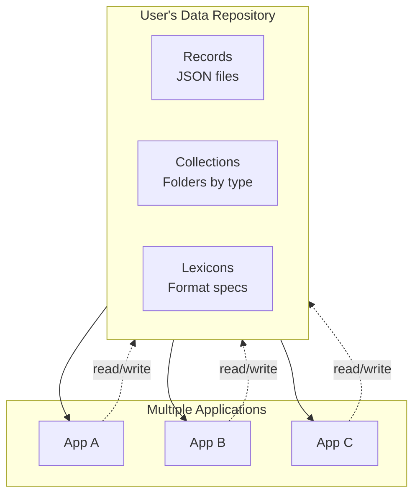

## Summary

Dan Abramov proposes applying the personal computing concept of files to social media. Traditional files belong to users, not applications—you can create a document in one app, open it in another, and never lose access when software changes. Social platforms violate this principle by trapping user data within their walls. The AT Protocol (powering Bluesky) demonstrates a working alternative: user data as portable records that any app can read and write.

## Key Points

- **Files enable portability** — Users can switch word processors without losing documents. Social apps offer no such freedom: Instagram follows, Reddit posts, and TikTok videos remain locked to their platforms.

- **Records replace files** — AT Protocol stores social data as JSON "records" organized in collections. Each record has a timestamp-based ID ensuring chronological order without collision.

- **Namespacing prevents chaos** — Collections use reverse-domain notation (e.g., `com.twitter.post`, `io.letterboxd.review`) so different apps can define their own data formats without conflict.

- **Lexicons define structure** — Schemas specify what records look like, similar to file format specifications. Apps validate records on read and ignore invalid ones—just like apps handle corrupted files.

- **Validation over trust** — Apps treat all records as untrusted input. This mirrors how traditional apps handle user files without assuming correctness.

- **Breaking changes through versioning** — Instead of mutating formats, developers publish new lexicon versions. Old records remain valid under old schemas.

## Visual Model

::

## Connections

- [[local-first-software]] — Both advocate for user ownership over platform control, though local-first focuses on device storage while the social filesystem focuses on portable cloud records
