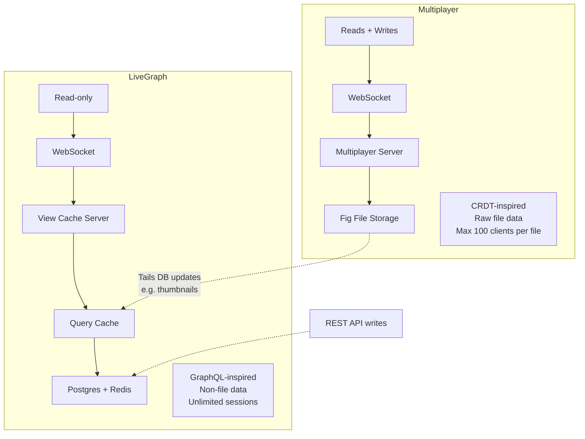

## Overview

Figma doesn't have one sync engine — it has two. Multiplayer handles the canvas (CRDT-inspired, read-write, file-scoped), while LiveGraph handles everything else (GraphQL-inspired, read-only, backed by Postgres and Redis). Arushi Bandi, who works on LiveGraph, walks through why they needed both, what broke as they scaled into the millions of daily users, and how the architecture is evolving from stateful mutation chains to stateless invalidation layers.

The interesting tension: Multiplayer scaled linearly with users. LiveGraph didn't — because it allows arbitrary computations over backend data, and those computations are the scaling bottleneck.

## Key Arguments

### Not everything can be a CRDT

The reflex is "just model everything as a CRDT." Figma tried and learned where that breaks:

- **Ephemeral state** like active file users — persisting session-scoped data in a CRDT document is wasteful
- **Derived immutable state** like library publishing — designers publish a snapshot of a component, other files consume that snapshot, not a live-updating stream
- **Server-driven data** like notifications — no collaborative editing happening, the server is the single source of truth

LiveGraph exists because product engineers shouldn't have to build bespoke sync for each of these use cases. The thesis: focus on features, not data plumbing.

### Transforms are the original sin

Multiplayer syncs raw data — what clients see is what the server stores. LiveGraph does not. It runs transforms, computations, and permission checks between the database and the client. Scaling Multiplayer was proportional to user growth. Scaling LiveGraph was driven by computation growth — arbitrary business logic, refetching, derived views.

This also makes consistency hard. If a query feeds both a raw view and a computed view, an update should hit both at the same time. But computations take time, fetch more data, and can't easily guarantee atomicity.

::

### Scale directly informs design

LiveGraph started when Figma ran on a single Postgres instance — the biggest Amazon RDS offered. Because querying that database on every update was too risky, the original architecture never re-queries. Instead, it sends minimal diffs at every layer: database row mutations → query cache mutations → server view mutations → client state mutations.

This made the client and server isomorphic (shared code, fast iteration) but deeply stateful. If any layer drops mid-stream, you can't safely replay. Mutations can't be reordered. A server crash means refilling state from scratch, causing thundering herd on the database.

Now that Figma has sharded databases with replicas, they're migrating to stateless invalidation: the database sends query invalidations, the query cache sends view invalidations, and each layer rebuilds fresh. The client stays stateful, but every backend layer is stateless and independently scalable.

### As you scale, initial load beats live updates

Counterintuitive shift: as Figma's user base grew, the percentage of traffic that actually needs live-updating data decreased. More users are viewers, not editors. Product engineers adopted LiveGraph for features that don't actually need real-time sync — they used it because the DX was good, not because live updates were required.

This led to a new architectural idea: split initial load (HTTP) from update subscription (WebSocket). Whale users who fetch huge views no longer overload the WebSocket servers. And in incidents, you can kill updates but still serve core functionality — graceful degradation.

## Notable Quotes

> "Product engineers should be able to focus on feature development, not data sync — and especially not bespoke data sync for each of their use cases."
> — Arushi Bandi

> "Computations — some people say it was the original sin of LiveGraph."
> — Arushi Bandi, on allowing arbitrary transforms in the sync path

## Practical Takeaways

- One sync engine doesn't fit all — different data patterns (collaborative editing, derived state, ephemeral state, server-authoritative) need different sync primitives
- Stateful, mutation-based sync architectures are fast to build but brutal to scale — stateless invalidation trades isomorphism for operability
- Multiplayer is implemented in Rust (migrated from TypeScript), LiveGraph is migrating from TypeScript to Go — language choice follows performance demands at scale
- Cursor-based reconnection solves thundering herd on deploys — clients send their last cursor position and only rebuild what changed

## Connections

- [[a-map-of-sync]] — Bandi's talk is a concrete case study of what that map describes abstractly: different data types landing in different quadrants of the sync design space
- [[crdts-solved-conflicts-not-sync]] — Figma's Multiplayer is explicitly "CRDT-inspired but not a true CRDT" because centralization is faster — the exact point this note makes about CRDTs being a substrate, not a complete solution
- [[sync-engines-for-vue-developers]] — LiveGraph's `useSubscription` hook mirrors the reactive subscription patterns described here, but at a much larger scale with server-side query caches
- [[can-sync-be-network-optional]] — Bandi's statement that "centralization is faster" echoes the formal argument made in this talk about the physics of sync
