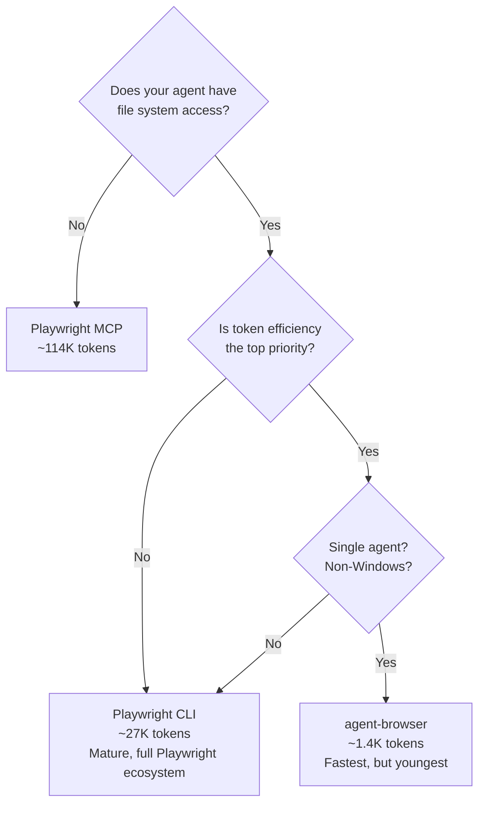

## The Problem

AI agents need to drive browsers, but the tools were built for humans writing test scripts. LLMs can't see pixels, CSS selectors break on DOM changes, and piping full accessibility trees into context burns tokens fast. Three tools now compete for this space: **Playwright MCP**, **Playwright CLI**, and **agent-browser**.

## Comparison

### Playwright MCP

The original integration path. MCP pipes accessibility snapshots and screenshot bytes directly into the LLM context window as tool-call responses. A single page snapshot can add tens of thousands of tokens.

- **Token cost:** ~114K tokens for a standard browser task ([[playwright-cli-vs-mcp]])
- **Strengths:** Works with any agent (no file system access needed), strict MCP standard, multi-browser support
- **Weaknesses:** Context fills with data the LLM never needed to reason about; MCP limits its default toolset to avoid context bloat
- **Best for:** Generic agentic loops without file system access, one-off exploratory debugging ([[claude-code-with-playwright]])

### Playwright CLI

A file-first alternative designed for coding agents. Every output — snapshots, screenshots, page content — gets written to disk. The agent decides what to read.

- **Token cost:** ~26.8K tokens for the same task — **4x reduction** over MCP ([[playwright-cli-vs-mcp]])
- **Strengths:** All commands ship enabled (no toolset trimming), headless by default, skill-based extensibility, deep integration with Claude Code and Copilot
- **Weaknesses:** Requires file system access, still uses Playwright's locator model (CSS selectors, role-based locators), Node.js runtime dependency
- **Best for:** Coding agents with disk access — Claude Code, Copilot, custom agents ([[my-4-layer-agentic-browser-automation-stack]])

### agent-browser

A native Rust CLI built from scratch for LLM tool-calling. Exposes the browser's accessibility tree as a snapshot with stable element refs (`@e1`, `@e2`, ...). An agent picks a ref and issues a shell command — no API knowledge required.

- **Token cost:** ~1,400 tokens per equivalent task (benchmarked at ~5.7x fewer than Playwright MCP)
- **Strengths:** Stable element refs survive DOM mutations, near-instant Rust startup, batch execution in single process invocation, built-in `chat` mode for natural language control, no Playwright API knowledge needed
- **Weaknesses:** Young project (~3 months), broken Windows support, multi-agent sessions can hijack each other's browser state (GitHub issue #326), still uses a Node.js daemon under the hood despite Rust branding ([[agent-browser]])
- **Best for:** Single-agent browser automation where token efficiency is critical and the agent communicates via shell commands

## Decision Framework

## Key Insight: CLI-First Beats Library-First for Agents

The browser automation space is splitting into two camps: **library-first** (Playwright, Puppeteer — designed for programmatic use) and **CLI-first** (agent-browser — designed for LLM tool-calling). Every coding agent already knows how to run shell commands. No SDK integration, no language bindings, no async runtime.

[[my-4-layer-agentic-browser-automation-stack]] reinforces this: "MCP servers chew tokens and lock you into their opinion. CLIs are cheaper, more flexible, and let you build your own opinionated layer on top."

## Where Playwright Still Wins

Playwright's **test agents** ([[playwright-test-agents]]) — planner, generator, healer — are purpose-built for test generation with self-healing loops. agent-browser is a better automation primitive, but lacks that test-specific orchestration. For multi-agent test pipelines like [[claude-code-with-playwright]], Playwright's ecosystem depth still matters.

## Caveats and Open Questions

- agent-browser's "No Node.js required" claim is misleading — a Node.js daemon manages the Playwright browser instance under the hood. The Rust binary is the CLI layer only.
- No head-to-head benchmarks exist comparing agent-browser directly to Playwright CLI (the 4x figure is CLI vs MCP; the 5.7x figure is agent-browser vs MCP from different benchmarks).
- agent-browser's multi-agent story is unresolved — concurrent sessions cause state conflicts.
- Playwright CLI's claim of "more capabilities than MCP" is widely repeated but unconfirmed in first-party docs.

## Connections

- [[agent-browser]] — Source wiki page for agent-browser features and architecture
- [[playwright-cli-vs-mcp]] — Detailed token efficiency comparison between CLI and MCP
- [[my-4-layer-agentic-browser-automation-stack]] — The 4-layer agent stack philosophy: CLIs over MCP servers
- [[playwright-test-agents]] — Playwright's first-party test agent pipeline
- [[claude-code-with-playwright]] — Real-world 4-agent test pipeline showing MCP vs CLI token costs
- [[context-efficient-backpressure]] — The broader principle: keep data out of LLM context until needed
