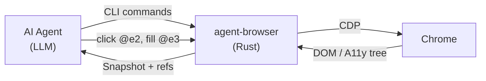

## Overview

The core problem with AI-driven browser automation: LLMs can't see pixels, and CSS selectors are brittle. agent-browser solves both by exposing the browser's accessibility tree as a snapshot with stable element refs (`@e1`, `@e2`, ...). An agent reads the snapshot, picks a ref, and issues a CLI command. No Playwright API knowledge. No Node.js runtime. Just shell commands a coding agent already knows how to run.

The CLI binary is built in Rust, so startup is near-instant — critical when an agent fires hundreds of commands per session. Under the hood, a persistent Node.js daemon still manages the Playwright browser instance; the "no Node.js required" framing applies only to the CLI binary itself. Chrome connects via CDP, and the daemon auto-detects existing Chrome, Brave, Playwright, or Puppeteer installations.



## Key Features

- **Accessibility-tree snapshots.** `agent-browser snapshot` returns a structured tree with element refs. The agent picks `@e2` and clicks — no guessing at selectors, no DOM fragility.
- **Annotated screenshots.** `--annotate` overlays numbered labels on the screenshot, bridging vision models with actionable refs.
- **Batch execution.** `agent-browser batch "open url" "snapshot" "click @e1"` runs multi-step workflows in a single process invocation — cuts overhead for agent loops.
- **Built-in AI chat mode.** `agent-browser chat "fill the login form"` lets the tool itself act as a natural-language browser agent, not just a command executor.
- **Network interception.** Route, block, or mock requests without touching code — useful for testing agents against controlled API responses.
- **Native Rust binary.** No Node.js daemon, no JVM. Installs via npm, Homebrew, or Cargo.

## Code Snippets

### Installation

```bash
npm install -g agent-browser
agent-browser install  # downloads Chrome for Testing
```

### The Agent Loop

```bash
agent-browser open example.com
agent-browser snapshot                    # get accessibility tree with refs
agent-browser click @e2                   # click by ref
agent-browser fill @e3 "test@example.com" # fill by ref
agent-browser screenshot page.png        # visual verification
agent-browser close
```

### Semantic Locators

```bash
agent-browser find role button click --name "Submit"
agent-browser find label "Email" fill "user@test.com"
agent-browser find text "Sign In" click
```

## Why This Matters

The browser automation space for AI agents is splitting into two camps: **library-first** (Playwright, Puppeteer — designed for programmatic use) and **CLI-first** (agent-browser — designed for LLM tool-calling). The CLI approach has a structural advantage: every coding agent already knows how to run shell commands. No SDK integration, no language bindings, no async runtime — just `agent-browser click @e2`.

28K+ stars suggest the ecosystem agrees. The ref-based interaction model (`@e1`, `@e2`) is particularly clever — it gives the LLM a stable handle that survives DOM mutations, which is exactly the failure mode that kills selector-based approaches.

## Connections

- [[playwright-test-agents]] — Playwright's first-party test agents solve a similar problem from the testing side, but require the Playwright API. agent-browser is the pure-CLI alternative that any agent framework can call.
- [[claude-code-with-playwright]] — The 4-agent testing pipeline uses Playwright underneath. agent-browser could replace the automation layer entirely, since the agents already communicate through files and shell commands.
- [[how-to-use-playwright-skills-for-agentic-testing]] — Playwright CLI skills drop skill files into `.claude/` or `.goose/` for agent-driven testing. agent-browser takes the same CLI-for-agents philosophy but builds it from scratch in Rust instead of wrapping Playwright.
- [[fastrender-building-a-browser-with-thousands-of-ai-agents]] — Also Rust, also browser + AI agents, but opposite direction: FastRender builds a browser engine with agents, while agent-browser automates existing browsers for agents.
- [[agent-browser-vs-playwright-for-ai-agents]] — Synthesis comparing agent-browser, Playwright CLI, and Playwright MCP with verified benchmarks and a decision framework.
