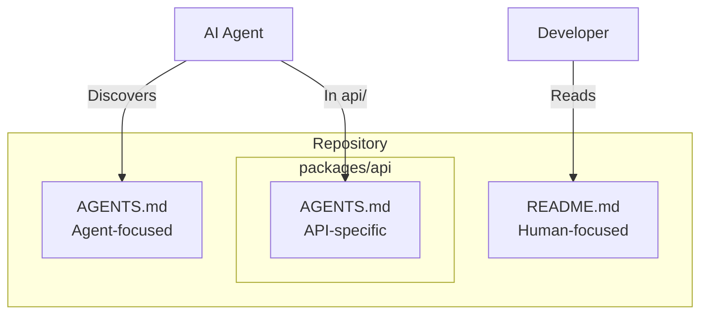

## Key Insight

While README files serve human contributors with quick starts and project descriptions, AI coding agents need different information: build steps, testing procedures, code conventions, and architectural context. AGENTS.md creates a dedicated location for this agent-specific guidance, adopted by over 60,000 open-source projects.

## How It Works

AGENTS.md uses standard markdown with no required fields. Place it at your repository root, and AI agents will discover and follow its instructions. Monorepos can include nested AGENTS.md files in subdirectories—the nearest file takes precedence.

::

## Supported Agents

The format is recognized by major AI coding tools including OpenAI Codex, Google Jules, Cursor, VS Code, GitHub Copilot, Devin, and Aider—over 25 platforms in total.

## Common Sections

- Project overview and architecture
- Build and test commands
- Code style guidelines
- Testing instructions
- Security considerations
- PR guidelines

## Connections

- [[writing-a-good-claude-md]] - Claude Code's CLAUDE.md file follows the same principle of dedicated agent configuration, though currently limited to Claude
- [[context-engineering-guide]] - AGENTS.md is a form of context engineering—structuring information specifically for AI consumption
- [[12-factor-agents]] - The specification aligns with factor #1: use natural language over DSLs for agent instructions
