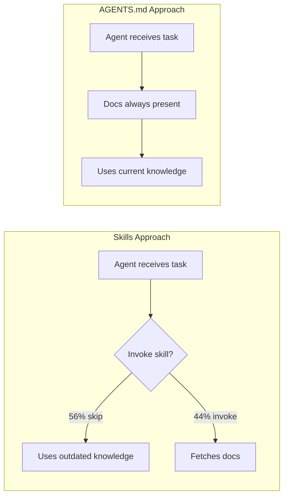

## Key Findings

Vercel tested how to best teach AI coding agents Next.js 16 APIs. The results were decisive:

| Approach                          | Pass Rate |
| --------------------------------- | --------- |
| No docs (baseline)                | 53%       |
| Skills (default)                  | 53%       |
| Skills with explicit instructions | 79%       |
| AGENTS.md docs index              | **100%**  |

Skills failed to be invoked in 56% of eval cases, even when available. Different instruction wordings produced dramatically different results—a fragility problem.

## Why Passive Context Wins

Three factors explain why embedded documentation outperforms skills:

1. **No decision point required** — information stays available without the agent needing to decide to fetch it
2. **Consistent availability** — present in every turn's system prompt
3. **No sequencing complications** — avoids the "explore first vs invoke first" dilemma



::

## Implementation

Vercel compressed 40KB of documentation into an 8KB index using pipe-delimited formatting:

```text
[Next.js Docs Index]|root: ./.next-docs
|IMPORTANT: Prefer retrieval-led reasoning over pre-training-led reasoning
```

An 80% size reduction while maintaining 100% eval performance.

### Quick Setup

```bash
npx @next/codemod@canary agents-md
```

This detects your Next.js version, downloads matching documentation to `.next-docs/`, and injects the compressed index into `AGENTS.md`.

## Implications

The research suggests framework maintainers should provide `AGENTS.md` snippets rather than waiting for skill-based approaches to mature. For developers using AI coding tools, passive context currently delivers more reliable results than relying on agent tool invocation.

## Connections

- [[agents-md-open-standard-for-ai-coding-agents]] — Vercel's findings provide empirical validation for the AGENTS.md standard, showing 100% success vs 53% baseline without agent instructions
- [[context-engineering-guide]] — Demonstrates a key context engineering principle: reducing agent decision points improves reliability
