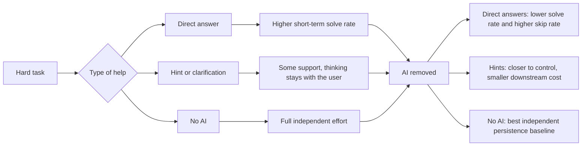

## Core Argument

This paper makes a sharper claim than the usual "AI might deskill us" hand-wringing. The problem is not AI assistance in the abstract. The problem is assistance shaped like instant completion. When a system keeps collapsing hard tasks into immediate answers, people stop building the tolerance for friction that learning depends on.

That lands for coding too. If the model becomes an answer vending machine, you can feel productive while quietly outsourcing the exact struggle that builds taste, debugging instincts, and independent judgment. The useful takeaway is not "don't use AI." It is "stop using AI in ways that remove the work your brain still needs to do."

## What They Tested

- Three randomized controlled experiments with 1,222 participants.
- Two fraction-solving studies and one reading-comprehension study.
- GPT-5 was available during a short learning phase, then removed without warning for a final independent test.
- Persistence was measured with a skip button. In the reading study, sub-5-second responses also counted as disengagement.

## What Actually Matters

- **Short-term gains were real.** People solved more during the assisted phase.
- **Independent performance dropped when the AI disappeared.** That replicated across both math and reading tasks.
- **Persistence dropped too.** People with prior AI access were more likely to skip once they had to work alone.
- **The strongest damage came from asking for direct answers.** In Experiment 2, people who used AI mainly for direct solutions performed worst at test time and skipped most often.
- **Hints looked different.** The paper's most actionable result is that hint-seeking users were much closer to the control group than answer-seeking users.

## Why I Care

This is the first paper I've seen that gives a clean causal version of a feeling many developers already have: AI can make you faster today while making you weaker tomorrow. That risk matters most in domains where the visible output hides the invisible skill-building underneath.

The coding version is obvious. If you use Claude Code or Copilot to escape every moment of confusion, you may ship more in the short run while training less of the judgment you need when the model is wrong, missing context, or unavailable. The paper doesn't argue for abstinence. It argues for scaffolding over substitution.

## Notable Details

- The paper is a preprint, under review, and reports version `v2` dated 2026-04-07.
- Experiment 1 found a lower independent solve rate and higher skip rate after AI removal.
- Experiment 3 replicated the effect in reading comprehension, which makes the result harder to dismiss as a math-only artifact.
- The authors frame current assistants as "short-sighted collaborators" because they optimize immediate helpfulness rather than long-term autonomy.

## Connections

- [[deliberate-intentional-practice-with-ai]] - Geoffrey Huntley argues AI skill comes from practice. This paper adds the missing constraint: the practice only compounds when AI behaves like a sparring partner, not an answer dispenser.
- [[ai-is-a-high-pass-filter-for-software]] - Bryan Finster says AI amplifies existing fundamentals. This paper gives one concrete mechanism for that divergence: direct-answer usage weakens the very persistence and judgment strong practitioners rely on.
- [[anthropic-economic-index-primitives]] - Anthropic flags deskilling as a macro labor-market risk. This paper shows the micro-level pathway: short-term helpfulness can erode motivation and independent capability after surprisingly little exposure.
