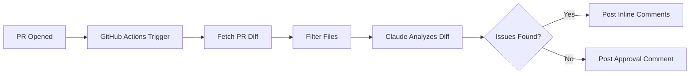

## Summary

The pitch is simple: PRs sit waiting for reviewers while obvious bugs collect dust. An AI reviewer won't replace humans, but it catches the low-hanging fruit — bugs, security holes, missing error handling — before anyone has to context-switch into review mode. Vadim walks through a complete implementation: a TypeScript script that fetches the PR diff via Octokit, sends it to Claude Sonnet, parses the response into inline review comments, and posts them back on the PR.

The interesting part isn't the code (it's ~150 lines of straightforward API glue). It's the operational lessons from running this on a real repo.

## Key Points

- **Diff-only review is enough.** Sending the entire repo context alongside the diff sounds better in theory, but in practice it makes reviews slower and more expensive without meaningful quality improvement. The diff alone catches most bugs.

- **The prompt's exclusion list matters more than its inclusion list.** Without explicit "do NOT comment on" instructions, Claude nitpicks style and naming until the team starts ignoring the bot entirely. The negative constraints are what make it usable.

- **Handle the silent case.** When the bot finds nothing wrong, it should say so. Early versions that stayed silent on clean PRs made people think the bot was broken. An explicit "looks good" comment confirms it ran.

- **File filtering slashes costs.** Lock files and generated code can balloon a diff from 2k to 50k tokens. A simple regex-based filter keeps costs at ~$0.01 per review — about $1/month for 100 PRs.

- **The permissions gotcha is real.** `pull-requests: write` in the GitHub Actions permissions block is required for posting review comments. Without it, you get a cryptic 403 and no helpful error message.



## Code Snippets

### Core review function

The Claude prompt is structured to return a JSON array of inline comments, each tied to a specific file and line number.

```typescript
async function reviewWithClaude(diff: string, files: string[]): Promise<ReviewComment[]> {
  const response = await anthropic.messages.create({
    model: "claude-sonnet-4-5-20250929",
    max_tokens: 4096,
    messages: [
      {
        role: "user",
        content: `You are a senior code reviewer...
Focus on: Bugs, security vulnerabilities, performance, error handling, type safety
Do NOT comment on: Formatting, minor naming, intentional design choices
Respond ONLY with the JSON array, no other text.`,
      },
    ],
  });
  const text = response.content[0].type === "text" ? response.content[0].text : "";
  const jsonMatch = text.match(/\[[\s\S]*\]/);
  if (!jsonMatch) return [];
  return JSON.parse(jsonMatch[0]) as ReviewComment[];
}
```

### File filtering

Skip lock files, minified assets, and generated code to keep token costs down.

```typescript
const SKIP_PATTERNS = [
  /package-lock\.json$/,
  /pnpm-lock\.yaml$/,
  /yarn\.lock$/,
  /\.min\.(js|css)$/,
  /\.generated\./,
  /\/dist\//,
  /\/\.next\//,
];

function shouldReviewFile(filename: string): boolean {
  return !SKIP_PATTERNS.some((pattern) => pattern.test(filename));
}
```

## Connections

- [[github-actions-complete-guide]] — Covers the GitHub Actions fundamentals (events, runners, permissions) that this bot relies on, including the permissions block gotcha Vadim mentions
- [[hardening-github-actions]] — The security angle: if you're giving a bot write access to PRs and piping secrets through CI, the hardening patterns from this guide apply directly
- [[optimizing-github-actions-workflows-for-speed]] — The file filtering and token optimization here is the AI equivalent of the caching and parallelization patterns for faster CI
