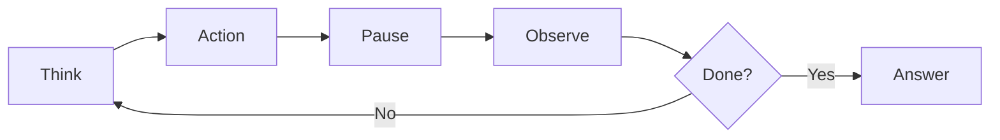

## Overview

Alex Shershebnev walks through building AI coding agents from scratch, demonstrating the progression from baseline LLM interactions to multi-agent collaboration. The talk includes live coding that builds increasingly sophisticated agents, culminating in a team of virtual developers creating a conference website.

## Key Arguments

### Current Assistants Fall Short

Today's coding assistants generate code quickly but create downstream problems. Research shows code churn has doubled with AI assistance. The root causes:

- LLMs trained on open-source data prefer popular frameworks over your internal ones
- Models lack knowledge of your specific codebase and environment
- Generated code can't be executed or verified before delivery
- 70% of developer time goes to understanding, not writing code

### The ReAct Pattern Powers Agents

Every coding agent follows the ReAct (Reason + Act) framework:

::

The LLM reasons about the task, chooses a tool, waits for execution, observes results, then loops until it has enough information to answer.

### Three Essential Tools

A functional agent needs surprisingly few primitives:

1. **Ping/Network** - Check service availability
2. **Bash** - Execute local commands
3. **Web Search** - Fetch current information

With these three tools, an LLM transforms from a static knowledge base to a grounded system that can verify information against reality.

### MCP Standardizes Tool Integration

The Model Context Protocol (MCP) from Anthropic provides a standard interface for connecting LLMs to tools. Instead of manually coding each integration:

- Define tools as JSON schemas
- Expose them through MCP servers
- Clients (like Claude) discover and call them automatically

MCP servers can access local resources (file system, Docker) or remote APIs (Jira, GitHub). Community-built servers handle common integrations out of the box.

### Multi-Agent Collaboration Scales

Complex tasks benefit from specialized agents working together. The demo shows a supervisor managing:

- **Front-end developer** - Creates React components with Tailwind
- **Back-end developer** - Builds FastAPI endpoints
- **DevOps engineer** - Handles Docker deployment

Each agent has access to different tools and can request clarification from humans. The supervisor routes tasks and synthesizes results.

## Notable Quotes

> "70% of the time developers spend on understanding what the hell is going on. Only 5% is actually editing the code."

> "We are building tools not just to replace developers but instead make you more efficient. Developers will become more like managers of those agents."

> "There's a chicken-and-egg problem: you need senior developers to review AI code, but if AI replaces juniors and mid-levels, where do seniors come from?"

## Practical Takeaways

- Start with the ReAct pattern and three basic tools before adding complexity
- Use MCP to standardize tool integration rather than building custom connectors
- LangChain and LangGraph provide abstractions for multi-agent orchestration
- Set recursion limits to control costs—agents can loop indefinitely
- The real value comes from context retrieval and grounding, not just generation

## Connections

- [[building-effective-agents]] - Anthropic's official guide emphasizes the same simplicity-first philosophy and composable patterns
- [[how-to-build-a-coding-agent]] - Geoffrey Huntley's workshop covers the same core primitives (Read, List, Bash, Edit, Search) in a 300-line implementation
- [[agentic-design-patterns]] - Expands on the ReAct pattern with 21 production-ready design patterns including multi-agent collaboration
