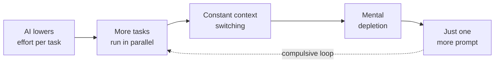

## Summary

Willison highlights research by Aruna Ranganathan and Xingqi Maggie Ye, who studied 200 employees at a U.S. technology company from April to December 2025. The finding: AI tools don't lighten workloads. They intensify them. Workers complete tasks manually while running AI alternatives in parallel, revive previously shelved projects because AI can "handle them," and fall into compulsive task-stacking loops that burn them out.

## Key Points

- **Parallel work illusion** — Employees run manual work alongside AI-generated alternatives, creating the feeling of a productive "partner" while actually multiplying context switches and open tasks.
- **Zombie tasks return** — Previously deprioritized work gets resurrected because AI lowers the perceived effort to tackle it. The backlog grows instead of shrinking.
- **Compulsive continuation** — The low cost of "just one more prompt" erodes boundaries between work and rest, leading to sleep deprivation and mental depletion.
- **Organizational blindness** — Companies see throughput numbers climb and assume genuine productivity gains. The burnout underneath stays invisible until people break.
- **Discipline required** — Sustainable AI use demands deliberate rebalancing of work practices. The tool won't impose limits — the human must.

## Intensification Cycle

::

## Connections

- [[ai-is-a-high-pass-filter-for-software]] — Finster frames AI as an amplifier of existing capability; this article reveals the human cost of that amplification — intensified work rhythms that erode sustainability
- [[some-software-devs-are-ngmi]] — Huntley argues AI adopters gain massive productivity advantages, but this research surfaces the dark side of that adoption: compulsive task-stacking and burnout disguised as throughput
