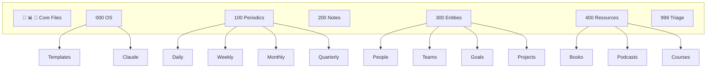

## Summary

This guide establishes a comprehensive Obsidian vault structure that functions as a "holistic life operating system." The system combines numeric folder prefixes for sidebar organization, structured templates for daily through quarterly reflection, entity-based notes for people and projects, and deep Claude Code integration for pattern analysis and automation.

## Vault Architecture

The folder structure uses numeric prefixes to control sidebar ordering:



::

**Key design decisions:**

- Emoji files (🌟, 📊, 🔗) sort first as core strategic documents
- **000 series:** Operating system components (templates, Claude configuration)
- **100 series:** Time-based periodics (daily, weekly, monthly, quarterly)
- **200 series:** Notes, writing, and AI session logs
- **300 series:** Entity types (people, teams, goals, projects, events)
- **400 series:** Resource collections (books, podcasts, courses)
- **999 series:** Triage inbox for unclassified content

## Tag Taxonomy

Three specialized tag namespaces enable pattern detection across notes:

**Self-insight tags** capture personal patterns:

- `#insight/pattern` — recurring behavioral patterns
- `#insight/trigger` — emotional reaction catalysts
- `#insight/energy` — energizing vs. draining activities
- `#insight/win` and `#insight/lesson` — achievements and learnings

**People interaction tags** track relational dynamics:

- `#people/feedback-given` and `#people/feedback-got`
- `#people/conflict`, `#people/connection`, `#people/idea`

**AI experimentation tags** document tool learnings:

- `#ai/prompt` — prompt engineering discoveries
- `#ai/agent` — multi-step workflow patterns
- `#ai/limitation` and `#ai/surprise` — capability boundaries

## Code Snippets

### Automated Week Setup Script

A Bun-based TypeScript utility generates weekly and daily notes with bidirectional linking.

```typescript
// 000 OS/Claude/scripts/setup-week.ts
// Calculates ISO week dates, creates weekly note with navigation,
// generates five daily notes (Mon-Fri) with backlinks
// Invoked via: bun run 000\ OS/Claude/scripts/setup-week.ts [optional-date]
```

### Dataview Action Items Query

Aggregates open action items across all notes.

```dataview
TASK
FROM "100 Periodics" OR "300 Entities"
WHERE !completed
SORT file.mtime DESC
```

## Essential Plugins

- **Dataview** — Powers dynamic queries and rollups across notes
- **Periodic Notes** — Creates date-formatted notes with templates
- **QuickAdd** — Rapid timestamped capture to daily inbox
- **Metadata Menu** — Frontmatter field management

## Connections

- [[teaching-claude-code-my-obsidian-vault]] — Similar approach using CLAUDE.md for vault context, with Spotlight integration for PDF search
- [[obsidian-claude-code-workflows]] — Community patterns for Claude + Obsidian including master context files and batch operations
