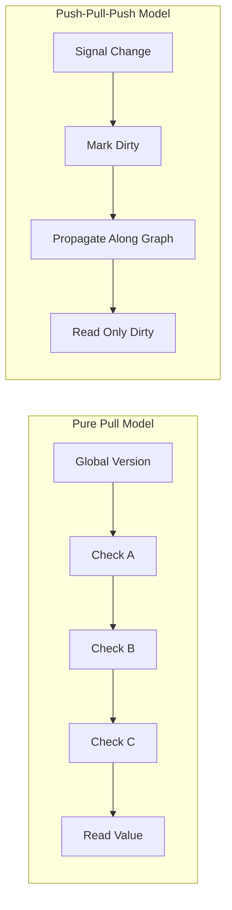

## Overview

Johnson Chu, creator of Volar and Vue core team member, documents the performance work behind alien-signals—the lightest reactive signals implementation in the JavaScript ecosystem. These notes trace key discoveries that emerged from pushing the Push-Pull-Push reactivity model to its limits.

## The Push-Pull-Push Model

Alien-signals uses a Push-Pull-Push model rather than pure pull-based reactivity. Pure pull models rely on a global version counter to detect changes. This creates a hidden trap: an unrelated signal update increments the global version, forcing every subsequent read to perform expensive dependency-chain checks.

Push-Pull-Push avoids this "one-bad-apple" problem by propagating dirty states precisely along the dependency graph without global versions.



::

## Key Optimizations

### Linked Lists Over Sets

The conventional choice for managing subscribers is `Set`—idiomatic and clean. But a doubly-linked list structure, pioneered by the Preact team, proves far more efficient. Each dependency-subscriber relationship becomes a single Link node living in two lists simultaneously: one for the signal's subscribers, one for the subscriber's dependencies.

Benefits:

- Adding a subscription: O(1)—append to tail
- Removing a subscription: O(1)—unlink the node, no searching
- No hashing, no internal bucket allocation, no GC pressure from discarded iterators

### JIT-Friendly Monomorphic Functions

V8's TurboFan JIT heavily optimizes "monomorphic" operations—operations where objects always have the same internal shape (Hidden Class). Polymorphic operations force de-optimization to slower generic implementations.

The fix: split functions that handle multiple scenarios into separate single-purpose functions. A function that once had an if/else block for "create new link" vs "update existing link" becomes two distinct functions. Each remains monomorphic, and the JIT applies aggressive optimizations.

### In-Object Property Limits

V8 stores the first several object properties directly "in-object" for fast access. Properties beyond this limit spill into a slower backing store. Early implementations had 8+ properties per subscriber class. The final `ReactiveNode` interface has only 5:

```typescript
interface ReactiveNode {
  deps?: Link;
  depsTail?: Link;
  subs?: Link;
  subsTail?: Link;
  flags: ReactiveFlags;
}
```

Properties like `version`, `running`, and `depsLength` were either merged into the `flags` bitmask or became redundant through simplification.

### Iterative DFS Propagation

Recursive DFS is elegant but risks stack overflow and carries function-call overhead. Converting to iterative DFS was challenging—nested while loops with goto-like labels to simulate recursive descent and ascent.

The payoff: explicit traversal state enables inspection during traversal. In linear graph chains (one subscriber per node), stack operations become redundant. The "fast path" checks if the current node has no `nextSub` and continues directly without pushing to the stack.

```typescript
if ((link = next!) !== undefined) {
  next = link.nextSub;
  continue; // Fast path: no stack push needed
}
```

### Dependency List Reuse

Most systems discard and rebuild dependency lists on re-execution. But dependency graphs typically remain stable between runs. Alien-signals reuses the existing linked list instead.

On re-execution, `depsTail` resets to `undefined`. As the getter runs and accesses signals, the `link` function checks if the next dependency in the old list matches the current one. If so, it updates the version on the existing Link and moves the pointer forward—no allocation needed.

```typescript
const nextDep = prevDep !== undefined ? prevDep.nextDep : sub.deps;
if (nextDep !== undefined && nextDep.dep === dep) {
  nextDep.version = version;
  sub.depsTail = nextDep;
  return; // Fast path: reuse existing link
}
```

Leftover nodes from conditional dependencies get cleaned up by `purgeDeps` afterward.

## Lessons Learned

The biggest performance wins came not from clever algorithms but from refining core abstractions. The 5-property `ReactiveNode` is faster than the 8-property `Subscriber` because it's a more distilled model of what a reactive node needs.

Some ideas remain unrealized. An "end-to-end" propagation model where effects subscribe directly to all upstream signals could eliminate multi-level traversal—but the memory cost of flattening the subscription graph makes it impractical.

## References

- [alien-signals on GitHub](https://github.com/stackblitz/alien-signals) - The library these optimizations produced
- [js-reactivity-benchmark](https://github.com/nickmccurdy/js-reactivity-benchmark) - The benchmark suite used for measuring performance
- [Vyacheslav Egorov's monomorphism article](https://mrale.ph/blog/2015/01/11/whats-up-with-monomorphism.html) - Deep dive into V8's JIT optimization
