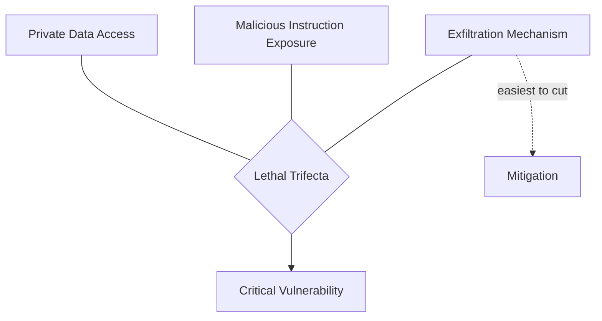

## Timestamps

| Time     | Topic                                                                            |
| -------- | -------------------------------------------------------------------------------- |
| 0:00     | Introduction — Simon Willison's background (Django, Datasette, prompt injection) |
| ~8:00    | AI State of the Union: the November 2025 inflection point                        |
| ~14:00   | Vibe coding vs. agentic engineering — where to draw the line                     |
| ~22:00   | Dark factories — StrongDM case study, nobody reads the code                      |
| ~28:00   | Defense of software engineers — cognitive exhaustion is real                     |
| ~32:00   | The middle squeeze: juniors up, seniors amplified, mid-career crushed            |
| ~42:00   | Working harder with AI — burnout, novelty, and writing code on a phone           |
| ~48:00   | Prediction: 50% of engineers at 95%+ AI code by end of 2026                      |
| ~52:00   | Simon's AI stack — Claude Code, GPT 5.4, constant model switching                |
| ~58:00   | The Pelican Riding a Bicycle benchmark                                           |
| ~1:04:00 | Agentic engineering patterns: hoarding skills, red/green TDD                     |
| ~1:16:00 | Prompt injection, the lethal trifecta, Challenger disaster of AI                 |
| ~1:28:00 | OpenClaw — personal digital assistants and the security problem                  |
| ~1:34:00 | What's next: zero-deliverable consulting, the "not-a-book"                       |

## Key Arguments

### The November inflection point changed everything (~8:00)

GPT 5.1 and Claude Opus 4.5 were incrementally better on paper, but they crossed a threshold: from "mostly works if you watch carefully" to "almost always does what you told it to do." That distinction unlocked 10,000-line days and triggered the current adoption wave. The technology didn't leap — the reliability did.

### Vibe coding vs. agentic engineering — a critical distinction (~14:00)

Simon draws a sharp line. Vibe coding (Karpathy's term) means building software without reading or understanding the code — going purely on vibes. Fine for personal projects where you're the only one who gets hurt by bugs. Agentic engineering is professional software development mediated by coding agents, where engineers review everything and take full responsibility for quality. The danger is people conflating the two.

### Dark factories are the real frontier (~22:00)

Companies like StrongDM are experimenting with a radical pattern: nobody writes OR reads code. Quality comes from swarms of AI-simulated QA testers running 24/7 in fake environments (simulated Slack, simulated Jira), plus AI-driven security pen testing. This is fundamentally different from both vibe coding and agentic engineering — it replaces code review with architectural safeguards.

### AI most threatens mid-career engineers (~32:00)

Citing ThoughtWorks research: seniors have deep experience to amplify (Simon's 25 years are more valuable than ever), juniors benefit from dramatically faster onboarding (Cloudflare and Shopify hiring 1,000 interns each). Mid-career engineers are caught in the worst position — past the onboarding gains, not yet at the depth where AI amplifies rather than replaces. They're "in the most trouble."

### The lethal trifecta makes prompt injection unsolvable at the model level (~1:16:00)

Three conditions create a critical vulnerability: access to private data, exposure to malicious instructions, and an exfiltration mechanism. Even at 97% detection, prompt injection remains a failing grade. More AI can't fix this — it requires architectural approaches like Google DeepMind's CaMeL paper, which splits agents into privileged and quarantined halves with taint tracking. Cut any one leg of the trifecta and you mitigate the risk.

### The Challenger disaster of AI is coming (~1:16:00)

Simon applies the "normalization of deviance" pattern from the Space Shuttle Challenger disaster. Every time we get away with using AI systems in unsafe ways, institutional confidence grows. The O-rings didn't fail — until they did. His prediction: a headline-grabbing prompt injection attack causing massive damage. He's predicted it every six months for three years and it hasn't happened yet, which only makes him more worried — that's exactly the normalization pattern.

### Using coding agents well is exhausting (~28:00)

Running four agents in parallel leaves Simon "wiped out by 11 AM." The skill isn't typing prompts — it's knowing which problem is a one-sentence prompt versus an open-ended challenge. 25 years of engineering experience is the amplification fuel. He hopes the cognitive exhaustion is a novelty effect that normalizes, but he's not sure.

## Predictions

- **Challenger disaster of AI will happen** — A massive, headline-grabbing prompt injection breach. High conviction, uncertain timing.
- **50% of engineers writing 95%+ AI code by end of 2026** — The technology is ready; the bottleneck is adoption curve, not capability.
- **Mid-career squeeze is already observable** — Seniors amplify, juniors onboard faster. The middle gets hollowed out.
- **Model leadership keeps leapfrogging** — GPT 5.4, Claude Opus 4.6, next Gemini. No single winner.
- **"Building your own Claw" becomes the new hello world** — Personal digital assistants as the standard first AI project.

## Notable Quotes

> "Today, probably 95% of the code that I produce, I didn't type it myself."
> — Simon Willison

> "Using coding agents well is taking every inch of my 25 years of experience as a software engineer. I can fire up four agents in parallel and have them work on four different problems. By 11:00 a.m., I am wiped out."
> — Simon Willison

> "Every previous year, I've always told myself, 'This year, I'm going to focus more. I'm going to take on less things.' This year, my ambition was take on more stuff and be more ambitious."
> — Simon Willison

> "Lots of people knew that those little O-rings were unreliable. But every single time you get away with launching a space shuttle without the O-rings failing, you institutionally feel more confident in what you're doing. We've been using these systems in increasingly unsafe ways. This is going to catch up with us."
> — Simon Willison

> "If you're vibe coding something for yourself where the only person who gets hurt if it has bugs is you, go wild. The moment you're vibe coding code for other people to use where your bugs might actually harm somebody else, that's when you need to take a step back."
> — Simon Willison

## Named Frameworks & Concepts

- **The November Inflection Point** — When coding agents crossed from "mostly works" to "almost always does what you told it to do" (Nov 2025, GPT 5.1 / Claude Opus 4.5)
- **Agentic Engineering** — Simon's term for professional software development mediated by coding agents, distinct from vibe coding
- **Dark Factory Pattern** — Fully automated software production where nobody writes or reads code; quality assured through architectural safeguards
- **The Lethal Trifecta** — Three conditions for critical prompt injection: private data + malicious instructions + exfiltration mechanism
- **Normalization of Deviance** — Systemic risk pattern where repeated safe outcomes with unsafe practices breed false confidence
- **Red/Green TDD for Agents** — Compact agent instruction: write tests first, watch them fail, implement, watch them pass
- **Proof of Usage** — Proposed replacement for traditional quality signals (tests, docs); actual sustained use as the trust signal
- **Zero-Deliverable Consulting** — One hour of attention, no report, no code, no invoicing complexity

## Connections

- [[heres-how-i-use-llms-to-help-me-write-code]] — Simon Willison's earlier piece on LLM-assisted coding, written before the November inflection point he describes here. The shift from "over-confident pair programming assistant" to "fire up four agents in parallel" shows how fast his own practice evolved.
- [[head-of-claude-code-what-happens-after-coding-is-solved]] — Boris Cherny on the same podcast making a complementary argument: coding is solved, the bottleneck moves to taste. Simon's response is more cautious — he'd say the bottleneck also includes safety, testing, and knowing what not to ship.
- [[cognitive-debt]] — Margaret-Anne Storey's concept directly maps to Simon's warning. If dark factories ship code nobody reads, the cognitive debt becomes infinite. The question is whether architectural safeguards (AI QA swarms, pen testing) can replace human understanding.
- [[from-ides-to-ai-agents-with-steve-yegge]] — Yegge describes the same "vampiric burnout" pattern: 3 productive hours at max speed, then wiped. Simon echoes this independently — two senior engineers arriving at the same exhaustion conclusion suggests it's structural, not anecdotal.
