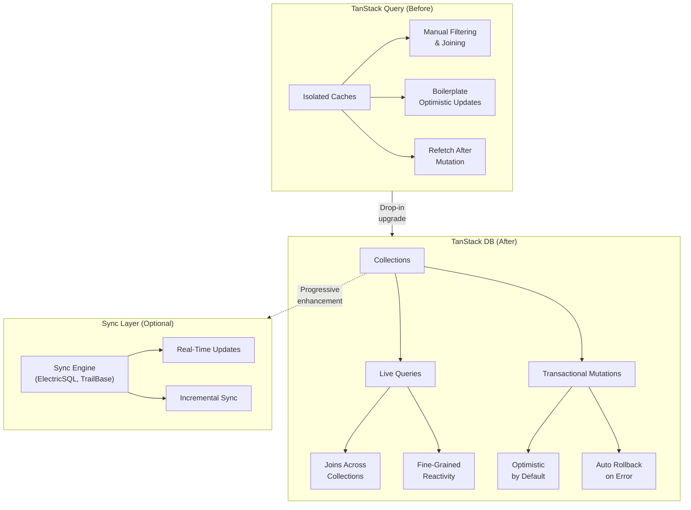

## The Core Argument

TanStack Query is everywhere, but it has a dirty secret: its cache model treats every query as an isolated silo. The moment you need to join data across queries, filter across collections, or do optimistic updates without a wall of boilerplate, you're fighting the abstraction. TanStack DB doesn't replace Query — it extends it with three primitives that make relational client-side data a first-class citizen.

What makes this article stand out: Ferreira doesn't just describe the API. He builds an interactive todo app that lets you _feel_ the difference — the lag of refetch-after-mutate vs. the snap of optimistic-by-default.

## Three Primitives

**Collections** are typed sets of objects that replace Query's isolated caches. They can be populated from REST, GraphQL, local storage, or sync engines. One source of truth per model.

**Live Queries** are the real breakthrough. A SQL-like API that runs against collections, updates reactively when data changes, and handles joins across collections natively. Sub-millisecond filtering on hundreds of thousands of elements. This is the piece TanStack Query never had — the ability to express "uncompleted todos from favorite projects" without manual `Array.filter` chains that break when your fetching strategy changes.

**Transactional Mutations** flip Query's mutation model. Instead of "mutate → wait for server → refetch → update UI", mutations are optimistic by default and auto-rollback on error. The `onUpdate` handler persists to the backend, but the UI already moved on. The boilerplate reduction is dramatic — no more `onMutate`/`onError`/`onSettled` ceremony for every mutation.



::

## The Sync Engine On-Ramp

The clever part: TanStack DB doesn't require a sync engine. Collections work fine with plain REST. But when you're ready, swapping `queryCollectionOptions` for `electricCollectionOptions` plugs in ElectricSQL — and suddenly every client gets real-time updates, incremental syncs, and the database as source of truth. No rewrite. Same collections, same live queries, different plumbing underneath.

This is the incremental adoption story that most sync engines lack. Zero, LiveStore, and PowerSync all demand architectural commitment upfront. TanStack DB says: start with what you know (Query), get relational data and optimistic updates for free, graduate to real-time sync when the pain demands it.

## Code That Matters

Collection definition wraps familiar Query options:

```typescript
const todoCollection = createCollection(
  queryCollectionOptions({
    queryKey: ["todos"],
    queryFn: async () => {
      const response = await fetch("/api/todos");
      return response.json();
    },
    queryClient,
    getKey: (item) => item.id,
  }),
);
```

Live query with a cross-collection join:

```typescript
const { data: todos } = useLiveQuery((q) =>
  q.from({ todo: todoCollection }).where(({ todo }) => eq(todo.projectId, projectId)),
);
```

Mutation — the entire optimistic update, rollback, and persistence in one call:

```typescript
todoCollection.update(todo.id, (draft) => {
  draft.completed = true;
});
```

Compare that last one to Query's `useMutation` with `onMutate` snapshot management, `onError` rollback, and `onSettled` refetch. The difference speaks for itself.

## Connections

- [[sync-engines-for-vue-developers]] — TanStack DB occupies a unique spot in the sync engine landscape: it's the TanStack Query upgrade path rather than a standalone engine, which changes the adoption calculus entirely
- [[rstore]] — Both rstore and TanStack DB converge on "collections + live queries" as the right abstraction for client-side data, but rstore builds on Vue's reactivity while TanStack DB builds on Query's cache — two routes to the same destination
- [[ux-and-dx-with-sync-engines]] — Carl Assmann explicitly calls out TanStack Query as the pattern that sync engines improve upon. TanStack DB is literally Query's answer to that criticism
- [[general-purpose-sync-with-ivm]] — Zero's IVM powers reactive queries at interactive speed. TanStack DB's live queries solve the same "reactive filtering across collections" problem through differential dataflow — different engine, same user-facing goal
