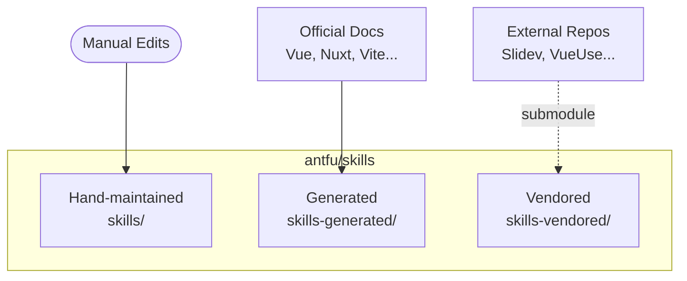

## Overview

Anthony Fu's Skills repository packages his development conventions and ecosystem knowledge into a portable format for AI coding assistants. Rather than teaching agents through prompts, the collection provides structured skill files that activate based on context—bringing expertise on Vue, Nuxt, Vite, and related tooling directly into the agent's context window.

The project addresses a core problem: documentation drifts, prompts become stale, and context scattered across files becomes unreliable. By using git submodules that reference upstream source documentation, skills stay synchronized with the tools they describe.

## Key Features

- **Three-tier skill organization**: Hand-maintained personal conventions, auto-generated documentation skills, and vendored community skills
- **Documentation sync via submodules**: Skills pull directly from official docs for Vue, Nuxt, Vite, Vitest, UnoCSS, and pnpm
- **Opinionated defaults**: Reflects Fu's development style, particularly around ESLint configuration and modern TypeScript patterns
- **Cross-agent compatibility**: Works with Claude Code, VS Code agents, and other tools supporting the emerging skills standard

## Code Snippets

### Installation

```bash
# Install all skills globally
pnpx skills add antfu/skills

# Install specific skills
pnpx skills add antfu/skills --skills vue,nuxt

# List available skills
pnpx skills list antfu/skills
```

### Vendored Skills

The collection includes skills synced from external repositories:

- **Slidev** - Presentation slides with Vue components
- **VueUse** - Collection of Vue Composition utilities
- **Turborepo** - Monorepo build system patterns

## Technical Details

The architecture separates skill tiers by maintenance model:

1. **Hand-maintained** (`skills/`): Personal conventions like ESLint config, pnpm workflows, Vitest patterns
2. **Generated** (`skills-generated/`): Auto-built from official documentation
3. **Vendored** (`skills-vendored/`): Submodules pointing to external skill repos



::

This structure allows ecosystem skills to stay current automatically while personal preferences remain manually curated.

## Connections

- [[nuxt-skills]] - Similar project focused specifically on Nuxt/Vue ecosystem skills, following the same Agent Skills standard
- [[claude-code-skills]] - Official skills documentation that defines the format this collection implements
