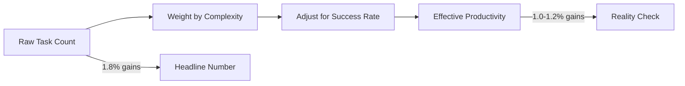

## Summary

Anthropic's fourth Economic Index report introduces "economic primitives"—five foundational metrics to track Claude's economic impact over time. By analyzing 2 million conversations (1M from Claude.ai, 1M from API), the research reveals that raw productivity numbers overstate real gains when task reliability enters the equation.

## The Five Economic Primitives

1. **Task complexity** — How difficult is the work?
2. **Skill level** — What education/expertise does the task require?
3. **Purpose** — Work, education, or personal use?
4. **AI autonomy** — How independently does AI operate?
5. **Success rates** — Does the task actually get completed correctly?

## Key Findings

### Task Performance

Complex tasks show greater speedup but lower reliability. High school-level tasks accelerate 9x while college-level tasks see 12x acceleration—but success rates decline from 70% to 66% as complexity rises.

The tension: tasks where AI helps most are also tasks where it fails more often.

### Occupational Coverage

Claude usage now covers 49% of jobs (up from 36% in January 2025). But "effective AI coverage"—accounting for reliability—paints a different picture than raw task coverage.

AI disproportionately affects higher-skilled work. The average AI-assisted task requires 14.4 years of education, compared to 13.2 years for the economy overall. This creates a potential "deskilling" effect if higher-education tasks get automated while lower-education tasks remain human.

### Productivity Reality Check

When accounting for task reliability, productivity gains drop from 1.8 to 1.0-1.2 percentage points annually. The headline numbers shrink when you factor in failures and retries.

### Geographic Patterns

Usage concentrates in wealthy nations. Lower-income countries show proportionally greater educational use of AI. Within the US, adoption is becoming more geographically distributed.

## The Measurement Framework

::

## Connections

- [[how-ai-is-transforming-work-at-anthropic]] — Earlier Anthropic research focused on internal engineering practices; this Economic Index expands the scope to economy-wide measurement with standardized primitives
- [[economic-possibilities-for-our-grandchildren]] — Keynes predicted technology would solve the economic problem; this data shows AI disproportionately affects higher-skilled work, raising questions about whether automation benefits distribute evenly
