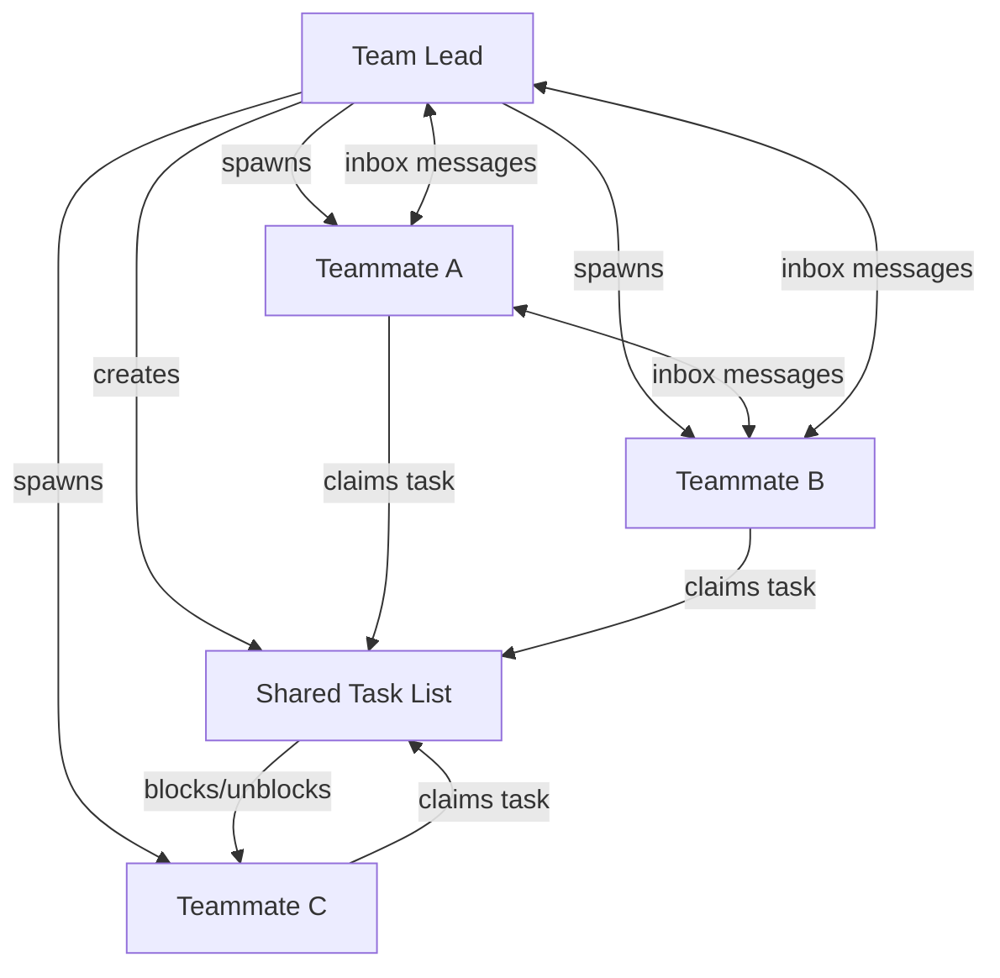

## Key Takeaways

- **Agent teams = shared task list + inbox.** Two primitives combine to form collaborative multi-agent sessions. The task list (with dependency blocking) handles work distribution; the inbox handles real-time communication between teammates.

- **Teammates persist until explicitly shut down.** Unlike short-lived sub-agents spawned via the Task tool, teammates stay alive across tasks. You can follow up with individual teammates, add new tasks, or spawn additional teammates mid-session.

- **Inter-agent messaging solves the mergeability problem.** Previously, parallel sub-agents worked on differing assumptions with no way to sync. The inbox lets a front-end agent and back-end agent share discoveries as they work, reducing merge conflicts.

- **Devil's advocate pattern.** Spawn a critique agent alongside implementation agents. Real-time feedback during work produces better results than post-hoc review.

- **Opus 4.6 improvements.** Better sub-agent orchestration (the model recognizes when to delegate), improved long-context performance, and adjustable effort levels (low/medium/high) to control cost and reasoning depth.

- **Auto-memory.** Claude Code now persists learnings to a `.claude` memory directory per project. Useful in theory, but risks filling up with noise unless pruned regularly.

## Architecture

The team system follows a leader-worker pattern with bidirectional messaging:

::

## Notable Quotes

> "By combining these two pretty basic ideas—a shared task list with blockers and a direct message system between sub-agents—we now unlock more efficient parallel collaboration and can solve more complex problems."

> "Someone on the Anthropic team made a C compiler using agent teams... after nearly 2,000 Claude Code sessions and $20,000 in API costs, agent teams produced a 100,000-line C compiler."

## Connections

- [[claude-codes-new-task-system-explained]] - Same author's previous video covering the task system that agent teams build upon—the shared task list with dependency blocking
- [[fastrender-building-a-browser-with-thousands-of-ai-agents]] - Demonstrates the extreme end of multi-agent scaling: 2,000 concurrent agents producing a million lines of code
- [[agentic-design-patterns]] - Covers the theoretical multi-agent collaboration patterns that Claude Code's team system implements in practice
