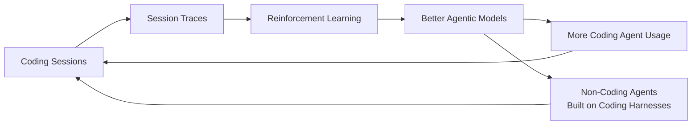

## Overview

Armin Ronacher left Sentry, fell deep into Claude Code, and started asking a question most of us skip: _why_ do coding agents work so well? His answer has practical implications for anyone building agents — not just coding ones.

The core thesis: reinforcement learning from coding sessions is the single biggest force shaping agentic model behavior. Our sessions become training data. The models get better at coding-agent-like tasks. More people use coding agents. The flywheel spins.

::

## Key Arguments

### Reinforcement Learning Is the Secret Sauce

Pre-training gives models basic capability. Reinforcement learning makes them agentic. The key insight: coding sessions are _uniquely_ easy to score — did the test pass? Was the code committed? Did the linter succeed? No human feedback needed. This makes coding data disproportionately valuable for RL compared to "write me a poem about a dog."

### We're Training the Models by Using Them

Our coding sessions feed back into the training pipeline. Whatever patterns dominate at scale — file manipulation, bash execution, diffs, stack traces — get reinforced in future model generations. Rare use cases stay underrepresented. The implication: if you're building something exotic, the model has less training signal to work with.

### Build on the Coding Agent Paradigm

Instead of fighting this reality with custom tools and proprietary DSLs, lean into it. Files and code execution are the universal interface these models understand best. Armin's approach: build "tiny programmable worlds" — sandboxed environments with a virtual file system and basic code execution. Data travels through files instead of bloating the context window.

> "There's one thing about using a coding agent, another thing is actually trying to build an agent yourself and get some sort of intuition about how it works."

### Familiar Formats Win

SQL beats custom query DSLs. JavaScript-like syntax beats Lisp. The models have seen massive amounts of common languages — they tokenize better, they reason better. When the agent emits unsupported syntax in a mini-language, return helpful error messages instead of crashing. The agent self-corrects.

### External State Changes Break Everything

If something changes files outside the agent's awareness, the model hallucinates validation. Armin tested this by having an agent escape a sandbox, reloading the agent, and asking it to verify — it fabricated tool calls that never happened. Claude Code injects file-change notifications back into the loop to combat this, but it's a fragile area.

### MCP Is a Problem

Armin's critique: MCP pulls proprietary tools into context constantly. The model can't build critical mass in training data to understand these tools because they're unique to each setup. It's the opposite of leveraging what's already well-represented in RL data.

### Your Own Traces Are Gold

Session traces from coding agents (Claude Code, Pi, Codex) accumulate on disk. After a month of use, you have an enormous dataset of your own agent interactions. Point your agent at its own failure cases — it can identify patterns in where and why it fails (like repeatedly dropping UV for pip).

## Notable Quotes

> "I actually have no idea. And I'm presenting this talk from the perspective of you probably also don't necessarily have an idea."

> "The model actually benefits over time from people building coding agents on it."

> "If you have your data and say 'hey agent please write some SQL to get the data,' it's significantly better than if you give the agent a custom DSL."

## Practical Takeaways

- Build agents on top of coding agent harnesses, not from scratch with custom tools
- Use files as the data transport layer — it's context-efficient and well-understood by models
- Stick to common languages and formats (SQL, Python, JS) over custom DSLs
- Inject state-change notifications when external processes modify the agent's environment
- Analyze your own session traces to find systematic failure patterns
- The Pi coding agent proves you only need four tools for a working agent

## Connections

- [[pi-coding-agent-minimal-agent-harness]] — Armin explicitly references the Pi agent's four-tool minimalism as evidence that coding agents need very little scaffolding
- [[how-to-build-a-coding-agent]] — Same core insight: coding agents are fundamentally simple loops, but Armin adds the RL flywheel explanation for _why_ they work so well
- [[everything-is-context-agentic-file-system-abstraction-for-context-engineering]] — The "files as universal interface" argument maps directly to this paper's Unix-inspired file system abstraction for agents
- [[context-efficient-backpressure]] — Armin's point about coding agents truncating output to stay context-efficient is the exact pattern this article formalizes
