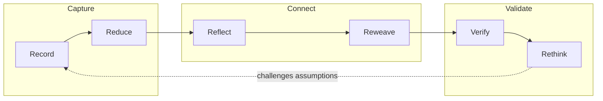

## Overview

Ars Contexta flips the typical Second Brain setup on its head. Instead of picking a template and adjusting it to fit, it interviews you about how you think and work, then derives a knowledge architecture from your answers. The name nods to historical precedents — Llull's Ars Combinatoria, Bruno's memory systems — external thinking tools, not filing cabinets.

The core bet: an LLM can traverse conceptual relationships autonomously, making the old dream of adaptive knowledge systems actually achievable. Every design decision traces back to a specific claim from a research graph spanning Zettelkasten methodology, cognitive science, and agent architecture.

## Key Features

- **Derivation engine** — a 20-minute conversational setup that maps responses to eight configuration dimensions, generating a vault tailored to how you actually think
- **Three-space separation** — `self/` (agent identity), `notes/` (knowledge graph), `ops/` (operational state) — each space grows at different rates
- **Six Rs processing pipeline** — Record, Reduce, Reflect, Reweave, Verify, Rethink — extending Cornell Note-Taking into an agentic loop
- **Four automation hooks** — session orient, write validation, auto-commit, session capture — Claude Code hooks doing the tedious work
- **`/ralph` command** — multi-phase task processing with fresh context per phase, preventing attention degradation across long sessions
- **Pre-validated presets** — Research, Personal, Experimental — starting points that the derivation engine adapts from



::

## Code Snippets

### Installation

```bash
/plugin marketplace add agenticnotetaking/arscontexta
/plugin install arscontexta@agenticnotetaking
/arscontexta:setup
```

### Key Commands

```bash
/reduce    # Extract insights from sources
/reflect   # Find connections, update MOCs
/reweave   # Update older notes with new context
/verify    # Combined quality check
/ralph 5   # Process 5 tasks with fresh context per phase
/pipeline  # End-to-end source processing
```

## Technical Details

The architecture enforces a clean separation between what the agent knows about itself (`self/`), what it knows about the world (`notes/`), and its operational state (`ops/`). Space names adapt to domain context — a research vault might call notes "claims," a personal vault might call them "reflections."

The `/ralph` command is the most interesting engineering decision. Instead of processing everything in one long context window, it spawns independent subagents per phase. Each subagent gets fresh context, runs its task, writes a handoff document, and exits. The orchestrator reads the handoff and advances the pipeline. This prevents the attention degradation that kills quality in long agentic sessions.

The plugin validates through 15 kernel primitives — a smoke test that ensures the generated system is internally consistent before activation. All design choices trace back to the methodology directory's 249 research claims.

## Connections

- [[teaching-claude-code-my-obsidian-vault]] - Ars Contexta automates what this note describes doing manually — giving Claude persistent context about a knowledge base
- [[compound-engineering-plugin]] - Both are Claude Code plugins that compound value over time, but Compound Engineering focuses on code quality while Ars Contexta focuses on knowledge architecture
- [[self-improving-skills-in-claude-code]] - The Rethink phase in the Six Rs pipeline embodies the same principle — agents that challenge their own assumptions and improve
- [[ai-native-obsidian-vault-setup-guide]] - Both tackle AI-native knowledge systems, but Ars Contexta derives structure from conversation rather than prescribing it
