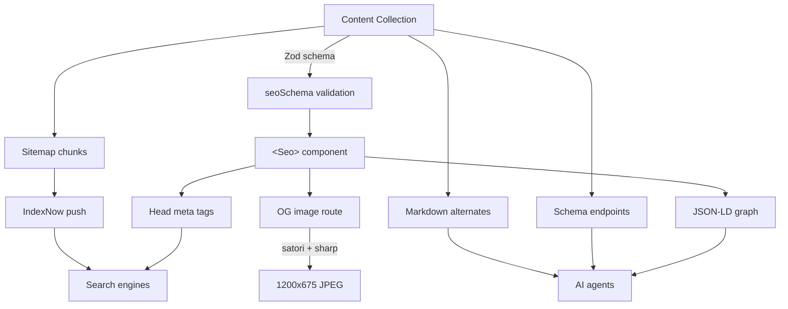

## Summary

Joost de Valk built Yoast SEO, the WordPress plugin that defined SEO for a generation. Eighteen years after his original "WordPress SEO: the definitive guide," he rewrote it for Astro — and used the occasion to update the whole worldview.

The big shift: search is vectorized, so keyword matching barely matters. What matters now is whether an AI agent can walk your content graph, extract self-contained paragraphs, and understand your site in one request. The stack he outlines (`@jdevalk/astro-seo-graph`, schema endpoints, `llms.txt`, markdown alternates) is less about ranking and more about being machine-legible.

For a Vue/Astro developer running a static blog, this is the closest thing to a reference implementation you'll find. The unifying idea is that a static site with a typed content collection is already a better SEO primitive than any CMS — Joost just wires up the structured layer on top.

## Key Concepts

- **Keywords are dead, topics matter.** Modern search embeds meaning, not strings. "Building websites with Astro" surfaces for "static site generators" without the exact phrase. Optimizing titles for keyword placement is solving a 2015 problem.
- **Paragraphs are the extraction unit.** AI systems quote paragraphs, not articles. Every paragraph should open with its point and stand alone — otherwise it can't be pulled into an AI-generated answer. The same discipline that helps L2 English readers helps machines.
- **JSON-LD graph over flat snippets.** Most sites output a single `Article` object. A linked `@graph` with `WebSite`, `Person`, `BlogPosting`, `BreadcrumbList` tied by `@id` references lets agents walk the relationships — who wrote it, where it lives, how it connects.
- **Agent discovery layer.** `llms.txt`, `/schemamap.xml`, markdown alternates with `<link rel="alternate" type="text/markdown">`, content negotiation on `Accept: text/markdown`. Standards that no crawler uses yet, but supply creates demand.
- **Build-time validation beats runtime warnings.** H1 counts, duplicate titles, image alt text, internal link resolution — all checked at build time. Zod schemas on content collections enforce SEO field lengths before the build succeeds. Stricter than any CMS sidebar nag.
- **Static HTML + CDN is the best SEO primitive.** No server to compromise, no database to inject into, no plugins fighting over `<head>`. Joost's `BaseHead.astro` went from 130 lines on WordPress to a single `<Seo>` component.

## The Stack



## Code Snippets

### One component for the entire head

```astro
---
import Seo from '@jdevalk/astro-seo-graph/Seo.astro';
---
<Seo
  title="My Post | My Site"
  description="A concise description for search engines."
  canonical="https://example.com/my-post/"
  ogType="article"
  ogImage="https://example.com/og/my-post.jpg"
  siteName="My Site"
  graph={graph}
/>
```

### Enforce SEO field lengths at the schema level

```typescript
import { seoSchema } from "@jdevalk/astro-seo-graph";
const blog = defineCollection({
  schema: ({ image }) =>
    z.object({
      title: z.string(),
      publishDate: z.coerce.date(),
      seo: seoSchema(image).optional(),
    }),
});
```

If someone adds a 200-character SEO title, the build fails — more reliable than a CMS sidebar warning.

### Git-based lastmod for sitemaps

```javascript
function gitLastmod(filePath) {
  const log = execSync(`git log -1 --format="%cI" -- "${filePath}"`, { encoding: "utf-8" }).trim();
  return log ? new Date(log) : null;
}
```

Frontmatter dates lose timestamps. Filesystem dates reset on CI. Git has the real answer.

## Alexander's Take

This is the most thorough Astro SEO reference I've seen, and it comes from someone who literally shaped how the industry thinks about SEO. Worth reading in full before shipping anything on alexop.dev that matters for discovery.

The paragraph-as-extraction-unit point is the one that sticks. It reframes readability as a machine-readability concern — not "write clearly so readers follow" but "write clearly so an LLM can lift this paragraph into an answer without needing the surrounding two." That's a concrete writing constraint I can test against.

The `llms.txt` discussion is the rare case of someone being honest: "No AI bot widely requests `llms.txt` today. That's not the point." Standards need supply before they get demand. That's a useful frame for anything early in adoption.

## Connections

- [[semantic-related-posts-astro-transformersjs]] — Same stack (Astro), same vectorized-search premise; my post ships embeddings client-side while Joost's graph ships structure server-side. Complementary layers of the same shift away from keyword matching.
