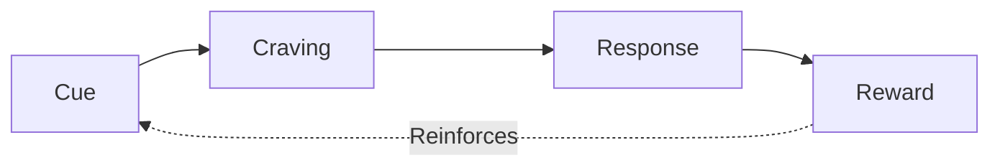

The core premise: small, incremental improvements (1% better each day) compound into massive changes over time. Habits are the compound interest of self-improvement.

## Core Message

Small, consistent 1% improvements compound into remarkable transformations over time. Lasting change comes not from ambitious goals but from building systems of tiny habits that gradually reshape your identity—because you fall to the level of your systems, not the height of your goals.

## Key Insights

1. **The 1% Compound Effect** - Getting 1% better every day results in being 37 times better after one year (1.01^365 = 37.78). Habits are the compound interest of self-improvement—small changes appear insignificant day-to-day but yield remarkable results when sustained.

2. **Systems Beat Goals** - Winners and losers often share identical goals; what separates them is their systems. Goals define what you want; systems define the processes that actually get you there. Focus on building better systems rather than setting bigger goals.

3. **Identity Drives Behavior** - The most effective way to change habits is to focus on who you wish to become, not what you want to achieve. Every action is a vote for the type of person you wish to be. True behavior change is identity change.

4. **The Plateau of Latent Potential** - Habits often appear to make no difference until you cross a critical threshold. Results are delayed—mastery requires patience through the "valley of disappointment" before breakthroughs occur.

5. **Environment Over Willpower** - People with strong self-control aren't more disciplined; they're better at structuring their environment to avoid temptation. Design your surroundings to make good habits obvious and bad habits invisible.

6. **The Two-Minute Rule** - Scale any habit down to something that takes two minutes or less. Want to read more? Start with "read one page." The goal is to make starting effortless—momentum follows.

7. **Habit Stacking** - Link new behaviors to existing routines using the formula: "After [CURRENT HABIT], I will [NEW HABIT]." This leverages the neurological momentum of established patterns.

8. **Temptation Bundling** - Pair actions you need to do with actions you want to do. Only allow yourself to watch your favorite show while exercising, or listen to podcasts while doing chores.

9. **Never Miss Twice** - Missing one day is an accident; missing two is the start of a new habit. The first mistake is never what ruins you—it's the spiral of repeated mistakes. Get back on track immediately.

10. **Decisive Moments** - Each day contains a few moments that deliver outsized impact. The choices made in these brief windows—like what you do when you get home from work—determine whether you have a productive or unproductive day.

11. **The Goldilocks Rule** - Peak motivation occurs when working on challenges right at the edge of your current abilities—not too hard, not too easy. This sweet spot keeps you engaged and in flow.

12. **Keep Identity Flexible** - Avoid letting any single role dominate your sense of self. Define yourself by values rather than titles, so you can adapt when circumstances change without losing your identity.

## Who Should Read This

This book is essential for anyone who struggles to maintain habits despite good intentions—the person who starts strong in January but fades by February. It's particularly valuable for professionals seeking sustainable productivity gains, entrepreneurs building new ventures, athletes pursuing incremental performance improvements, and anyone skeptical of "overnight transformation" promises.

No prerequisites required. Clear's accessible writing style, chapter summaries, and practical frameworks make the concepts digestible regardless of prior reading in psychology or self-improvement. Whether you want to exercise consistently, write daily, reduce screen time, or build any lasting change, this book provides the actionable system to get there.

---

## The Four Laws of Behavior Change

A framework for building good habits and breaking bad ones:

| To Build a Good Habit | To Break a Bad Habit |
| --------------------- | -------------------- |
| 1. Make it obvious    | Make it invisible    |
| 2. Make it attractive | Make it unattractive |
| 3. Make it easy       | Make it difficult    |
| 4. Make it satisfying | Make it unsatisfying |

## Key Concepts

- **Identity-based habits** — Focus on who you wish to become, not what you want to achieve. Every action is a vote for the type of person you want to be.
- **Habit stacking** — Link new habits to existing ones: "After [CURRENT HABIT], I will [NEW HABIT]."
- **Environment design** — Make cues for good habits obvious and cues for bad habits invisible.
- **The Two-Minute Rule** — Scale any habit down to a two-minute version to make starting easy.
- **Temptation bundling** — Pair an action you want to do with an action you need to do.

## The Habit Loop

::

## Highlights

> Your outcomes are a lagging measure of your habits. Your net worth is a lagging measure of your financial habits. Your weight is a lagging measure of your eating habits. Your knowledge is a lagging measure of your learning habits. Your clutter is a lagging measure of your cleaning habits. You get what you repeat.

> The purpose of setting goals is to win the game. The purpose of building systems is to continue playing the game.

> The ultimate form of intrinsic motivation is when a habit becomes part of your identity. It's one thing to say I'm the type of person who wants this. It's something very different to say I'm the type of person who is this.

> True behavior change is identity change.

> Every goal is doomed to fail if it goes against the grain of human nature.

> Until you make the unconscious conscious, it will direct your life and you will call it fate.

> Environment is the invisible hand that shapes human behavior.

> You don't have to be the victim of your environment. You can also be the architect of it.

> When scientists analyze people who appear to have tremendous self-control, it turns out those individuals aren't all that different from those who are struggling. Instead, "disciplined" people are better at structuring their lives in a way that does not require heroic willpower and self-control.

> You feel bad, so you eat junk food. Because you eat junk food, you feel bad. Watching television makes you feel sluggish, so you watch more television because you don't have the energy to do anything else.

> Self-control is a short-term strategy, not a long-term one. You may be able to resist temptation once or twice, but it's unlikely you can muster the willpower to override your desires every time.

> Desire is the engine that drives behavior.

> Your culture sets your expectation for what is "normal." Surround yourself with people who have the habits you want to have yourself. You'll rise together.

> A craving is just a specific manifestation of a deeper underlying motive.

> Life feels reactive, but it is actually predictive.

> If you want to master a habit, the key is to start with repetition, not perfection.

## Connections

The science behind habit formation connects to [[science-of-setting-achieving-goals]] — both emphasize how dopamine drives motivation and how small consistent actions create lasting change.
