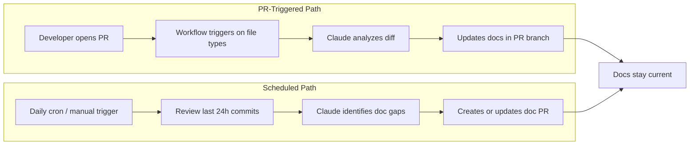

## Summary

Documentation rot is the default state of every codebase. Frank Bernhardt offers a practical fix: wire Claude Code into GitHub Actions so docs update themselves. The article presents two complementary workflows — one fires on every PR touching code files, the other runs a daily sweep — and together they cover both immediate changes and cross-cutting gaps.

The real value isn't the YAML configs (those are straightforward). It's the operational pattern: treat documentation like a CI artifact. If it drifts from the code, the pipeline catches it.

## Two Workflows, One Goal

**PR-triggered workflow** fires when code changes land on specific file types (Python, TypeScript, YAML). Claude reads the diff via `gh pr diff`, identifies which docs need updating, and commits changes back to the PR branch. The feedback loop is tight — docs ship alongside the code that changed them.

**Scheduled workflow** runs daily at midnight UTC. It reviews the last 24 hours of commits across all branches and creates a consolidated documentation PR. This catches what the PR workflow misses: deletions, cross-cutting concerns, and changes that touch docs-relevant logic without modifying the filtered file types.

The smart PR management is a nice touch — subsequent runs add commits to an existing doc PR rather than creating a new one each time.

## Guardrails That Matter

Two operational details separate a useful automation from an infinite loop nightmare:

1. **Actor check** — the workflow skips runs triggered by its own commits (`github.actor` guard). Without this, Claude updates docs → triggers the workflow → Claude updates docs → forever.
2. **Tool restrictions** — Claude is scoped to safe git commands and markdown-only file editing. No arbitrary code execution.

This mirrors the same infinite loop protection pattern in [[claude-code-github-actions-agent-automated-pr-fixes]], which uses branch-name guards for the same purpose.

## Key Points

- **Documentation as CI artifact** — if docs can drift from code, they will. Automating the update loop makes staleness structurally impossible.
- **Two workflows beat one** — the PR trigger handles immediate changes; the scheduled sweep catches everything else. Running both provides full coverage.
- **Prompt quality determines output quality** — generic prompts produce generic docs. Project-specific context, style guidelines, and length constraints in the prompt are what make the output useful.
- **The cost is negligible** — API costs for doc generation are tiny compared to the engineering time saved on manual documentation passes.

## Connections

- [[claude-code-github-actions-agent-automated-pr-fixes]] — covers the same `claude-code-action@v1` integration but for code fixes instead of documentation; shares the infinite loop prevention pattern
- [[ai-code-review-bot-claude-github-actions]] — another Claude + GitHub Actions pattern, focused on code review rather than documentation; the prompt design lessons apply directly here
- [[github-actions-complete-guide]] — foundational reference for the GitHub Actions concepts (workflows, events, permissions) this article builds on
