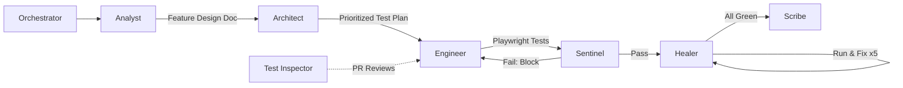

## Summary

OpenObserve's QA team was drowning — feature analysis took an hour, 30+ flaky tests poisoned every run, and test creation couldn't keep pace with shipping. Their fix wasn't hiring. They built the "Council of Sub Agents": eight specialized Claude Code agents organized into a six-phase pipeline that automates the entire journey from feature analysis to test documentation.

The result? 380 tests became 700+. Flaky tests dropped from 35 to 5. Feature analysis went from 45 minutes to under 10. And during a routine test creation run, the pipeline found a silent ServiceNow production bug that no customer had reported yet.



## The Eight Agents

The architecture philosophy is **specialization over generalization** — each agent owns one job and does it well. This mirrors the pattern Nicholas Carlini found when [[building-a-c-compiler-with-a-team-of-parallel-claudes]]: bounded agents with clear responsibilities outperform a single "super agent" trying to do everything.

1. **Orchestrator** — routes features, determines OSS vs. Enterprise paths
2. **Analyst** — extracts `data-test` selectors from source, maps workflows, identifies edge cases
3. **Architect** — prioritizes tests into P0 (critical), P1 (core), P2 (edge cases)
4. **Engineer** — writes Playwright tests using Page Object Model and verified selectors
5. **Sentinel** — quality gate that blocks the pipeline on framework violations or anti-patterns
6. **Healer** — runs tests, diagnoses failures, fixes issues through up to 5 iterations
7. **Scribe** — documents test cases in TestDino
8. **Test Inspector** — reviews E2E PRs independently on GitHub

The Sentinel is the interesting one. Most AI testing tools skip the quality gate — they generate code and hope it works. Having a dedicated agent that can _block the pipeline_ forces standardization and catches anti-patterns before they accumulate. It's the same principle as [[agentic-design-patterns]]: feedback loops and self-correction separate real autonomous systems from glorified code generators.

## The Killer Feature: Iteration

The Healer's iterative loop (up to 5 attempts per failing test) is what makes this autonomous rather than assistive. Code generation alone is table stakes. The difference between "AI writes tests" and "AI owns testing" is whether the system can diagnose its own failures and fix them without human intervention.

Context chaining amplifies this — each agent receives the previous phase's output, so the Healer isn't debugging blind. It has the Analyst's feature understanding, the Architect's priority context, and the Sentinel's audit feedback.

## The ServiceNow Bug

The best evidence this works: during test creation for alert destinations, the pipeline discovered a URL validation bug in production.

```javascript
// Broken: hostname.split('.').slice(-3, -1).join('.') === 'service-now'
// Fixed: hostname.endsWith('.service-now.com')
```

Silent failure — prevented all ServiceNow destination edits, no visible errors, zero customer reports. The autonomous testing system found it because it actually _exercised the feature_ rather than just checking that a page renders.

## What This Means for Agentic QA

This is a concrete implementation of the [[from-tasks-to-swarms-agent-teams-in-claude-code]] pattern applied to testing. The key lessons:

- **Quality gates create long-term value** — the Sentinel's ability to block forces consistency
- **Bounded agents beat monoliths** — specialization enables depth the generalist can't reach
- **Test creation should happen at feature time** — not weeks later when context has evaporated
- **Self-healing beats manual triage** — the Healer's iteration loop eliminates the RCA bottleneck

The future roadmap — visual regression, performance testing, self-improving prompts — points toward a world where QA isn't a phase but a continuous autonomous process. The [[playwright-cli-vs-mcp]] distinction matters here too: this pipeline uses Playwright directly rather than through MCP, which is the right call for agents with filesystem access.

## Connections

- [[building-a-c-compiler-with-a-team-of-parallel-claudes]] — same core insight: specialized parallel agents outperform a single generalist, validated here in a QA context rather than compiler construction
- [[from-tasks-to-swarms-agent-teams-in-claude-code]] — the theoretical pattern (task-based agent coordination) that this article implements in production for testing
- [[agentic-design-patterns]] — the Sentinel quality gate and Healer iteration loop map directly to the self-correction and feedback loop patterns
- [[playwright-cli-vs-mcp]] — relevant tooling choice: this pipeline uses Playwright directly, which aligns with the CLI-over-MCP recommendation for agents with disk access
