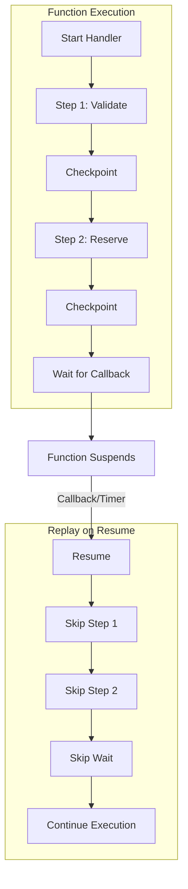

## Overview

Eric Johnson (Principal Developer Advocate) and Michael (Product Manager) introduce AWS Lambda durable functions, announced at re:Invent 2025. The feature addresses a long-standing developer request: how to build reliable multi-step applications without the cognitive overhead of distributed systems.

## Key Arguments

### Build Like a Monolith, Deploy Like Microservices

The serverless journey progressed from monoliths to microservices to Lambda to Step Functions. Each step added decoupling but increased complexity. Durable functions aim to give developers the single-screen coding experience of monoliths while maintaining microservice deployment benefits.

Durable functions are not a new resource—they're regular Lambda functions with a new SDK that adds checkpoint and replay capabilities. You enable durable execution with a simple toggle in the console or two lines of configuration in SAM.

### Checkpoint/Replay as the Core Primitive

When you wrap code in a `context.step()`, the SDK checkpoints that work. If the function crashes or times out, replay re-executes from the start but skips completed checkpoints using stored results. This gives you:

- **Progress tracking**: Automatic checkpointing at each step
- **Automatic retries**: Configurable retry strategies with backoff and jitter
- **Idempotency**: Duplicate invocations detect running executions and don't spawn new ones
- **Version pinning**: Replay always uses the code version that started the execution

### Wait Primitives for Suspension

The SDK provides wait capabilities that suspend execution without compute charges:

- **Timer-based**: `context.wait(5, 'seconds')` suspends until time elapses
- **Callbacks**: Generate a callback ID, send it downstream, suspend until the external system completes the callback
- **Conditions**: Poll external APIs at intervals while sleeping between checks
- **Cancellation**: Configure automatic timeout on waits—if no response arrives, the function resumes and handles the cancellation

This enables human-in-the-loop workflows, payment confirmations, and external service coordination.

### Saga Pattern Made Simple

Compensation logic (undoing work when something fails) is just more steps. Wrap your compensation code in steps, use try/catch, and the SDK handles checkpointing the rollback operations with the same reliability guarantees.

## Diagram: Durable Execution Lifecycle

::

## Notable Quotes

> "Developers wanna build like you're building monoliths, but you want to deploy microservices. We want the old days of a single screen, but we wanna be able to use the decoupled architectures that are out there without the cognitive overload."
> — Eric Johnson

> "Durable functions are regular Lambda functions. It's not a new resource. It is literally the same function that you know today."
> — Michael

## Live Demo: Serverlesspresso

Eric rebuilt the Serverlesspresso application (originally Step Functions-based) using durable functions in roughly six hours with Kiro. The demo showed:

- Local invocation with `sam local invoke` for synchronous testing
- Interactive callback handling—the function paused waiting for barista acceptance
- Real-time execution inspection in the Lambda console's new "Durable executions" tab
- CloudWatch Logs integration with replay-aware logging

## Practical Takeaways

- **Start with SAM or CDK**: Both support durable execution configuration with version pinning handled automatically
- **Wrap non-deterministic code in steps**: UUIDs, timestamps, and random values need checkpointing to ensure consistent replay
- **Use the SDK's concurrency primitives**: `Promise.all` and `Promise.race` have deterministic-safe versions in the SDK
- **Prime your AI assistants**: LLMs don't yet know durable functions—load documentation into your coding agent's context
- **Synchronous invocations cap at 15 minutes**: For longer workflows, use async invocation with callbacks

## Choosing Durable Functions vs Step Functions

Both are valid choices. The talk offers this guidance:

| Criterion      | Durable Functions              | Step Functions             |
| -------------- | ------------------------------ | -------------------------- |
| Primary use    | Application code orchestration | AWS service orchestration  |
| Interface      | Code (TypeScript, Python)      | Visual workflow builder    |
| Learning curve | SDK primitives                 | ASL state machine language |
| Debugging      | Local testing with SAM         | Step Functions console     |

## Connections

- [[aws-lambda-durable-functions]] - AWS documentation covering the same feature with technical reference details
- [[building-effective-agents]] - Agent workflows involving retries, human-in-the-loop, and multi-step reasoning align well with durable function patterns
