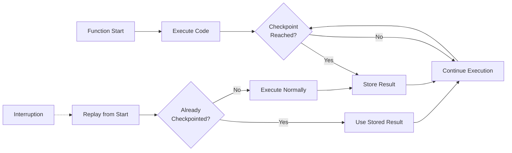

## Summary

Lambda durable functions solve the problem of building reliable long-running workflows on serverless infrastructure. Traditional Lambda functions have execution limits, but durable functions use checkpointing to track progress and replay from interruptions—skipping completed work while maintaining consistency.

## Key Concepts

- **Durable Execution**: A function execution that persists across interruptions. When resumed, it replays from the beginning but skips checkpointed work using stored results.
- **Steps**: Execute business logic with built-in retries and progress tracking. Wrap service calls in steps for automatic checkpointing.
- **Waits**: Suspend execution without compute charges. Ideal for human-in-the-loop processes or external events.

## How Checkpoint/Replay Works

::

The SDK wraps your Lambda handler and provides a `DurableContext` with access to steps and waits. You write sequential code; the SDK handles state management transparently.

## Use Cases

1. **AI Workflows**: Chain model calls, incorporate human feedback, handle long-running inference tasks
2. **Payment Processing**: Multi-step authorization with transaction state maintenance and automatic rollback
3. **Order Fulfillment**: Coordinate inventory, payment, shipping, and notifications across services
4. **Business Processes**: Employee onboarding, loan approvals, compliance workflows spanning days or weeks

## Trade-offs

| Benefit                         | Consideration                           |
| ------------------------------- | --------------------------------------- |
| Executions up to 1 year         | Only JS/TS/Python supported             |
| No compute charges during waits | Requires SDK adoption                   |
| Automatic retry and recovery    | Code must be deterministic for replay   |
| Familiar sequential programming | Learning curve for checkpoint semantics |

## Connections

- [[building-effective-agents]] - Discusses workflow patterns for AI agents that durable functions can reliably execute at scale
- [[build-autonomous-agents-using-prompt-chaining-with-ai-primitives]] - Prompt chaining workflows are a natural fit for durable function orchestration
