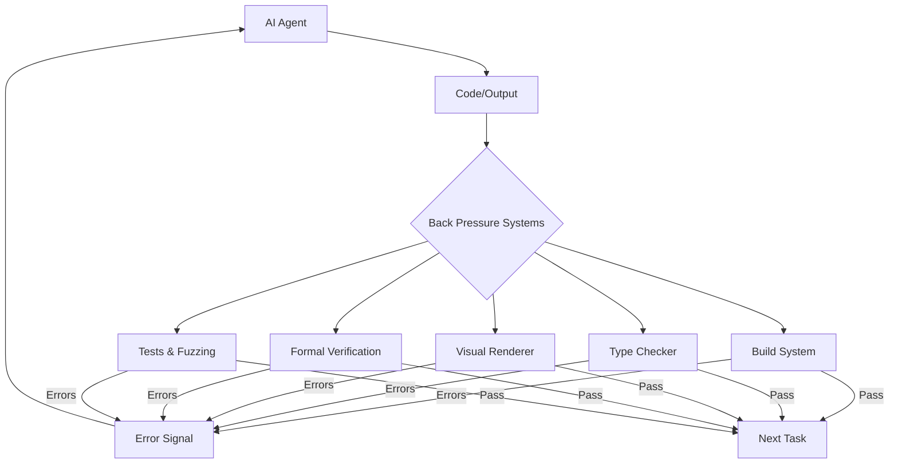

## Summary

Moss Ebeling argues that successful AI agent applications rely on **back pressure**—automated feedback mechanisms that help agents identify and correct mistakes during task execution. Engineers gain leverage by building these feedback systems rather than manually reviewing each output.

## The Core Problem

Without automated feedback, agents depend on human review: "Without a way to interact with a build system the model relies on you for feedback about whether or not the change it made is sensible." Manual correction doesn't scale.

## Categories of Back Pressure

### Build Systems & Bash Tools

Agents running their own builds and reading error output eliminates trivial feedback tasks. The build system becomes an automated reviewer.

### Type Systems

Languages with expressive type systems—Rust, Elm—prevent invalid states and generate helpful error messages. These messages guide LLMs toward correct solutions without human intervention.

### Visual Rendering Tools

MCP servers for Playwright and Chrome DevTools let agents compare UI expectations with actual rendered results. Visual verification without manual inspection.

### Formal Verification

Proof assistants like Lean combined with AI enable trusted results through automated validation. The tightest possible feedback loop.

### Testing & Fuzzing

Randomized testing for CUDA kernels and automated documentation generation provide immediate correctness feedback.

## Diagram

::

## Key Insight

The central question: "Are you wasting your back pressure?" Rather than spending time correcting agent mistakes, invest in automated quality checks. Shift focus from trivial corrections to higher-level problem-solving.

## Connections

- [[dont-waste-your-back-pressure]] - Geoffrey Huntley explores the same concept with a focus on calibration—balancing too much vs. too little backpressure
- [[essential-ai-coding-feedback-loops-for-typescript-projects]] - Matt Pocock's practical implementation of feedback loops using TypeScript, Vitest, and Husky
- [[context-efficient-backpressure]] - Complementary focus on making backpressure context-efficient by suppressing verbose output
