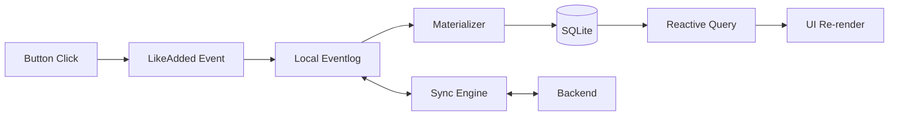

## Summary

This tutorial demonstrates building a minimal likes feature using LiveStore, a local-first sync engine that combines event sourcing with reactive SQLite. The implementation requires just three pieces: an event definition, a materializer to update state, and a reactive query for the UI.

## Key Concepts

- **Events as source of truth**: User actions (like button clicks) become immutable events in a local eventlog. The `LikeAdded` event carries no payload—its existence represents a like.

- **Materializers transform events to state**: A callback function increments the counter each time `LikeAdded` fires. The SQLite database rebuilds from the shared event history on each client.

- **Reactive queries eliminate loading states**: Components subscribe to database state and re-render automatically when the like count changes. No manual cache invalidation required.

## Architecture



::

The sync engine distributes events between clients and server while each client maintains its own materialized database. This architecture provides offline support by default—the local eventlog and database work without connectivity.

## Code Snippets

### Event Definition

Events require only a name and schema. For a simple counter, an empty schema suffices.

```typescript
const LikeAdded = Event.create({
  name: "LikeAdded",
  schema: Schema.Struct({}),
});
```

### Materializer

The materializer translates events into database mutations.

```typescript
const likeMaterializer = Materializer.create({
  event: LikeAdded,
  exec: (event, { db }) => {
    db.run("UPDATE likes SET count = count + 1 WHERE id = 1");
  },
});
```

### Reactive Query

Components subscribe to state changes without manual refetching.

```typescript
const likes = useQuery((db) => db.queryFirst("SELECT count FROM likes WHERE id = 1"));
```

## Connections

- [[livestore]] - The framework powering this implementation, with deeper coverage of its reactive SQLite foundation and sync architecture
- [[ux-and-dx-with-sync-engines]] - Explains why sync engines remove network latency from the interaction path, which is why this likes feature feels instant
