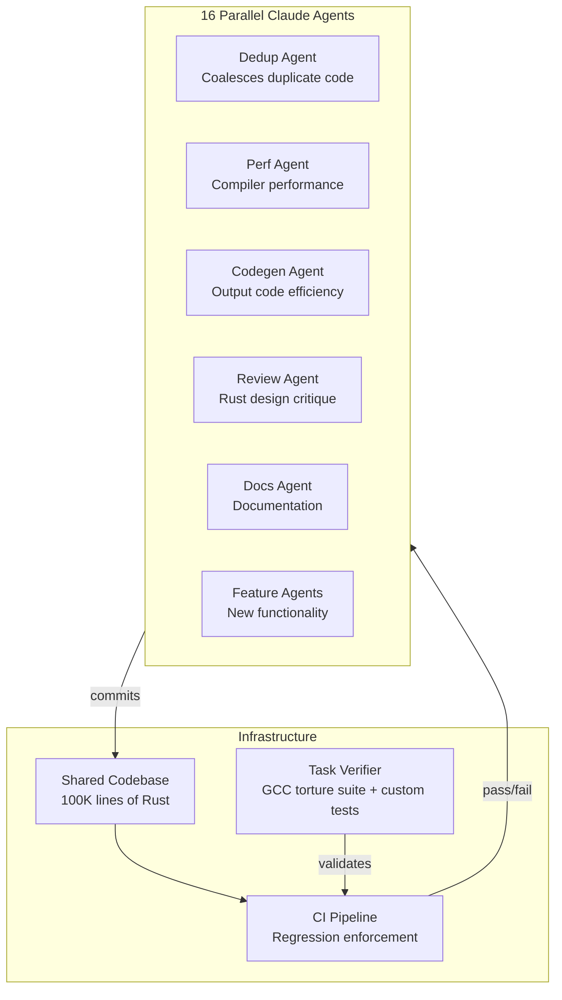

## Summary

Nicholas Carlini, a researcher on Anthropic's Safeguards team, stress-tested a new approach to autonomous software development: agent teams. He set 16 Claude instances loose on building a Rust-based C compiler from scratch, with no internet access and no human supervision. The result was a 100,000-line clean-room implementation that compiles Linux 6.9 on x86, ARM, and RISC-V.

## Key Concepts

- **Agent teams over pair programming**: Rather than a developer guiding one AI in real time, Carlini built a simple loop that automatically restarts Claude when it finishes a task. This removes the human bottleneck entirely.

- **Parallelism enables specialization**: Each of the 16 agents owned a distinct responsibility—one coalesced duplicate code, another optimized compiler performance, a third improved output code efficiency, another critiqued the Rust design, and yet another handled documentation. Specialization made the system more capable than a single agent switching contexts.

- **The verifier matters more than the agent**: The task verifier must be nearly perfect. When it has gaps, Claude solves the wrong problem. Carlini spent significant effort finding high-quality compiler test suites (including the GCC torture test suite), writing custom verifiers, and designing new tests as failure modes surfaced.

- **CI as a guardrail against regression**: Near the project's end, Claude frequently broke existing functionality when implementing new features. A continuous integration pipeline with strict enforcement—new commits cannot break existing code—solved the regression problem.

- **Model capability thresholds**: Previous Claude versions (including Opus 4.5) could produce a functional compiler but failed on real-world projects. Only Opus 4.6 crossed the threshold for production-scale software compilation.

## Results

| Metric                     | Value            |
| -------------------------- | ---------------- |
| Claude Code sessions       | ~2,000           |
| API cost                   | $20,000          |
| Lines of code              | 100,000          |
| Architectures              | x86, ARM, RISC-V |
| GCC torture test pass rate | 99%              |

The compiler can build Linux 6.9, QEMU, FFmpeg, SQLite, PostgreSQL, Redis—and it can compile and run Doom.

## Limitations

The compiler is not production-ready in every sense. It lacks the 16-bit x86 mode needed to boot Linux out of real mode (it calls GCC for this). It has no independent assembler or linker—those remain buggy and the demo used GCC's. The generated code runs slower than GCC with all optimizations disabled. The Rust code quality is reasonable but nowhere near what an expert Rust programmer would produce.

## Visual Model

::

## Connections

- [[the-importance-of-agent-harness-in-2026]] - Carlini's CI pipeline and task verifier are a concrete example of the "agent harness" Schmid describes as the competitive differentiator for multi-agent systems
- [[we-removed-80-percent-of-our-agents-tools]] - Contrasting agent architecture: Vercel succeeded by stripping agents to a single bash tool, while Carlini succeeded by multiplying specialized agents—both approaches validate that agent structure matters more than raw model capability
- [[understanding-claude-code-full-stack-mcp-skills-subagents-hooks]] - Carlini's parallel Claude instances represent the extreme case of the subagent pattern, pushing Claude Code's orchestration model from developer-guided sessions to fully autonomous multi-agent workflows
