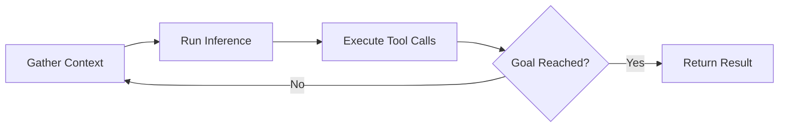
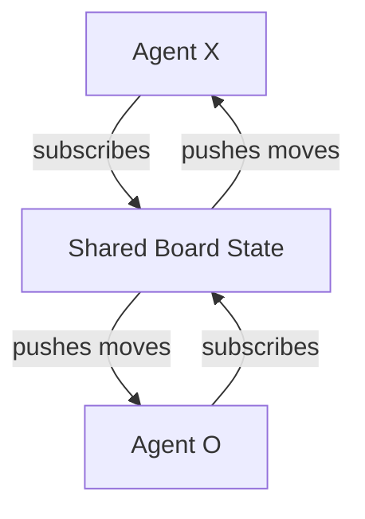

## Overview

Sunil Pai argues that 30 years of front-end development wisdom applies directly to building AI agents. The same architectural evolution—from pull-based to push-based, from request-response to real-time sync—solves the performance bottleneck that plagues current agent frameworks when connecting to external data sources through MCP.

## Key Arguments

### Agents Are Servers That Also Act as Clients

Cloudflare's agent framework treats agents as durable objects with lifecycle hooks. They expose HTTP endpoints, handle websockets, receive emails, and soon voice calls. But unlike traditional servers, they also connect outward to data sources and act on your behalf.

The abstraction provides:

- **Scheduling per instance** - Not a global cron job; each agent schedules its own future tasks
- **Automatic state sync** - All connected clients receive state changes via websockets
- **Type-safe RPC** - Methods exposed on the class become callable functions for clients

### The Agent Loop Mirrors Front-End Architecture

The agent loop—gather context, run inference, execute tool calls, repeat—feels familiar because it's the same pattern front-end frameworks have evolved through:

::

Every framework generation (jQuery, Backbone, React) solved data fetching differently, but all moved toward pushing data to the UI rather than pulling on demand.

### MCP's Pull Problem

The current MCP architecture has a fundamental performance issue: coding agents operate with the file system as synchronous local state, but MCP servers require fetch-wait-process cycles. Every external data source means another round trip.

The solution: MCP servers should push data into the agent's context, forming a reactive envelope around the LLM rather than forcing it to pull repeatedly.

### Sync Engines as Agent Infrastructure

Cloudflare's approach: define state and events as types, let a sync engine handle distribution. The tic-tac-toe demo pits two AI agents against each other on a shared board—the entire architecture fits in one slide because the sync engine handles all coordination.

::

## Notable Quotes

> "The punch line is obvious here. I think every agent, every agent, every agent framework should actually be a sync engine."

> "AI agents are just spicy cron jobs. And I agree, they are spicy cron jobs. You should be able to do things at a given time."

> "I'm very stupid, so I love stupid software. I can hold this entire image in my brain."

## Practical Takeaways

- Agents that connect to multiple data sources benefit from push-based architectures
- Schedule tasks per-agent instance, not globally, for more natural agent behavior
- State sync to connected clients enables real-time agent observability
- Start with the simplest possible state representation—a type, some events, and a sync engine

## Connections

- [[ai-coding-agents-and-how-to-code-them]] - Covers the same agent loop pattern and MCP integration, with multi-agent orchestration that could benefit from sync engine architecture
- [[local-first-software-taking-back-control-of-our-data]] - Explains the CRDT and sync engine foundations that Sunil argues should power AI agent frameworks
