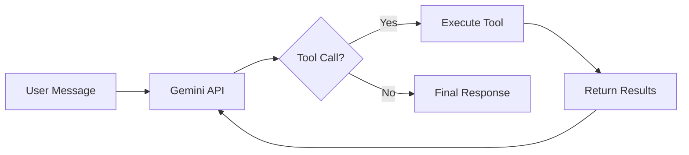

## Summary

Dennis Stanoev advocates learning agent fundamentals before adopting frameworks. The core insight: an agent is just a wrapper around an LLM that allows the model to make decisions and take actions. By building a customer support agent from scratch with TypeScript and the Gemini API, he demonstrates that the architecture is surprisingly simple.

## Key Concepts

### The Agent Loop

Every agent follows a five-step pattern:

1. Define available tools with metadata (parameters, descriptions)
2. Send user prompt and tool definitions to the LLM
3. Model analyzes request and returns structured tool-use responses
4. Execute intercepted tool calls and capture results
5. Return results to model for next iteration or final response

### Static vs Dynamic Content

FAQ information belongs in system prompts rather than tool calls. Static content embedded in prompts reduces latency compared to fetching through tools.

### Function Declarations

Tools are defined through function declarations—metadata that tells the LLM what the tool does and what parameters it accepts. The LLM invokes tools; handlers execute actual operations.

## Visual Model



::

## Code Snippets

### Tool Definition

How to define a tool for the Gemini API.

```typescript
const validateOrderDeclaration: FunctionDeclaration = {
  name: "validateOrder",
  description: "Validates an order by its ID and returns order details",
  parameters: {
    type: SchemaType.OBJECT,
    properties: {
      orderId: {
        type: SchemaType.STRING,
        description: "The unique identifier of the order",
      },
    },
    required: ["orderId"],
  },
};
```

### Agent Loop

Core loop that powers the agent.

```typescript
while (true) {
  const result = await chat.sendMessage(userMessage);
  const response = result.response;

  const functionCalls = response.functionCalls();
  if (!functionCalls || functionCalls.length === 0) {
    // No tool calls - we have our final response
    return response.text();
  }

  // Execute each tool call and collect results
  for (const call of functionCalls) {
    const toolResult = await executeTool(call.name, call.args);
    // Send result back to continue the conversation
  }
}
```

## Connections

- [[how-to-build-an-agent]] - Thorsten Ball arrives at the same "loop until done" pattern using Go and the Anthropic API, reinforcing that this architecture is universal
- [[building-effective-agents]] - Anthropic's official guide provides complementary workflow patterns and production considerations for when the basic loop needs orchestration
