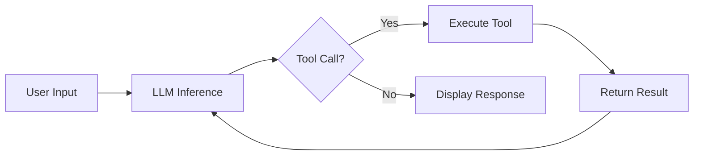

## Overview

Geoffrey Huntley, engineer at SourceCraft building AMP code, strips away the mystique around AI coding agents. His core thesis: tools like Cursor, Windsurf, Claude Code, and GitHub Copilot are fundamentally simple—roughly 300 lines of code running in a loop with LLM tokens. The model does all the real work; tooling vendors just provide hints and tuning.

## Key Arguments

### Agents Are Simple Loops

The entire architecture of a coding agent reduces to:

1. Take user input
2. Call the LLM for inference
3. Check if the model wants to call a tool
4. Execute the tool and return results
5. Loop until done

> "It's really not that hard to build an agent... It's 300 lines of code running in a loop. You just keep throwing tokens on the loop and then you got yourself an agent."
> — Geoffrey Huntley

### Not All LLMs Are Agentic

LLMs fall into distinct behavioral categories:

| Dimension    | Low                                | High                               |
| ------------ | ---------------------------------- | ---------------------------------- |
| **Safety**   | Grok (security research)           | Anthropic, OpenAI (ethics-aligned) |
| **Behavior** | Oracles (summarization, reasoning) | Agentic (tool-calling "squirrels") |

Claude Sonnet is an "incremental squirrel" optimized for tool calls. O3 is an oracle for checking work. Combine them strategically.

### Context Window Discipline

> "You should only use the context window for one activity."

The context window is smaller than advertised—system prompts, tool configurations, and MCP definitions all consume memory. Context pollution causes degraded results.

**Hit "New Chat" constantly.** Mix topics and you mix outcomes.

### MCPs Are Just Billboards

> "A tool or MCP is just a function with a billboard on top."

The billboard tells the LLM how to invoke the function. Don't overload on MCPs—each one allocates context window space, making the LLM "dumber." You don't need the GitHub MCP if the model already knows the CLI.

### The Four Primitives

Every coding agent needs four tools stacked together:

1. **List Files** - Repository layout for the LLM to navigate
2. **Read File** - Access file contents
3. **Bash Tool** - Execute system commands
4. **Edit Tool** - Write and modify files

That's it. Stack these primitives with tuning and prompt engineering, and you have a coding agent.

## Visual Model

::

## Practical Takeaways

- **Build your own agent** - Understanding primitives is the new baseline knowledge, like knowing what a primary key is
- **Use one context for one activity** - New chat for new tasks
- **Don't overload MCPs** - Each one costs context window space
- **The model does the work** - Tooling is hints and infrastructure
- **Invest in yourself** - "Your coworker is going to take your job, not AI"

## Notable Quotes

> "AI hasn't displaced them. No, it's enabled a really skilled engineer to be able to automate their particular things."
> — Geoffrey Huntley

> "Not everything can be solved by AI. Not everything should be solved by AI. But as you build your agents and you learn about this, you're going to develop nuance."
> — Geoffrey Huntley

## Connections

- [[12-factor-agents]] - Complements this talk with production-grade patterns; while Huntley demystifies the basic loop, 12 Factor Agents addresses when to add deterministic control flow vs. LLM decision-making
- [[build-and-deploy-a-cursor-clone]] - A hands-on tutorial for building what Huntley describes conceptually—the Cursor-style AI code editor
