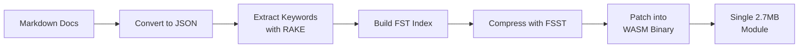

## Summary

João Moreno built docfind, a client-side search engine for VS Code's documentation that delivers instant results without server dependencies. The stack combines Finite State Transducers for compact keyword indexes, RAKE for automatic keyword extraction, and FSST for metadata compression—all compiled to a single WebAssembly binary. Copilot played a significant role in navigating unfamiliar Rust territory.

## Key Concepts

### Finite State Transducers (FSTs)

Based on Andrew Gallant's work on automata theory, FSTs provide compact, efficient keyword indexes supporting fast lookups and fuzzy matching. They map keywords to document indices with minimal memory overhead.

### RAKE Algorithm

"Rapid Automatic Keyword Extraction" identifies important keywords and phrases from documentation automatically, assigning relevance scores for ranking.

### FSST Compression

"Fast Static Symbol Table" compresses document metadata (titles, categories, snippets) to minimize index size while maintaining fast decompression.

### WASM Binary Patching

The most complex aspect: embedding the index directly into WebAssembly modules without recompiling. Moreno's solution parses the WASM binary structure, locates memory sections, and patches them with actual index data.

## Build Pipeline

::

## Results

For VS Code's documentation (~3 MB markdown, ~3,700 documents):

| Metric       | Value                                  |
| ------------ | -------------------------------------- |
| Index size   | ~2.7 MB (Brotli compressed)            |
| Search speed | ~0.4ms per query                       |
| Deployment   | Single downloadable WebAssembly module |

## Copilot's Role

Moreno credits Copilot significantly for enabling the project:

- Rapid exploration of unfamiliar Rust libraries
- Efficient development despite limited Rust expertise
- WebAssembly project scaffolding
- Complex binary format debugging

> "Copilot helped me fill in the blanks and tackle the hard problems."

## Connections

- [[heres-how-i-use-llms-to-help-me-write-code]] - Both articles demonstrate LLM-assisted development in practice. Moreno's experience using Copilot to learn Rust parallels Willison's observations about "vibe-coding" and iterative development with unfamiliar technologies.
