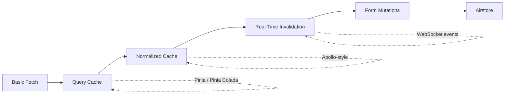

## Overview

Rijk van Zanten walks through the escalating complexity of handling data from multiple APIs in Vue applications. Drawing from years of building the Directus studio—a Vue/Nuxt app that federates data from system endpoints, user databases, third-party APIs, and plugin extensions—the talk surfaces five pain points that compound on each other: caching, cache normalization, real-time updates, mutations, and form state management.

## Key Arguments

### Query Caching Is the Easy Part (And Still Tricky)

Basic in-memory caching—moving fetch logic into shared stores so multiple components pull from memory instead of hitting the API—solves the obvious duplication problem. Pinia handles the state management layer well, and Pinia Colada wraps it further with TanStack Query-style abstractions. But query-level caching breaks down when two different queries contain overlapping data.

### Normalized Caches Fix Overlap but Explode in Complexity

Instead of caching query outputs directly, normalizing the cache stores each entity separately. A user fetched as part of a list doesn't need refetching for its detail page. The tradeoff: you now maintain mapping logic between queries and the normalized store, and the codebase grows fast. Apollo's GraphQL client solved this for the GraphQL ecosystem, but REST-based apps lack an equivalent.

### Real-Time Invalidation Demands Event-Driven Architecture

Time-based or LRU cache invalidation wastes bandwidth or serves stale data. The preferred approach: listen for server-side events via WebSocket and invalidate only the specific record that changed. With a normalized cache, this means updating a single entity rather than blowing away entire query results. The ideal setup receives not just _what_ changed but _which fields_ changed, enabling surgical cache patches.

### Form Mutations Create a Separate State Problem

Forms can't bind directly to the cache—editing would modify cached data before the user saves. You need a copy of the cached record as the form's reactive model, then reconcile on save: update both the local cache and the remote API. This doubles the state management surface.

## Visual Model

::

## Airstore: The Combined Solution

The talk introduces Airstore, a new open-source reactive data store for Vue and Nuxt that bundles all five concerns into one library:

- **Normalized reactive cache** keeping all components in sync
- **Collocated queries** (`queryFirst`, `queryMany`) with five fetch policies: cache-first, cache-and-fetch, fetch-only, cache-only, no-cache
- **Relation-aware data models** defined with TypeScript and validated with standard schema libraries like Zod
- **Plugin system** for connecting arbitrary data sources (REST, GraphQL, WebSocket, local storage)
- **Built-in form handling** with `$reset`, `$save`, `$loading`, `$error`, and schema validation
- **Nuxt module** with auto-scanning of models and plugins, SSR payload handling, and DevTools integration

## Notable Quotes

> "Caching is kind of like a fridge. You put a bunch of stuff in it, you forget it's there. After a while, it starts to smell."
> — Rijk van Zanten

## Practical Takeaways

- Start with Pinia + Pinia Colada for basic query caching and request deduplication
- Move to normalized caching only when you have overlapping data across multiple queries—the maintenance cost is real
- Prefer event-driven cache invalidation over time-based or LRU strategies for real-time apps
- Never bind form v-models directly to cache data; always work with a reactive copy
- Evaluate Airstore if your Vue/Nuxt app federates data from multiple sources and needs real-time sync

## Connections

- [[local-first-software]] - Airstore explicitly aims for a "local-first and real-time experience," applying the same principle of keeping data on the client and syncing in the background
- [[ux-and-dx-with-sync-engines]] - Both address the same root problem: network latency degrades UX when every interaction requires a server roundtrip, and sync-based architectures remove the network from the critical path
- [[graphql-in-action]] - The talk references Apollo's normalized cache as prior art, and GraphQL's resolver-based normalization directly inspired Airstore's entity-level approach
