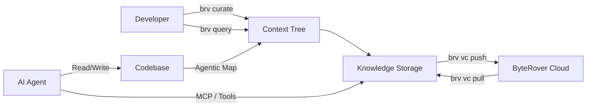

## Overview

ByteRover CLI (`brv`) attacks the same problem [[cognee]] tackles from a different angle: AI agents are stateless by default. Every new session starts cold. ByteRover's answer isn't a knowledge graph — it's a **context tree** with git-style version control, so you curate what your agent remembers and sync it like code.

The pitch is compelling: drop `brv` into any project directory, curate knowledge about your codebase ("Auth uses JWT with 24h expiry"), and every agent you use — Claude Code, Cursor, Windsurf, 22+ others — gets access through MCP or built-in tools. The context survives sessions, machines, even teammates.

What makes this different from just writing docs is the review workflow. You `/curate` knowledge, then `/review approve` or reject it. Treat agent memory like code changes — with intent.



## Key Features

- **Git-like version control for context** — branch, commit, merge, push/pull your agent's memory
- **18 LLM providers** — swap between Anthropic, OpenAI, Google, and 15 others
- **24 built-in agent tools** — code execution, file ops, knowledge search, memory management
- **MCP integration** — works as an MCP server for any compatible agent
- **Review workflow** — approve/reject curated context like code review
- **Cloud sync** — SOC 2 Type II certified, team context sharing

## Code Snippets

### Installation

```bash
# No Node.js required — bundled binary
curl -fsSL https://byterover.dev/install.sh | sh

# Or via npm (Node.js >= 20)
npm install -g byterover-cli
```

### Basic Usage

```bash
cd your/project
brv                  # Start interactive REPL

# Curate knowledge
/curate "Auth uses JWT with 24h expiry" @src/middleware/auth.ts

# Query what the agent knows
/query How is authentication implemented?
```

### Version Control for Context

```bash
brv vc init          # Initialize version control
brv vc commit        # Save changes
brv vc push          # Push to ByteRover cloud
brv vc pull          # Pull from cloud
brv vc branch        # Branch context trees
brv vc merge         # Merge branches
```

## Technical Details

Built with React/Ink for the TUI, TypeScript throughout. The architecture centers on a context tree — a hierarchical knowledge structure that agents can read and write. The version control layer mirrors git semantics so the mental model transfers directly.

Benchmarks look strong: 96.1% accuracy on LoCoMo (conversational memory, 1,982 questions) and 92.8% on LongMemEval-S (multi-session synthesis, 23,867 docs). Licensed under Elastic License 2.0 — free for individual use, restrictions on competing products.

## Connections

- [[cognee]] — Both solve the agent memory problem but from opposite ends: Cognee builds knowledge graphs automatically from raw data, ByteRover lets developers manually curate what agents should remember. Different philosophies — automated extraction vs. intentional curation
- [[advanced-context-engineering-for-coding-agents]] — ByteRover is essentially a tool for the context engineering workflow described here — persistent, structured context that survives sessions and compounds over time
- [[agentic-knowledge-map]] — Fits squarely into the persistent context and agent harness space this map tracks
