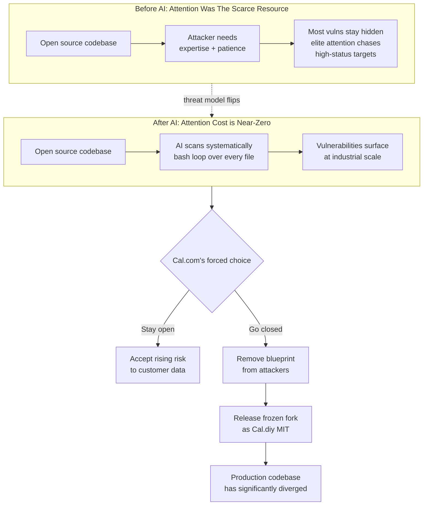

## The Argument

Cal.com spent five years as an open-source scheduling company. This post is the goodbye: the production repo is going closed and the community gets a frozen fork called Cal.diy under MIT. The stated reason is not competitive, not commercial — it's security. AI can now be pointed at an open codebase and systematically scan for vulnerabilities, and the threat model they signed up for in 2021 no longer exists.

Their framing is blunt: "Being open source is increasingly like giving attackers the blueprints to the vault." The BSD kernel example — AI uncovering a 27-year-old vulnerability and generating working exploits in hours — is cited as the canary.

## Decision Logic

## Why This One Matters

Companies have gone closed-source before — usually it's "we need to build a moat" dressed up as something else. This is the first notable case where the stated reason is explicitly AI-driven vulnerability research, and the framing is going to get copied. Expect the next OSS-core SaaS company facing the same decision to cite this post.

The dogma being quietly retired here is "security through obscurity is not security." That was true when attacker attention was the scarce resource — hiding the source didn't help because a motivated human could reverse-engineer it anyway. When attackers have a universal jigsaw solver that can be run for pennies, hiding the source does help at the margin. Not because it's "secure" — because it's one more unit of friction on top of a pile, and every unit now matters more.

## The Cal.diy Fig Leaf

The tell is this line: _"our production codebase has significantly diverged, including major rewrites of core systems like authentication and data handling."_ Translation: Cal.diy is a snapshot of yesterday's codebase, frozen. Nothing flows back upstream. Security patches won't flow either, because the whole point of going closed is to keep the patch delta private.

So Cal.diy exists so they can keep saying "we support open source." It's not untrue — hobbyists can self-host. But it's not the same thing that attracted developers to Cal.com in 2021 either. A company that open-sourced for distribution is now closed-sourcing for security. The MIT fork is the exit scar.

## The "Wave of AI Security Startups" Signal

Buried detail worth extracting: _"In recent months, we've seen a wave of AI security startups productizing this capability. Each platform surfaces different vulnerabilities, making it difficult to establish a single, reliable source of truth for what is actually secure."_

This is Cal.com admitting they can't audit their own codebase against the new tooling. Every new scanner finds different stuff; there's no "pass" state anymore. The cost of maintaining public auditability is now unbounded. That's a different problem than "AI found a CVE" — it's the defender-side version of the asymmetry Ptacek warned about.

## What This Implies

- **OSS-core scheduling, CRM, auth, payments** — any vertical SaaS with sensitive customer data — is now on the timer. The economic pressure to close will build as each scanner release surfaces new CVEs.
- **Supabase, PostHog, Plausible** and similar will need to answer the question publicly. Some will hold the line; the ones that don't will cite this post.
- **The "you can audit our code" trust model** is under pressure for security-sensitive products. The audit was a value prop when it stopped at human review. It's a liability when AI scanners are part of the audit.

## Connections

- [[vulnerability-research-is-cooked]] — Ptacek predicted this exact reasoning six weeks earlier; Cal.com is the first name-brand company to publicly act on it, and their language ("blueprints to the vault", "systematically scan") maps directly onto his "universal jigsaw solver" framing.
- [[open-source-maintainers-are-jerks]] — different sustainability crisis, same direction: Huntley and Randolph argued open source wasn't funded to handle companies' supply-chain expectations; Cal.com is arguing it wasn't funded to handle attackers' AI-augmented scanning. Both conclude the 20-year-old OSS social contract doesn't match the 2026 reality.
- [[biggest-problems-of-ai]] — fits the "security threats" branch of that synthesis; this is the first concrete business-model consequence of AI-accelerated vulnerability research hitting SaaS.
