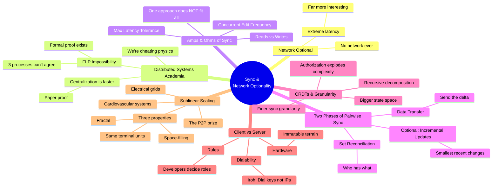

## Overview

Brendan O'Brien (b5), CEO of n0 and creator of Iroh, delivers the talk a networking library would give if it could speak. The framing is playful — "pretend I'm your networking package talking to you about stuff I've seen" — but the observations land hard. This is a practitioner who has watched dozens of sync protocols built on top of Iroh and distilled the patterns that keep showing up.

The core move: stop treating sync as a single problem. Different use cases occupy different positions in a tradeoff space O'Brien calls "amps and ohms" — and the engineering implications of those positions are radically different.

::

## Key Arguments

### Sync is impossible — we're cheating physics

The FLP impossibility result proves you can't get three processes to agree over a network that they're in a consistent state. Full stop. Everything we call "sync" is a proxy, an approximation. O'Brien frames this as liberating rather than limiting — we're genuinely cheating physics when we get this right, and that should give us permission to be creative rather than dogmatic about approaches.

### The "amps and ohms" of sync

When n0 starts working with new teams, they ask: how many reads and writes? What's the maximum latency before a peer is considered invalid? What's your concurrent edit frequency? These dimensions map the tradeoff space. A surgery robot syncing at sub-10ms latency has zero innovation budget left for anything else. A collaborative document editor lives in completely different territory.

The key insight: when people argue about sync approaches, they're often talking past each other because they're optimizing for different positions in this space. This is a practitioner's version of what Sujay Jayakar formalized in his nine-dimension taxonomy.

### All pairwise sync has two phases

Every sync algorithm O'Brien has observed follows the same pattern: set reconciliation (deciding who has what) followed by data transfer. Many add a third phase — incremental updates for the smallest recent deltas. Even a browser fetching a web page follows this pattern: the HTML references are the set, and fetching the assets is the data transfer. HTTP push is the incremental update.

### CRDTs trade granularity for state space explosion

Applying CRDTs to graph structures — giving an identifier to every character in a document — opens up fine-grained sync. But it creates a proportionally larger state space that needs synchronizing. The real pain point: authorization. Every time O'Brien's team finishes a public sync implementation and adds authorization, complexity explodes. Who's allowed to connect to whom, about what — this is where the hard problems live.

### Clients and servers are both computers

Only three things separate them: hardware (immutable terrain — can't change what's in someone's pocket), dialability (servers have stable IPs, clients don't), and rules (developers decide what runs where). Iroh attacks the dialability problem: dial cryptographic keys instead of IP addresses. With that solved, you can focus on what actually matters — the rules about what each node does.

### Sublinear scaling is the real P2P prize

The most original argument in the talk. Electrical sockets in a building have sublinear scaling: as the number of plugs increases, the work each plug does decreases. Same physics powers electrical grids, cardiovascular systems, and city road networks. All sublinear networks share three properties: they're space-filling, fractal (the same pattern repeats at every scale), and they have identical terminal units (you can hot-swap any two endpoints).

That last property — same terminal units — is the hardest part for software. It means client and server need to behave as interchangeable nodes. But if you can get there, you unlock the scaling properties that make P2P not just ideologically appealing but physically superior.

## Notable Quotes

> "We are genuinely cheating physics when we get this stuff right."

> "Clients and servers are both computers."

> "Sublinear scaling is the thing that we care about and it's why we care about peer-to-peer."

## Practical Takeaways

- Map your sync use case in "amps and ohms" before choosing an approach — reads/writes ratio, max acceptable latency, concurrent edit frequency
- Authorization is where sync complexity explodes; design for it early, not as an afterthought
- Iroh's one-liner endpoint creation gives any device (phone, server, browser via WASM) a dialable identity via key pairs
- The live demo proved the point: 9MB of WASM gave every audience member a syncing node in their browser, and it kept working after the server was killed

## Connections

- [[a-map-of-sync]] — O'Brien's "amps and ohms" is a practitioner's shorthand for what Jayakar formalized as nine dimensions; both argue the same core point — one sync approach doesn't fit all
- [[general-purpose-sync-with-ivm]] — Aaron Boodman's talk at the same conference builds one specific answer to O'Brien's "one approach doesn't fit all" — query-driven sync optimized for interactive UI latency
- [[safe-in-the-keyhive]] — Iroh's "dial keys not IPs" philosophy connects directly to Keyhive's cryptographic identity layer; both are building the infrastructure that makes decentralized auth and sync practical
- [[sync-engines-for-vue-developers]] — Alexander's own comparison of sync engines mapped on a server-first to local-first spectrum; O'Brien's amps-and-ohms framing adds the missing practitioner dimension to that analysis
