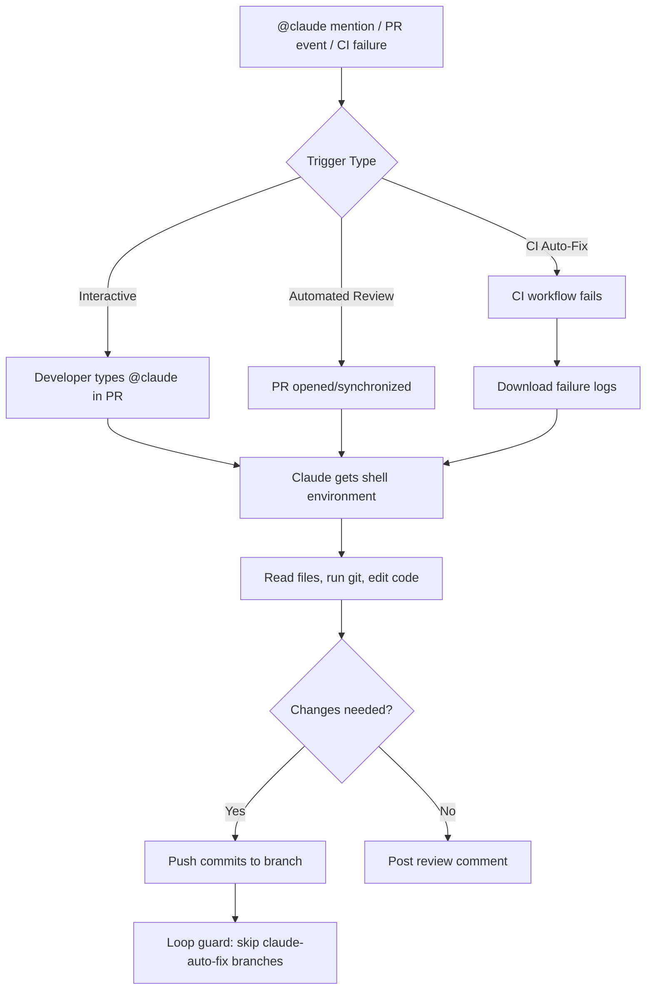

## Summary

This is the practical playbook for `anthropics/claude-code-action@v1` — Anthropic's official GitHub Action that dropped with Claude Code 2.0 in September 2025. The key distinction from typical AI code review tools: this isn't a glorified linter posting comments. Claude gets a full shell environment inside the runner — it reads files, runs git, edits code, installs dependencies, and pushes commits. It's a software agent acting on your repo, not talking about it.

The article covers four workflow patterns from simple to high-impact, with real YAML configs and the guardrails you need to avoid infinite loops and budget blowouts.

## The Four Patterns

The action runs in two modes — **interactive** (`@claude` in PR comments) and **automated** (headless on events). Most production setups use both.

1. **Interactive comment trigger** — `@claude fix the failing test in auth.spec.ts` in a PR comment. Simplest deployment, lowest risk.
2. **Automated PR review** — fires on every PR open/sync, posts structured review before human reviewers touch it. The `concurrency` block matters here — without it, rapid commits spawn parallel Claude jobs that race each other.
3. **CI failure auto-fix** — the force multiplier. When CI fails, Claude downloads the logs, diagnoses the issue, and pushes a fix. The critical detail: you _must_ guard against infinite loops with `!startsWith(github.event.workflow_run.head_branch, 'claude-auto-fix-ci-')`.
4. **Structured JSON output** — Claude returns typed JSON for downstream workflow steps. Example: classifying failures as flaky vs. real regression before deciding to retry.

## Cost Reality

The numbers are surprisingly cheap with Sonnet:

- **Small PR** (<200 lines): $0.01–$0.03
- **Medium PR** (200–1K lines): $0.05–$0.15
- **Large PR** (1K+ lines): $0.20–$0.50

A 50-PR/month team stays under $5. The key cost controls: `--max-turns 5` as a hard cap, `cancel-in-progress: true` for concurrency, path filtering to skip docs, and `--allowedTools` to restrict operations.

## Security Model

Three layers worth knowing:

- **Access control** — only write-access contributors can trigger Claude by default. Setting `allowed_non_write_users: "*"` is explicitly flagged as dangerous.
- **Prompt injection protection** — the action strips HTML comments, invisible characters, and hidden attributes from inputs. Not bulletproof, but it raises the bar.
- **CLAUDE.md constraints** — a persistent system prompt per repository. "Never modify /vendor/", "never push to main", "flag hardcoded credentials as critical." This is where you encode team-specific guardrails.

The principle of least privilege point is underappreciated: giving `contents: write` to a review-only job is a common misconfiguration. Match permissions to what the job actually does.

## Connections

- [[ai-code-review-bot-claude-github-actions]] — Vadim's DIY approach to the same problem: a custom TypeScript script calling Claude's API for PR review. This Groundy article covers the official action that wraps all of that plumbing for you — the contrast shows when to roll your own vs. use the first-party tool
- [[the-complete-guide-to-building-skills-for-claude]] — The CLAUDE.md behavioral constraints described here are a simplified version of the skills architecture. Teams using the action seriously will eventually want skills for more sophisticated agent behavior
