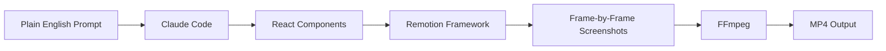

## Key Takeaways

- **Remotion turns video creation into React code**: Videos are essentially websites recorded frame-by-frame into MP4s. AI agents that struggle with complex GUIs like After Effects can easily write React components instead.

- **Agent skills use progressive disclosure**: The full skill instructions only load when your task matches its description. This keeps the context window lean—Claude only loads animation, timing, or sequencer docs when needed.

- **Agent skills are an open standard**: Like MCPs and agents.md, skills work across Claude Code, OpenCode, Agent Zero, and other AI agents. Remotion's skill bundles their API patterns, component conventions, and best practices.

- **Best practices for great results**: Start with a detailed storyboard, iterate with 5-10 prompts rather than one-shotting, keep compositions modular (separate intro, transitions, outro components), and provide high-quality assets.

## How Remotion Works



::

The workflow transforms text prompts into video through code generation. Claude writes React components, Remotion renders each frame, and FFmpeg stitches them into a video file.

## Setup Steps

1. Run `npx create-video@latest` to scaffold a Remotion project
2. Install the Remotion skill via `skills.sh` (select Claude Code as the agent)
3. Launch Claude Code and verify the skill with `/skill`
4. Create detailed prompts in markdown files for complex animations
5. Let Claude Code generate the React components

## Code Snippets

### Sequence Components

Remotion uses `Sequence` components to place elements on a timeline:

```tsx
import { Sequence } from "remotion";

export const MyVideo = () => (
  <>
    <Sequence from={0} durationInFrames={60}>
      <IntroScene />
    </Sequence>
    <Sequence from={60} durationInFrames={120}>
      <MainContent />
    </Sequence>
  </>
);
```

### Running the Preview

```bash
npm run dev  # Opens localhost player for real-time scrubbing
npm run build  # Renders final MP4 via FFmpeg
```

## Notable Quotes

> "AI agents are great at writing code. However, these same agents are terrible at using complex graphical user interfaces like After Effects."

> "In 2026, you really cannot afford to fall behind."

## Connections

- [[claude-code-skills]] - Official documentation on how skills work and their automatic semantic triggering—Remotion's skill is a real-world example of this pattern
- [[claude-code-2-1-skills-universal-extension]] - The 2.1 update that made skills hot-reloadable and added progressive disclosure—the exact features Remotion's skill leverages
