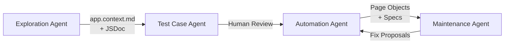

## Summary

Single-prompt AI test generators read the DOM, not your product rules — so the tests break on the next deploy. Pratik Patel's fix is a 4-agent pipeline where each agent handles one phase, communicates through files on disk, and can be paused, edited, or resumed independently. At TestDino, a 20-line prompt became 3 page objects and a complete spec in 15 minutes.

The real insight isn't the agents themselves — it's the 3-layer context strategy that makes them work. Without `app.context.md` documenting business logic, the agents loop endlessly guessing at things the accessibility tree can't reveal.



## Key Concepts

### The 3-Layer Context Strategy

This is the core architectural decision that separates the pipeline from naive "just point the AI at the app" approaches:

1. **app.context.md** — Product knowledge foundation: workflows, roles, auth methods, what's out of scope. Written once, cached across runs.
2. **Per-feature JSDoc** — Documents what the DOM can't show: clipboard-only tokens, permission rules, conditional flows, API response shapes.
3. **Playwright Skills** — Curated markdown guides enforcing production patterns: semantic locators, `storageState` auth, auto-waiting assertions.

### Human Checkpoint Before Code Generation

The Test Case Agent outputs human-readable specifications — not code. A human reviews coverage _before_ the Automation Agent burns tokens generating page objects. This catches coverage gaps early instead of debugging generated tests later.

### MCP vs CLI: Know When to Use Which

MCP streams the full browser state into context each turn — 50k+ tokens per snapshot on complex pages. CLI writes artifacts to disk and the model reads only what it needs. For the pipeline, CLI wins at ~4x lower token cost. MCP is better for one-off exploratory debugging.

### Where Agents Actually Get Stuck

Standard operations (login, form fill, navigation) succeed on first attempt. Loops happen exclusively where answers exist _outside_ the DOM: clipboard-only tokens, permission rules, conditional API responses. The fix is always a one-sentence addition to the JSDoc — not more agent sophistication.

## Code Snippets

### Response Interception for Clipboard-Only Data

When a token is sent to clipboard but never rendered in the DOM, register the response listener _before_ clicking — reversed promise registration prevents the 1-in-10 CI flakiness.

```typescript
async rotateKey(name: string): Promise<string> {
  const row = this.page.getByRole('row', { name });
  await row.getByRole('button', { name: 'Rotate' }).click();

  // Promise-first: register BEFORE confirming
  const responsePromise = this.page.waitForResponse(
    (resp) => resp.url().includes('/api-key') &&
              resp.request().method() === 'PUT',
  );
  await this.confirmRotateButton.click();

  const response = await responsePromise;
  const body = await response.json();
  return body.data.token;
}
```

### Multi-Role Auth via storageState

Role-specific sessions established once, reused by all agents — no re-login per test.

```typescript
test.use({ storageState: "tests/auth/member.json" });

test("member cannot create API keys", async ({ page }) => {
  await page.goto("/settings?tab=api");
  await expect(page.getByRole("button", { name: "Generate Key" })).not.toBeVisible();
});
```

## Mistakes Worth Avoiding

- **Skipping app.context.md** — 30 minutes of documentation prevents 10 agent loops per feature. Context quality determines output quality more than prompt length.
- **Trusting auto-healing on permission tests** — If a test broke because a permission rule changed, a silent fix hides a real bug. Always human-review RBAC test changes.
- **Using MCP for the Automation Agent** — 3-4x token overhead. MCP for exploration, CLI for generation at scale.
- **Ignoring `test.describe.serial()`** — Parallel execution silently breaks state-sharing tests. Data-dependent tests need serial execution.

## Connections

- [[autonomous-qa-testing-ai-agents-claude-code]] — OpenObserve's 8-agent QA pipeline tackles the same problem from a different angle: more agents, tighter orchestration, and a "Council" metaphor vs. Patel's looser file-based handoffs. Both converge on the same lesson — specialization beats one-shot generation.
- [[the-complete-guide-to-building-skills-for-claude]] — The Playwright Skills layer in this pipeline is exactly the pattern Anthropic's skill guide describes: curated markdown that teaches Claude _how_ to use tools well, not just _that_ tools exist.
