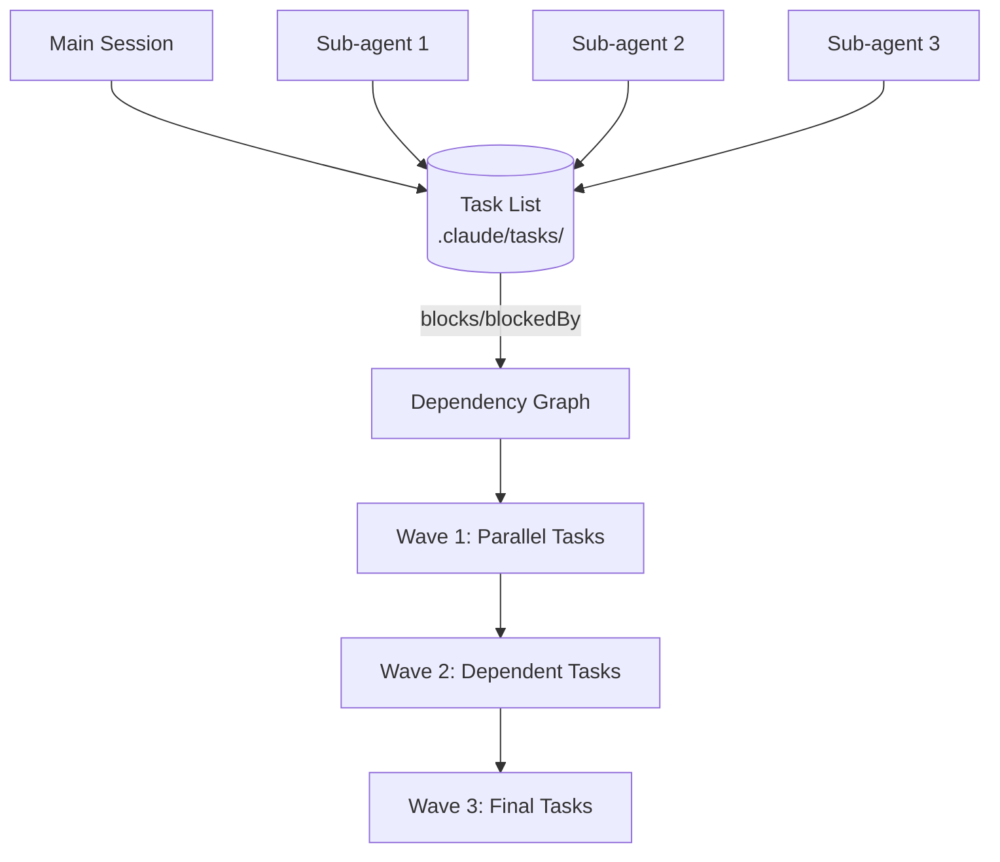

The previous todo list lived in session memory and vanished on restart. The new task system writes tasks to `.claude/tasks/` as JSON files, making them shareable across sessions and sub-agents.

## The Problem It Solves

Coding agents suffer from two weaknesses:

1. **Agent amnesia** — Starting a new session mid-task loses all progress unless you manually document remaining work
2. **Context pollution** — A full context window makes the agent drop discovered bugs instead of tracking them

[[beads]] pioneered the solution: structured task files with dependency graphs. Claude Code now integrates a similar pattern natively.

## How It Works

Tasks persist in `.claude/tasks/{session-id}/` with these fields:

- Description of what to do
- Status (pending, in progress, completed)
- Dependency graph (`blocks`, `blockedBy`)

Four new tools expose this system: `TaskCreate`, `TaskGet`, `TaskUpdate`, `TaskList`. Both the main session and sub-agents can read and write tasks.

## Task System Architecture



::

## Practical Benefits

**Context efficiency** — Running tasks in sub-agents consumed only 18% of context versus 56% when running everything in the main session. Each sub-agent gets a fresh context window focused on its specific task.

**Real-time synchronization** — Two Claude Code sessions sharing the same task list receive instant notifications when tasks update. No polling required; no stale state.

**Dependency-aware parallelism** — Claude identifies which tasks can run concurrently and which have prerequisites. Wave 1 runs three tasks in parallel; wave 2 waits for blockers to clear.

## Multi-Session Workflow

Set a shared task list ID to enable coordination across sessions:

```bash
CLAUDE_CODE_TASK_LIST_ID=myproject claude
```

Or add to `.claude/settings.json`:

```json
{
  "env": {
    "CLAUDE_CODE_TASK_LIST_ID": "myproject"
  }
}
```

One session acts as orchestrator; the other becomes a checker that monitors completed tasks, verifies implementation quality, and adds follow-up tasks for anything missing.

## Key Insight

> "This now mirrors real engineering workflows where you have work being done in parallel, you have handoffs, blockers and dependencies."

The difference from [[ralph-wiggum-loop-from-first-principles]]: Ralph spawns completely isolated loops without an orchestrator. Claude Code's task system keeps a coordinator in the main session, receiving sub-agent output but offloading the heavy lifting.

## Notable Quotes

> "By having each task that you give a coding agent isolated into its own context window, you can now give it the ability to log any bugs for later."

> "If you do remember Ralph Wiggum, it's kind of Ralph Wiggum as well, because each task has been completed in its own brand new fresh context window."

## Connections

- [[beads]] — The inspiration for this system; a git-backed task graph that Claude Code now partially replicates natively
- [[the-six-levels-of-claude-code-slash-commands]] — Level 4 (Orchestrator) describes the sub-agent spawning pattern this task system enables
- [[ralph-wiggum-loop-from-first-principles]] — Shares the "fresh context per task" philosophy, but without the centralized orchestrator
