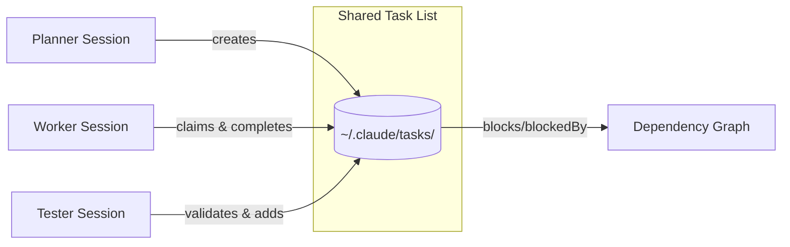

Kieran Klaassen and Trevan explore Claude Code's new task management system, comparing it to [[beads]] and discussing how it fits into the compound engineering workflow.

## The Convergence

Everyone building AI coding workflows has converged on markdown task lists. Claude naturally updates them without instruction. Beads formalized this into a structured system. Now Anthropic has shipped native task tools that persist to `.claude/tasks/`.

The question: does this replace our custom approaches, or complement them?

## Key Observations

**Session-scoped by default.** Tasks persist to `~/.claude/tasks/{session-id}/` and aren't automatically shared across sessions. You can set `CLAUDE_CODE_TASK_LIST_ID=myproject` to share, but it's a manual step.

**Cross-agent potential.** The real power is multi-session orchestration: one terminal as planner, another as worker, a third as tester. Each picks from the same task queue. This mirrors what people built manually with Beads.

**Dependency tracking exists.** Tasks support `blocks` and `blockedBy` fields, enabling proper sequencing. Claude can figure out what runs in parallel versus what waits.

## Contextual Intelligence

Trevan raises the deeper insight: we've been forcing context into markdown artifacts when the better approach is letting machines query for context.

> "I think this contextual intelligence is the next frontier... instead of forcing everything to create an artifact that the machine reads, how do we create a system in which the machine can query for context?"

He mentions _Unblocked_ (getunblocked.com) as an example—a product that connects repos, Slack, and docs into a queryable knowledge layer. The agent asks questions; the system retrieves relevant context from wherever it lives.

## Compound Engineering Implications

The compound engineering plugin already has todo tracking. The decision now: delete custom skills and rely on native tasks, or extend the native system with additional metadata (namespaced attributes like `compound-engineering:priority`).

Kieran notes a workflow gap: pending versus ready states. Sometimes AI proposes tasks that need human approval before work begins. The native system only has `pending`, `in_progress`, `completed`—no "approved" checkpoint.

## Multi-Agent Pattern

The pattern they've found effective:

1. **Planner session** — Brainstorms and creates tasks
2. **Worker session** — Picks up tasks and implements
3. **Tester session** — Runs browser tests and validates

::

With shared task lists, these can coordinate without manual handoffs. Each session maintains its own context window, avoiding the pollution problem of running everything in one session.

## What's Missing

- **No task deletion** — You can't remove tasks, only mark them complete
- **No subcategorization** — Global IDs without project hierarchy
- **No blocking status** — Can't mark tasks as blocked by external factors
- **Cross-project dependencies** — The home directory approach doesn't scale to teams

## Notable Quotes

> "The value in the compounding loop isn't about task tracking and dependency management. It's really thinking, using judgment, taste, and the scaffolding above that."

> "By having each task isolated into its own context window, you can now give it the ability to log any bugs for later."

## Connections

- [[claude-codes-new-task-system-explained]] — Ray Amjad's technical breakdown of the same feature, with architecture diagrams
- [[beads]] — The inspiration for Claude's native task system; still offers features like hash-based IDs and stealth mode that the native version lacks
- [[ralph-wiggum-loop-from-first-principles]] — Another approach to fresh context per task, but without centralized orchestration
